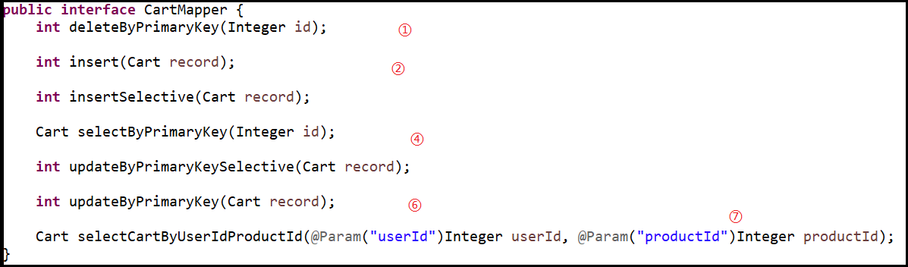

# Mybatis一般使用

## 1.通过Mybatis-generator生产相关文件
### 1.1.里程碑一：编写generatorConfig.xml文件
generatorConfig.xml文件是一次性使用的配置文件。当相关文件生产完毕后，就不再使用。<br>
下面提供一个文件模板：<br>
```xml
<?xml version="1.0" encoding="UTF-8"?>
<!DOCTYPE generatorConfiguration
        PUBLIC "-//mybatis.org//DTD MyBatis Generator Configuration 1.0//EN"
        "http://mybatis.org/dtd/mybatis-generator-config_1_0.dtd">

<generatorConfiguration>
    <!--导入属性配置-->
    <context id="MySql" targetRuntime="MyBatis3">

        <plugin type="org.mybatis.generator.plugins.FluentBuilderMethodsPlugin"/>
        <plugin type="org.mybatis.generator.plugins.ToStringPlugin"/>
        <plugin type="org.mybatis.generator.plugins.SerializablePlugin"/>
        <plugin type="org.mybatis.generator.plugins.RowBoundsPlugin"/>

        <!--jdbc的数据库连接 -->
        <jdbcConnection
                driverClass="${db.driverClassName}"
                connectionURL="${db.url}"
                userId="${db.username}"
                password="${db.password}">
        </jdbcConnection>

        <!-- Model模型生成器,用来生成含有主键key的类，记录类 以及查询Example类
            targetPackage     指定生成的model生成所在的包名
            targetProject     指定在该项目下所在的路径
        -->
        <!--<javaModelGenerator targetPackage="com.mmall.model" targetProject=".\src\main\java">-->
        <javaModelGenerator targetPackage="com.noble.model" targetProject="./src/main/java">
            <!-- 是否允许子包，即targetPackage.schemaName.tableName -->
            <property name="enableSubPackages" value="false"/>
            <!-- 是否对model添加 构造函数 -->
            <property name="constructorBased" value="true"/>
            <!-- 是否对类CHAR类型的列的数据进行trim操作 -->
            <property name="trimStrings" value="true"/>
            <!-- 建立的Model对象是否 不可改变  即生成的Model对象不会有 setter方法，只有构造方法 -->
            <property name="immutable" value="false"/>
        </javaModelGenerator>

        <!--mapper映射文件生成所在的目录 为每一个数据库的表生成对应的SqlMap文件 -->
        <!--<sqlMapGenerator targetPackage="mappers" targetProject=".\src\main\resources">-->
        <sqlMapGenerator targetPackage="mappers" targetProject="./src/main/resources">
            <property name="enableSubPackages" value="false"/>
        </sqlMapGenerator>

        <!-- 客户端代码，生成易于使用的针对Model对象和XML配置文件 的代码
                type="ANNOTATEDMAPPER",生成Java Model 和基于注解的Mapper对象
                type="MIXEDMAPPER",混合模式(不要用)，生成基于注解的Java Model 和相应的Mapper对象
                type="XMLMAPPER",生成SQLMap.XML文件和Mapper接口 完全分开
        -->

        <!-- targetPackage：mapper接口dao生成的位置 -->
        <javaClientGenerator type="XMLMAPPER" targetPackage="com.noble.dao" targetProject="./src/main/java">
            <!-- enableSubPackages:是否让schema作为包的后缀 -->
            <property name="enableSubPackages" value="false" />
        </javaClientGenerator>
        <table tableName="mmall_product_feature_item" domainObjectName="ProductFeatureItem" enableCountByExample="false" enableUpdateByExample="false" enableDeleteByExample="false" enableSelectByExample="false" selectByExampleQueryId="false">
            <columnOverride column="float_price" javaType="org.joda.money.Money" jdbcType="DECIMAL"
                            typeHandler="com.noble.mmall.handler.MoneyTypeHandler"/>
        </table>
    </context>
</generatorConfiguration>
```

### 1.2.里程碑二：运行mybatis-generator插件
运行下述代码即可执行generator插件。<br>
```java
List<String> warnings = new ArrayList<String>();
boolean overwrite = true;
File configFile = new File("generatorConfig.xml");
ConfigurationParser cp = new ConfigurationParser(warnings);
Configuration config = cp.parseConfiguration(configFile);
DefaultShellCallback callback = new DefaultShellCallback(overwrite);
MyBatisGenerator myBatisGenerator = new MyBatisGenerator(config, callback, warnings);
myBatisGenerator.generate(null);
```

### 1.3.里程碑三：添加配置参数

我们需要把自动生产的``mapper``添加到``Spring``容器中，保证可以使用``@Autowired``成功注入。

##### 方法一：配置文件

```properties
mybatis.mapper-locations = classpath*:mapper/**/*.xml
mybatis.type-handlers-package =com.noble.mmall.handler
mybatis.type-aliases-package=com.noble.mmall.model
mybatis.configuration.map-underscore-to-camel-case = true
```

##### 方法二：注释

```
@MapperScan配置扫描位置
@Mapper注释到接口上
```


## 2.Mapper接口介绍

<br>
在Mapper接口中定义,这些接口的实习都是需要执行SQL语句的,Mybatis将他们分装成接口,对上层业务隐藏了sql和数据库底层<br>

接口定义好了,他们的实现写在mappers的xml文件中,里面是类sql语言<br>

## 3.mappers中的xml文件介绍
mappers目录中的文件同样是mybatis插件自动生成的<br>
看一个实例(关注注释内容):<br>
```xml
<?xml version="1.0" encoding="UTF-8" ?>
<!DOCTYPE mapper PUBLIC "-//mybatis.org//DTD Mapper 3.0//EN" "http://mybatis.org/dtd/mybatis-3-mapper.dtd" >
<mapper namespace="com.noble.dao.CartMapper">
    <!-- resultMap 数据库中的一张表对应为java类中的'com.noble.pojo.Cart',如type的值.在当前文件中,如果sql查询的结果是Cart这个类,就用id的值'BaseResultMap'表示 -->
	<resultMap id="BaseResultMap" type="com.noble.pojo.Cart">
		<constructor>
			<idArg column="id" jdbcType="INTEGER"
				javaType="java.lang.Integer" />
			<arg column="user_id" jdbcType="INTEGER"
				javaType="java.lang.Integer" />
			<arg column="product_id" jdbcType="INTEGER"
				javaType="java.lang.Integer" />
			<arg column="quantity" jdbcType="INTEGER"
				javaType="java.lang.Integer" />
			<arg column="checked" jdbcType="INTEGER"
				javaType="java.lang.Integer" />
			<arg column="create_time" jdbcType="TIMESTAMP"
				javaType="java.util.Date" />
			<arg column="update_time" jdbcType="TIMESTAMP"
				javaType="java.util.Date" />
		</constructor>
	</resultMap>
    <!--使用id值为'Base_Column_List'表示数据表的所有表项,仅仅为了方便,提高重用性 -->
	<sql id="Base_Column_List">
		id, user_id, product_id, quantity, checked, create_time,
		update_time
	</sql>
    <!-- 下面是一条select查询语句,使用id 绑定mapper类中的selectByPrimaryKey方法接口,resultMap="BaseResultMap"表示返回值是Cart类,如上所述.parameterType表示传入的参数,处理写完整的类名也可以直接写'int' -->
	<select id="selectByPrimaryKey" resultMap="BaseResultMap"
		parameterType="java.lang.Integer">
		select
        <!--使用了Base_Column_List,如上所述 -->
		<include refid="Base_Column_List" />
		from mmall_cart
		where id = #{id,jdbcType=INTEGER}
	</select>
    <!-- 一条delete语句,与CartMapper类的deleteByPrimaryKey方法接口绑定 -->
	<delete id="deleteByPrimaryKey"
		parameterType="java.lang.Integer">
		delete from mmall_cart
		where id = #{id,jdbcType=INTEGER}
	</delete>
    <!--insert语句,实现了CartMapper类的insert接口 -->
	<insert id="insert" parameterType="com.noble.pojo.Cart">
		insert into mmall_cart (id,
		user_id, product_id,
		quantity, checked, create_time,
		update_time)
		values
		(#{id,jdbcType=INTEGER}, #{userId,jdbcType=INTEGER},
		#{productId,jdbcType=INTEGER},
		#{quantity,jdbcType=INTEGER},
		#{checked,jdbcType=INTEGER}, now(),
		now())
	</insert>
    <!--一条insert语句,实现了CartMapper类的insertSelective接口方法,和上面insert语句不同的是如果Cart类的成员变量有null,不会报错,会添加默认值 -->
	<insert id="insertSelective" parameterType="com.noble.pojo.Cart">
		insert into mmall_cart
		<trim prefix="(" suffix=")" suffixOverrides=",">
			<if test="id != null">
				id,
			</if>
			<if test="userId != null">
				user_id,
			</if>
			<if test="productId != null">
				product_id,
			</if>
			<if test="quantity != null">
				quantity,
			</if>
			<if test="checked != null">
				checked,
			</if>
			<if test="createTime != null">
				create_time,
			</if>
			<if test="updateTime != null">
				update_time,
			</if>
		</trim>
		<trim prefix="values (" suffix=")" suffixOverrides=",">
			<if test="id != null">
				#{id,jdbcType=INTEGER},
			</if>
			<if test="userId != null">
				#{userId,jdbcType=INTEGER},
			</if>
			<if test="productId != null">
				#{productId,jdbcType=INTEGER},
			</if>
			<if test="quantity != null">
				#{quantity,jdbcType=INTEGER},
			</if>
			<if test="checked != null">
				#{checked,jdbcType=INTEGER},
			</if>
			<if test="createTime != null">
				now(),
			</if>
			<if test="updateTime != null">
				now(),
			</if>
		</trim>
	</insert>
    <!--一条ubdate语句,实现了CartMapper类的updateByPrimaryKeySelective接口方法,和下面update语句不同的是如果Cart类的成员变量有null,不会报错,会保留原内容 -->
	<update id="updateByPrimaryKeySelective"
		parameterType="com.noble.pojo.Cart">
		update mmall_cart
		<set>
			<if test="userId != null">
				user_id = #{userId,jdbcType=INTEGER},
			</if>
			<if test="productId != null">
				product_id = #{productId,jdbcType=INTEGER},
			</if>
			<if test="quantity != null">
				quantity = #{quantity,jdbcType=INTEGER},
			</if>
			<if test="checked != null">
				checked = #{checked,jdbcType=INTEGER},
			</if>
			<if test="createTime != null">
				create_time = #{createTime,jdbcType=TIMESTAMP},
			</if>
			<if test="updateTime != null">
				update_time = now(),
			</if>
		</set>
		where id = #{id,jdbcType=INTEGER}
	</update>
    <!--一条update语句 -->
	<update id="updateByPrimaryKey"
		parameterType="com.noble.pojo.Cart">
		update mmall_cart
		set user_id =
		#{userId,jdbcType=INTEGER},
		product_id = #{productId,jdbcType=INTEGER},
		quantity = #{quantity,jdbcType=INTEGER},
		checked =
		#{checked,jdbcType=INTEGER},
		create_time =
		#{createTime,jdbcType=TIMESTAMP},
		update_time = now()
		where id =
		#{id,jdbcType=INTEGER}
	</update>
    <!--我自定义的select语句,实现了我们自定义的selectCartByUserIdProductId接口方法.因为有多个参数,所有参赛列表使用了'map' -->
	<select id="selectCartByUserIdProductId"
		resultMap="BaseResultMap" parameterType="map">
		select
		<include refid="Base_Column_List" />
		from mmall_cart
		where user_id = #{userId}
		and product_id = #{productId}
	</select>
</mapper>
```

## 4.mappers.xml文件中重要sql语句写法技巧
### 4.1.where标签使用
- 1.``where``标签功能等同于``SQL``中的``where``字段，后面接``filter``语句。
- 2.``where``标签中可以嵌套``if``标签实现如下图的妙用
  - 如果``productName == null`` ``&&`` ``productId == null``就会忽略这些条语句，不会因为多了一个``and``关键字报错。想一想是不是这样。

```xml
<select id="selectByNameAndProductId" resultMap="BaseResultMap"
    parameterType="map">
    SELECT
    <include refid="Base_Column_List" />
    from mmall_product
    <where>
        <!--if语句为真时,mybatis会自动删除第一个and -->
        <if test="productName != null">
            and name like #{productName}
        </if>
        <if test="productId != null">
            and id = #{productId}
        </if>
    </where>
</select>
```

### 4.2.foreach使用

- 下面的``foreach``拼凑了``category_id in (arg1,arg2....)``的语法格式(很使用的，还可以尝试更多想法)
- 详细可以看看下面代码中的注释部分。

```xml
<select id="selectByNameAndCategoryIds"
    resultMap="BaseResultMap" parameterType="map">
    select
    <include refid="Base_Column_List" />
    from mmall_product
    where status = 1
    <if test="productName != null">
        and name like #{productName}
    </if>
    <if test="categoryIdList != null">
        and category_id in
        <!--categoryIdList是我们传入的参数List类型,使用foreach将该参数拼接成 sql可以识别的结构'() ,'的形式 -->
        <foreach item="item" index="index" open="(" separator=","
            close=")" collection="categoryIdList">
            <!--item不是我们自己传入的参数 -->
            #{item}
        </foreach>
    </if>
</select>
```

### 4.3.查询结果为null时
如果我们接受返回结果是``int``,如下:<br>
```java
int getCartProductCont(@Param("userId") Integer userId);
```
但查询结果可能是``null``，当``userId``不存在时返回``null``<br>

```xml
<select id="getCartProductCont" parameterType="int" resultType="int">
	select sum(quantity) from mmall_cart
	where user_id = #{userId}
</select>
```
为了不让程序出错,我们使用``IFNULL``关键字处理:

```xml
<select id="getCartProductCont" parameterType="int" resultType="int">
	select IFNULL(sum(quantity),0) from mmall_cart
	where user_id = #{userId}
</select>
```


## 5.其他对mappers.xml文件的常用操作

### 5.1.获取插入行的自增ID

考虑如下需求:<br>
业务对数据库执行完sql后,想拿到执行sql后的数据.比如:插入一条数据,前端想要得到mysql表的自增ID是多少(注释部分):<br>

```xml
<!-- 加入两个属性,useGeneratedKeys="true" keyProperty="目标列名"-->
<insert id="insert" parameterType="com.noble.pojo.Shipping" useGeneratedKeys="true" keyProperty="id">
	insert into mmall_shipping (id, user_id, receiver_name,
	...
	#{receiverZip,jdbcType=VARCHAR}, now(), now()
	)
</insert>
```

### 5.2.使用模糊查询like时，如何拼接“%”

考虑使用MySQL自带的``concat()``函数

```xml
  <select id="selectByLikeName" resultMap="BaseResultMap" parameterType="java.lang.String">
    select
    <include refid="Base_Column_List" />
    from mmall_product
    where name like CONCAT("%",#{name,jdbcType=VARCHAR},"%")
  </select>
```

