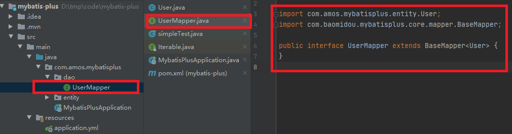

# mybatis-plus快速开始

## 1.准备数据

### 1.1.准备数据库

```sql
DROP TABLE IF EXISTS user;

CREATE TABLE user
(
	id BIGINT(20) NOT NULL COMMENT '主键ID',
	name VARCHAR(30) NULL DEFAULT NULL COMMENT '姓名',
	age INT(11) NULL DEFAULT NULL COMMENT '年龄',
	email VARCHAR(50) NULL DEFAULT NULL COMMENT '邮箱',
	PRIMARY KEY (id)
);
```

添加数据：

```sql
DELETE FROM user;

INSERT INTO user (id, name, age, email) VALUES
(1, 'Jone', 18, 'test1@baomidou.com'),
(2, 'Jack', 20, 'test2@baomidou.com'),
(3, 'Tom', 28, 'test3@baomidou.com'),
(4, 'Sandy', 21, 'test4@baomidou.com'),
(5, 'Billie', 24, 'test5@baomidou.com');
```


## 2.启动一个Spring-boot项目

### 2.1.启动spring-boot项目

略


### 2.2.添加依赖

#### 2.2.1.mybatis-plus依赖

```xml
<dependency>
    <groupId>com.baomidou</groupId>
    <artifactId>mybatis-plus-boot-starter</artifactId>
    <version>3.3.2</version>
</dependency>
```


#### 2.2.2.mysql-连接jar依赖

```xml
<!-- https://mvnrepository.com/artifact/mysql/mysql-connector-java -->
<dependency>
    <groupId>mysql</groupId>
    <artifactId>mysql-connector-java</artifactId>
    <version>8.0.19</version>
</dependency>
```


### 2.3.配置mysql数据库连接信息

打开``application.yml``文件：

```yml
spring:
  datasource:
    driver-class-name: com.mysql.cj.jdbc.Driver
    url: jdbc:mysql://localhost:3306/mp?useSSL=false&serverTimezone=GMT%2B8
    username: root
    password: amos
```


## 2.4.添加注释配置

#### 2.4.1.给application.class添加``@MapperScan``注解

```java
@SpringBootApplication
@MapperScan("com.amos.mybatisplus.mapper")
public class Application {

    public static void main(String[] args) {
        SpringApplication.run(QuickStartApplication.class, args);
    }

}
```


## 2.5.编码测试

### 2.5.1.实现entity

```java
@Data
public class User {
    private Long id;
    private String name;
    private Integer age;
    private String email;
}
```


### 2.5.2.编写Mapper类 `UserMapper.java`




### 2.5.3.编写测试并执行

添加测试类，进行功能测试：

```java
@RunWith(SpringRunner.class)
@SpringBootTest
public class SampleTest {

    @Autowired
    private UserMapper userMapper;

    @Test
    public void testSelect() {
        System.out.println(("----- selectAll method test ------"));
        List<User> userList = userMapper.selectList(null);
        Assert.assertEquals(5, userList.size());
        userList.forEach(System.out::println);
    }

}
```

> UserMapper 中的 `selectList()` 方法的参数为 MP 内置的条件封装器 `Wrapper`，所以不填写就是无任何条件

控制台输出：

```text
User(id=1, name=Jone, age=18, email=test1@baomidou.com)
User(id=2, name=Jack, age=20, email=test2@baomidou.com)
User(id=3, name=Tom, age=28, email=test3@baomidou.com)
User(id=4, name=Sandy, age=21, email=test4@baomidou.com)
User(id=5, name=Billie, age=24, email=test5@baomidou.com)
```