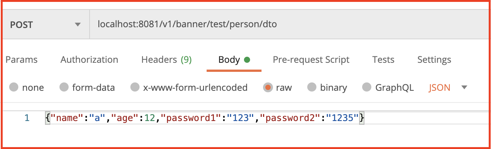

# springboot 接收参数
本篇介绍springboot通过接口接收参数的几种方式：
- 1.URL字段接收
- 2.get方法参数接收
- 3.post方法简单参数接收
- 4.json参数接收

## 01.简单参数获取
- 1.@PathVariable 获取url参数
- 2.@RequestParam 获取普通请求参数

```java
@GetMapping("/demo/{id}")
public void demo(@PathVariable(name = "id") String id, @RequestParam(name = "name") String name) {
    System.out.println("id="+id);
    System.out.println("name="+name);
}
```

实践结果：
GET Request：
```
http://localhost:8080/demo/123?name=suki_rong
```
```
id=123
name=suki_rong
```

## 02.复杂参数获取
- @RequestBody

```java
    @PostMapping("/test/person/dto")
    public void testPersonDTO(@RequestBody PersonDTO personDTO){
        System.out.println(personDTO.toString());
    }
```

实践结果：
POST Request：

