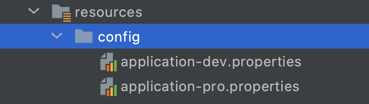
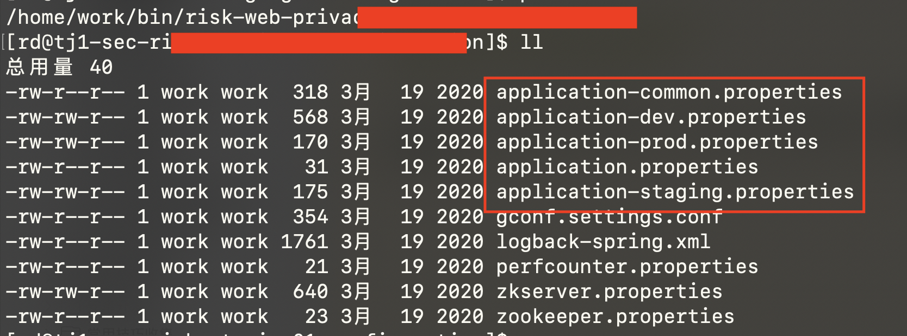
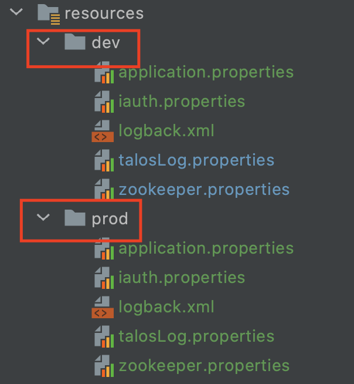

# Maven profile环境变量【maven已更新文档】

需要了解：
- 1.maven基本使用
- 2.pom.xml文件结构
- 3.profiles相关概念

工作开发中我们要面对不同的环境，包括开发环境，测试环境，生产环境等。在不同的环境下需要不同的配置信息(比如，mysql连接的url和用户名密码)。
这时候我们需要使用maven的profiles机制，让项目在不同的环境下启用不同的配置。

```
java -jar -Dspring.profiles.active=prod appeal-0.0.1-SNAPSHOT.jar
```
## 1.现有的问题
现成的解决方案，可以轻松在网上搜索到，大致如下：
- 1.建立不同的application-xxx.properties（xxx对应不同profile的名称）
- 2.在项目编译时使用``mvn clean package -P xxx jar包``来启用不同的profile环境

多个环境配置文件类似如下：


通过以上方法确实解决了 不同环境启用不同配置的需求。但也引入了一些新的问题：
线上打包文件包含所有环境的配置信息，比如staging服务器上的jar包有
```
application-staging.properties
application-prod.properties
```
等多个文件。这引发了安全问题，一个只有staging权限等人员却可以得到prod的配置信息。


## 2.现在提供一个解决上述问题的方案
- 1.这个方案不会引入maven之外的工具和概念
- 2.易于理解

**在build项目时，依据不同的profile使用不同的resources目录**


### 2.1.里程碑一:编写配置文件
建立多个resource目录：
下面示例创建了dev和prod两个目录：


- 1.每个目录下面都有完整的配置文件
- 2.不同目录下面的配置文件对应不同的profile环境
    - dev下面的配置文件在dev-profile启用
    - prod下面的配置文件在prod-profile启用

    
### 2.2.里程碑二:修改pom.xml配置
```xml
<build>
    <resources>
        <resource>
<!--        <directory>src/main/resources/prod</directory>-->
            <directory>${resources.directory}</directory>
            <filtering>true</filtering>
            <includes>
                <include>**/*.properties</include>
                <include>**/*.xml</include>
            </includes>
        </resource>
    </resources>
    ...........
</build>
```
系统启动后，会在``build->resources->directory``配置的目录下读取配置文件，我们这里配置为``${resources.directory}``变量，它会从下面这段配置中取值：

```xml
<profiles>
    <profile>
        <id>dev</id>
        <activation>
            <property>
                <name>dev</name>
            </property>
        </activation>
        <properties>
            <profiles.active>dev</profiles.active>
            <resources.directory>src/main/resources/dev</resources.directory>
        </properties>
    </profile>
    <profile>
        <id>prod</id>
        <activation>
            <property>
                <name>prod</name>
            </property>
            <activeByDefault>true</activeByDefault>
        </activation>
        <properties>
            <profiles.active>prod</profiles.active>
            <resources.directory>src/main/resources/prod</resources.directory>
        </properties>
    </profile>
</profiles>
```
在上面的profiles配置中，根据不同的profile，<resources.directory>会有不同的值。

### 2.3.里程碑三:编译启动项目
使用命令：
```sh
mvn clean -U package -P prod -Dmaven.test.skip=true
mvn clean -U package -P dev -Dmaven.test.skip=true
```
打包出来的jar不会包含其他环境的配置文件，实现了我们的需求。