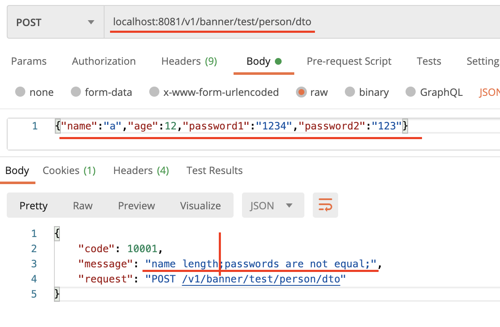

# 用户输入的校验
做web项目，用户输入的校验其重要性不做过多讨论，本文只介绍springboot项目实现数据校验的实践方法。
```xml
<dependency>
    <groupId>org.springframework.boot</groupId>
    <artifactId>spring-boot-starter-validation</artifactId>
</dependency>
```

## 01.开启用户校验``@Validated``
``org.springframework.validation.annotation.Validated``
我们使用注解``@Validated``来开启校验。如果没有加入这个注解，参数校验是不会生效的。

```java
@PostMapping("/test/person/dto")
public void testPersonDTO(@Validated @RequestBody PersonDTO personDTO){
    System.out.println(personDTO.toString());
}
```
上面的代码中使用``@Validated``开启了参数``personDTO``的校验。使得``personDTO``下面的验证注解可以开始工作。

```java
@PasswordEqual
public class PersonDTO {
    @Length(min=2, max=10, message = "name length")
    private String name;
    private Integer age;
    private String password1;
    private String password2;
}
```
上面的PeronDTO有两项校验，分别是``String name``的长度校验，还有``@PasswordEqual``的自定义校验。
下面使用postman测试这两个校验，发现两项校验都生效：


## 02.启用级联校验``@Valid``
``javax.validation.Valid;``
如果我们都PersonDTO比较复杂，下面还有嵌套的子模块：
```java
@PasswordEqual
public class PersonDTO {
    @Length(min=2, max=10, message = "name length")
    private String name;
    private Integer age;
    private String password1;
    private String password2;

    private SchoolDTO schoolDTO;
}

public class SchoolDTO {
    @Length(max = 5)
    private String name;
}
```
此时，SchoolDTO的校验是不生效的，如果我们希望SchoolDTO的校验也生效，需要使用级联校验开关：
```java
@PasswordEqual
public class PersonDTO {
    @Length(min=2, max=10, message = "name length")
    private String name;
    private Integer age;
    private String password1;
    private String password2;

    @Valid
    private SchoolDTO schoolDTO;
}
```

## 03.注解举例

约束注解	详细信息
@Null	被注释的元素必须为 null
@NotNull	被注释的元素必须不为 null
@Min(value)	被注释的元素必须是一个数字，其值必须大于等于指定的最小值
@Max(value)	被注释的元素必须是一个数字，其值必须小于等于指定的最大值
@Size(max, min)	被注释的元素的大小必须在指定的范围内
@Email	被注释的元素必须是电子邮箱地址
@Length	被注释的字符串的大小必须在指定的范围内
@NotEmpty	被注释的字符串的必须非空
@Range	被注释的元素必须在合适的范围内
@Positive	数字，正数
@PositiveOrZero	数字，正数或0
@Negative	数字，负数
@NegativeOrZero	数字，负数或0

## 04.实现自定义注解
介绍自定义注解@PasswordEqual的实现方式。
@PasswordEqual的功能是检查字段password1和password2的值是否相同。

### 4.1.实现@PasswordEqual注解
```java
@Documented
@Retention(RetentionPolicy.RUNTIME)
@Target(ElementType.TYPE)
@Constraint(validatedBy = PasswordValidator.class)
public @interface PasswordEqual {
    int min() default 4;

    int max() default 6;

    String message() default "passwords are not equal";
    Class<?>[] groups() default {};
    Class<? extends Payload>[] payload() default {};
}
```
- ``@Target``表示这个注解的作用对象
    - 1.``ElementType.TYPE``指``class`
    - 2.``ElementType.FIELD``指字段
    - 3.``ElementType.METHOD``指方法
- @Constraint中指明注解逻辑实现的类
    - 1.上面的类指实现逻辑是``PasswordValidator``类

    
### 4.2.``PasswordValidator``

```java
public class PasswordValidator implements ConstraintValidator<PasswordEqual, PersonDTO> {
    private int min;
    private int max;
    @Override
    public void initialize(PasswordEqual constraintAnnotation) {
        this.min = constraintAnnotation.min();
        this.max = constraintAnnotation.max();
    }
    @Override
    public boolean isValid(PersonDTO personDTO, ConstraintValidatorContext constraintValidatorContext) {
        String password1 = personDTO.getPassword1();
        String password2 = personDTO.getPassword2();
        return password1.equals(password2);
    }
}
```