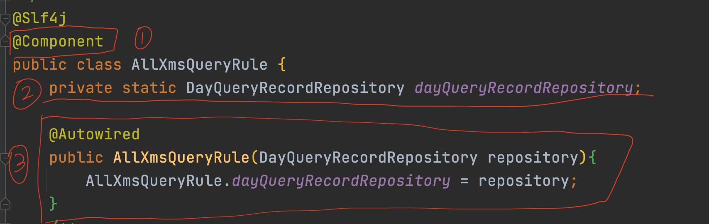

# 静态注入

# 条件注入
满足以下几个情况下条件注入才有意义：
- 1.一个抽象的实现有多个
- 2.我们只需要使用其中一个

条件注入解决的问题是：通过条件筛选我们需要注入的实例。

## 1.条件注解
下面介绍一些常用的条件注入注解。
因为springboot已经实现了这些逻辑，所以我们只需要拿来使用就可以，不需要自己实现，而使用的方式就是注解。

### 1.1.@ConditionalOnProperty
通过配置文件的配置实现条件注解。
```java
@Component
@ConditionalOnProperty(value = "hero.name", havingValue = "irelia", matchIfMissing = true)
public class Irelia implements ISkill {
    public void q(){
        System.out.println("Irelia q");
    }
    public void w(){
        System.out.println("Irelia w");
    }
    public void e(){
        System.out.println("Irelia e");
    }
    public void r(){
        System.out.println("Irelia r");
    }
}
```
- 1.value 从默认的``application.properties``文件读取
- 2.havingValue 的值和value相等才注入容器
- 3.matchIfMissing 当配置文件找不到正确的配置项时，会默认注入这个对象

### 1.2.@ConditionalOnBean

### 1.3.其他成品条件注解
```java
@ConditionalOnClass
@ConditionalOnExpression         // 基于SpEl表达式
@ConditionalOnJava               // 基于java版本
@ConditionalOnJndi               // 基于JNDI存在时查找制定位置
@ConditionalOnMissingBean        // 当SpringIOS容器中不存在指定Bean
@ConditionalOnMissingClass       // 当SpringIOS容器不存在指定Class
@ConditionalOnNotWebApplication  // 当前项目不是web项目
@ConditionalOnResource           // 类路径是否有指定的值
@ConditionalOnSingleCandidate    // 
@ConditionalOnWebApplication    //
```

## 自定义条件
当springboot现有的条件注解不能满足我们的业务时，才需要使用自定义条件注解，但这种情况很少。除非我们自己写框架可能用到。
### 目标bean
```java
public class Camille implements ISkill {
    public void q(){
        System.out.println("Camille q");
    }
    public void w(){
        System.out.println("Camille w");
    }
    public void e(){
        System.out.println("Camille e");
    }
    public void r(){
        System.out.println("Camille r");
    }
}
```

### 通过configuration加入容器
```java
@Configuration
public class Configuration {

    @Bean
    @Conditional(com.amos.simple.selectinject.condition.Conditional.class)
    public ISkill camille(){
        return new Camille();
    }
}
```

### 自定义conditional
```java
public class Conditional implements Condition {
    @Override
    public boolean matches(ConditionContext context, AnnotatedTypeMetadata metadata) {
        String name = context.getEnvironment().getProperty("hero.name");
        return "camille".equalsIgnoreCase(name);
    }
}
```

### 在application.properties文件中
```properties
hero.name = "camille"
```