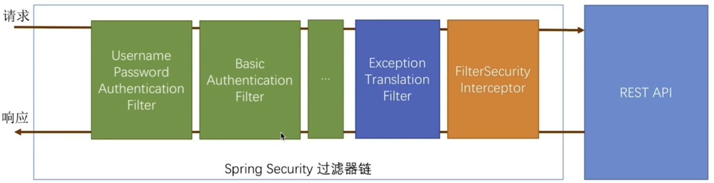

# SpringSecurity基本原理

## 基础概念

### 1.认证和授权
认证 常见为登录行为，是在证明你是谁
授权 确定你能访问哪些服务

### 2.SpringSecurity认证授权原理


- 1.绿色部分可以通过配置让哪个或哪些**认证**过滤器生效
- 2.橘黄色谁授权过滤器链，判断访问是否有权限
- 3.蓝色过滤器用来处理 被判断为无权限状态时 要采取的策略


## SpringSecurity基本环境

```xml
<dependency>
    <groupId>org.springframework.boot</groupId>
    <artifactId>spring-boot-starter-security</artifactId>
</dependency>
```

```java
package com.example.simple2.config;

import org.springframework.context.annotation.Configuration;
import org.springframework.security.config.annotation.web.builders.HttpSecurity;
import org.springframework.security.config.annotation.web.configuration.WebSecurityConfigurerAdapter;

@Configuration
public class SecurityConfig extends WebSecurityConfigurerAdapter {
    protected void configure(HttpSecurity http) throws Exception {
        http.formLogin()
                .and()
                .authorizeRequests()
                .anyRequest()
                .authenticated();
    }
}
```
上面的代码基本实现了一个认证逻辑
- 1.formLogin表示表单登录
- 2.anyRequest表示所有Api都需要认证