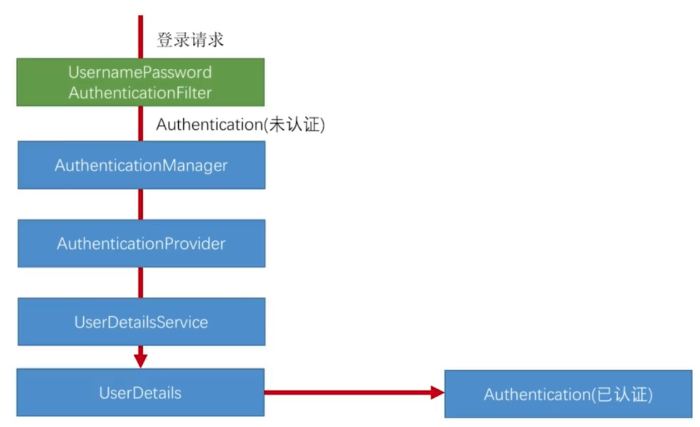

# 授权认证简单demo和原理

## 表单认证授权demo

```java
@Configuration
public class SecurityConfig extends WebSecurityConfigurerAdapter {
    protected void configure(HttpSecurity http) throws Exception {
        http.formLogin()
                .and()
                .authorizeRequests()
                .anyRequest()
                .authenticated();
    }
}
```
```java
import lombok.extern.slf4j.Slf4j;
import org.springframework.beans.factory.annotation.Autowired;
import org.springframework.context.annotation.Bean;
import org.springframework.security.core.authority.AuthorityUtils;
import org.springframework.security.core.userdetails.User;
import org.springframework.security.core.userdetails.UserDetails;
import org.springframework.security.core.userdetails.UserDetailsService;
import org.springframework.security.core.userdetails.UsernameNotFoundException;
import org.springframework.security.crypto.bcrypt.BCryptPasswordEncoder;
import org.springframework.security.crypto.password.PasswordEncoder;
import org.springframework.stereotype.Component;

@Component
@Slf4j
public class MyUserDetailsService implements UserDetailsService {
    @Autowired
    private PasswordEncoder passwordEncoder;
    @Bean
    public PasswordEncoder passwordEncoder() {
        return new BCryptPasswordEncoder();
    }
    @Override
    public UserDetails loadUserByUsername(String username) throws UsernameNotFoundException {
        log.info("login: {}", username);
        User user = new User(username, passwordEncoder.encode("123456"), AuthorityUtils.commaSeparatedStringToAuthorityList("admin"));
        return user;
    }
}
```

### 1.UserDetails
认证授权在上面的逻辑有些交融。
注意UserDetails类，我们需要返回这个累告诉SpringSecurity是否认证授权成功。
```java
public User(String username, String password, Collection<? extends GrantedAuthority> authorities) {
	this(username, password, true, true, true, true, authorities);
}
```
- username 是用户输入的用户名
- password 是我们存储容器保存这个加密密码(demo为了简便 现场加密)
- authorities 表示这个用户的授权

## 个性化用户认证流程

### 1.自定义登录成功
实现AuthenticationSuccessHandler接口
```java
@Component
@Slf4j
public class RiskAuthenticationSuccessHandler implements AuthenticationSuccessHandler {
    @Override
    public void onAuthenticationSuccess(HttpServletRequest httpServletRequest, HttpServletResponse httpServletResponse, Authentication authentication)
            throws IOException, ServletException {
        String str = authentication.getPrincipal().toString();
        log.info("cookie: {}", str);
        Cookie cookie = new Cookie("username", str);
        cookie.setPath("/");
        httpServletResponse.addCookie(cookie);
    }
}
```
<hr>

配置自己实现的AuthenticationSuccessHandler
```java
@Configuration
public class SecurityConfig extends WebSecurityConfigurerAdapter {
    @Autowired
    private RiskAuthenticationSuccessHandler successHandler;
    protected void configure(HttpSecurity http) throws Exception {
        http.formLogin()
                .successHandler(successHandler)
                .and()
                .authorizeRequests()
                .anyRequest()
                .authenticated()
                .and()
                .csrf().disable();
    }
}
```

## SpringSecurity原理


- filter是下方过程的封装
- 验证逻辑在Provider中
- UserDetails就是我们熟悉的认证结果