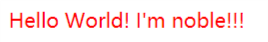
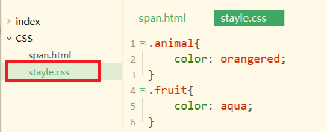
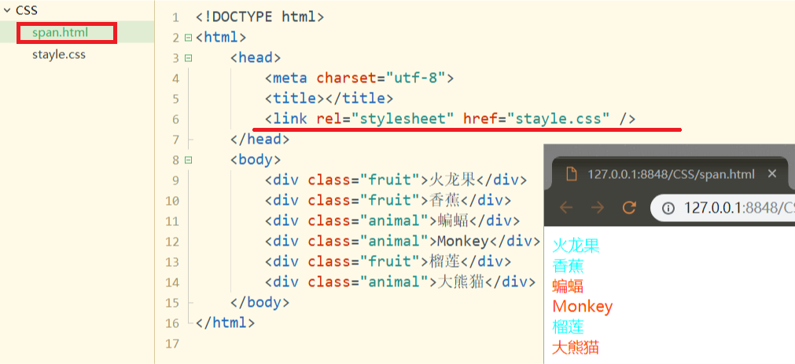
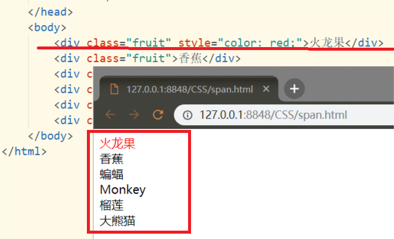
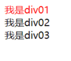
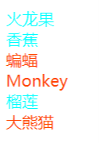

# CSS
## 1.简述
CSS其功能是对HTML页面美化,以及HTML页面元素杂乱而修改困难的情况.<br>
CSS其中最重要的工具之一:选择器,将目标元素(标签)选出,添加"样式"来达到美化页面和修改页面的目的<br>
实例:<br>
```html
<!DOCTYPE html>
<html>
	<head>
		<meta charset="utf-8">
		<title></title>
		<style>
			span{
				color: red;
			}
		</style>
	</head>
	<body>
		<span>Hello World!</span>
		<span>I'm noble!!!</span>
	</body>
</html>
```
运行结果:<br>
<br>

## 2.div标签
div是一个定位技术.<br>
### 2.1.div溢出
如果div里包裹的内容超出了div标签设置的边界.我们可以有以下处理方式:<br>
```css
/*overflow 的属性设置*/
visible   /* 默认值.内容不会被修剪, 会呈现在元素框之外 */
hidden    /* 超出的部分被隐藏 */
scroll    /* 不论是否需要,都显示滚动条 */
auto      /* 按需显示滚动条以便查看其余的内容 */
```

## 3.CSS的引入

CSS引入的方式主要有三种:<br>

- 1.外部引用
- 2.内部引用
- 3.行内引用

之前的案例中都采用内部引用的方式<br>

### 3.1.CSS外部引用

通过``link``标签引入一个外部文件<br>
**里程碑一**
新建一个``stayle.css``结尾的文件,将以下样式放入该文件<br>

```css
.animal{
	color: orangered;
}
.fruit{
	color: aqua;
}
```

如下图:<br>
<br>

**里程碑二**
在``span.html``文件中引用``stayle.css``的样式:<br>

```html
<!DOCTYPE html>
<html>
	<head>
		<meta charset="utf-8">
		<title></title>
		<link rel="stylesheet" href="stayle.css" />
	</head>
	<body>
		<div class="fruit">火龙果</div>
		<div class="fruit">香蕉</div>
		<div class="animal">蝙蝠</div>
		<div class="animal">Monkey</div>
		<div class="fruit">榴莲</div>
		<div class="animal">大熊猫</div>
	</body>
</html>
```

<br>

### 3.2.内部引用

见之前的案例<br>

### 3.3.行内应用

在``div``标签和``span``标签中引用``stayle``属性<br>
示例:<br>

```html
<!DOCTYPE html>
<html>
	<head>
		<meta charset="utf-8">
		<title></title>
	</head>
	<body>
		<div class="fruit" style="color: red;">火龙果</div>
		<div class="fruit">香蕉</div>
		<div class="animal">蝙蝠</div>
		<div class="animal">Monkey</div>
		<div class="fruit">榴莲</div>
		<div class="animal">大熊猫</div>
	</body>
</html>
```

<br>

## 4.选择器

真如之前所述,选择器时CSS实现其价值的有力工具,下面介绍一些常用的CSS选择器.<br>
- 1.元素选择器
- 2.类选择器
- 3.ID选择器
- 4.属性选择器

他们的优先级依次增高.<br>

### 4.1.元素选择器
简述中使用的示例就是元素选择器,在``<style>``标签中写下目标元素的名称(如:span)在后面的大括号``{}``中写入加入的CSS样式.<br>
```
元素的名称{
    属性名称:属性值;
    属性名称:属性值;
}
```

```html
<!DOCTYPE html>
<html>
	<head>
		<meta charset="utf-8">
		<title></title>
		<style>
			span{
				color: red;
			}
		</style>
	</head>
	<body>
		<span>Hello World!</span>
		<span>I'm noble!!!</span>
	</body>
</html>
```

### 4.2.ID选择器
```
ID在整个页面中必须唯一
#ID的名称{
    属性名称:属性值;
    属性名称:属性值;
}
```
使用ID选择器可以避免影响全局的元素.<br>
示例:<br>
```html
<!DOCTYPE html>
<html>
	<head>
		<meta charset="utf-8">
		<title></title>
		<style type="text/css">
			#div01{
				color: red;
			}
		</style>
	</head>
	<body>
		<div id="div01">我是div01</div>
		<div id="div02">我是div02</div>
		<div id="div03">我是div03</div>
	</body>
</html>
```
<br>

### 4.3类选择器
```
以.开头
.类的名称{
    属性名称: 属性值;
    属性名称: 属性值;
}
```

示例:<br>
```html
<!DOCTYPE html>
<html>
	<head>
		<meta charset="utf-8">
		<title></title>
		<style type="text/css">
			.animal{
				color: orangered;
			}
			.fruit{
				color: aqua;
			}
		</style>
	</head>
	<body>
		<div class="fruit">火龙果</div>
		<div class="fruit">香蕉</div>
		<div class="animal">蝙蝠</div>
		<div class="animal">Monkey</div>
		<div class="fruit">榴莲</div>
		<div class="animal">大熊猫</div>
	</body>
</html>
```
<br>

### 4.4.属性选择器
```
用中括号包裹属性名称
[属性名称]{
	属性名称: 属性值;
    属性名称: 属性值;
}
```
```html
[title]{
	color: lightgray;
}
```

### 4.5.伪类选择器

A CSS **pseudo-class** is a keyword added to a selector that specifies a special state of the selected element(s).For example, [`:hover`](https://developer.mozilla.org/en-US/docs/Web/CSS/:hover) can be used to change a button's color when the user's pointer hovers over it.

伪类是加在一般选择器上的关键词，它可以指定选择器一个特殊状态。比如``:hover``可以当用户的鼠标悬浮在目标``button``上时可以用来改变当时的``button``颜色。

下面用``<a>``标签做演示：

```html
<style>
    a:link{               //a标签本身的颜色
        color: lightblue;
    }
    a:hover{              //悬浮
        color: lightcoral;
    }
    a:active{            //激活(鼠标点击但不松开)
        color: lightgreen;
    }
    a:visited{           //访问过后
        color: lightgray;
    }
</style>
```

**伪类标签如下**：

- [`:active`](https://developer.mozilla.org/en-US/docs/Web/CSS/:active)
- [`:any-link`](https://developer.mozilla.org/en-US/docs/Web/CSS/:any-link) 
- [`:blank`](https://developer.mozilla.org/en-US/docs/Web/CSS/:blank) 
- [`:checked`](https://developer.mozilla.org/en-US/docs/Web/CSS/:checked)
- `:current` 
- [`:default`](https://developer.mozilla.org/en-US/docs/Web/CSS/:default)
- [`:defined`](https://developer.mozilla.org/en-US/docs/Web/CSS/:defined)
- [`:dir()`](https://developer.mozilla.org/en-US/docs/Web/CSS/:dir) 
- [`:disabled`](https://developer.mozilla.org/en-US/docs/Web/CSS/:disabled)
- `:drop` 
- [`:empty`](https://developer.mozilla.org/en-US/docs/Web/CSS/:empty)
- [`:enabled`](https://developer.mozilla.org/en-US/docs/Web/CSS/:enabled)
- [`:first`](https://developer.mozilla.org/en-US/docs/Web/CSS/:first)
- [`:first-child`](https://developer.mozilla.org/en-US/docs/Web/CSS/:first-child)
- [`:first-of-type`](https://developer.mozilla.org/en-US/docs/Web/CSS/:first-of-type)
- [`:fullscreen`](https://developer.mozilla.org/en-US/docs/Web/CSS/:fullscreen) 
- `:future` 
- [`:focus`](https://developer.mozilla.org/en-US/docs/Web/CSS/:focus)
- [`:focus-visible`](https://developer.mozilla.org/en-US/docs/Web/CSS/:focus-visible) 
- [`:focus-within`](https://developer.mozilla.org/en-US/docs/Web/CSS/:focus-within)
- [`:has()`](https://developer.mozilla.org/en-US/docs/Web/CSS/:has) 
- [`:host`](https://developer.mozilla.org/en-US/docs/Web/CSS/:host)
- [`:host()`](https://developer.mozilla.org/en-US/docs/Web/CSS/:host())
- [`:host-context()`](https://developer.mozilla.org/en-US/docs/Web/CSS/:host-context()) 
- [`:hover`](https://developer.mozilla.org/en-US/docs/Web/CSS/:hover)
- [`:indeterminate`](https://developer.mozilla.org/en-US/docs/Web/CSS/:indeterminate)
- [`:in-range`](https://developer.mozilla.org/en-US/docs/Web/CSS/:in-range)
- [`:invalid`](https://developer.mozilla.org/en-US/docs/Web/CSS/:invalid)
- [`:is()`](https://developer.mozilla.org/en-US/docs/Web/CSS/:is) 
- [`:lang()`](https://developer.mozilla.org/en-US/docs/Web/CSS/:lang)
- [`:last-child`](https://developer.mozilla.org/en-US/docs/Web/CSS/:last-child)
- [`:last-of-type`](https://developer.mozilla.org/en-US/docs/Web/CSS/:last-of-type)
- [`:left`](https://developer.mozilla.org/en-US/docs/Web/CSS/:left)
- [`:link`](https://developer.mozilla.org/en-US/docs/Web/CSS/:link)
- `:local-link` 
- [`:not()`](https://developer.mozilla.org/en-US/docs/Web/CSS/:not)
- [`:nth-child()`](https://developer.mozilla.org/en-US/docs/Web/CSS/:nth-child)
- `:nth-col()` 
- [`:nth-last-child()`](https://developer.mozilla.org/en-US/docs/Web/CSS/:nth-last-child)
- `:nth-last-col()` 
- [`:nth-last-of-type()`](https://developer.mozilla.org/en-US/docs/Web/CSS/:nth-last-of-type)
- [`:nth-of-type()`](https://developer.mozilla.org/en-US/docs/Web/CSS/:nth-of-type)
- [`:only-child`](https://developer.mozilla.org/en-US/docs/Web/CSS/:only-child)
- [`:only-of-type`](https://developer.mozilla.org/en-US/docs/Web/CSS/:only-of-type)
- [`:optional`](https://developer.mozilla.org/en-US/docs/Web/CSS/:optional)
- [`:out-of-range`](https://developer.mozilla.org/en-US/docs/Web/CSS/:out-of-range)
- `:past` 
- [`:placeholder-shown`](https://developer.mozilla.org/en-US/docs/Web/CSS/:placeholder-shown) 
- [`:read-only`](https://developer.mozilla.org/en-US/docs/Web/CSS/:read-only)
- [`:read-write`](https://developer.mozilla.org/en-US/docs/Web/CSS/:read-write)
- [`:required`](https://developer.mozilla.org/en-US/docs/Web/CSS/:required)
- [`:right`](https://developer.mozilla.org/en-US/docs/Web/CSS/:right)
- [`:root`](https://developer.mozilla.org/en-US/docs/Web/CSS/:root)
- [`:scope`](https://developer.mozilla.org/en-US/docs/Web/CSS/:scope)
- [`:target`](https://developer.mozilla.org/en-US/docs/Web/CSS/:target)
- `:target-within` 
- `:user-invalid` 
- [`:valid`](https://developer.mozilla.org/en-US/docs/Web/CSS/:valid)
- [`:visited`](https://developer.mozilla.org/en-US/docs/Web/CSS/:visited)
- [`:where()`](https://developer.mozilla.org/en-US/docs/Web/CSS/:where) 


### 4.5选择器的优先级

行内style>ID选择器>类选择器>元素选择器<br>
当一个元素有多个类名时,则类选择器之间按就近原则确定优先级.<br>

