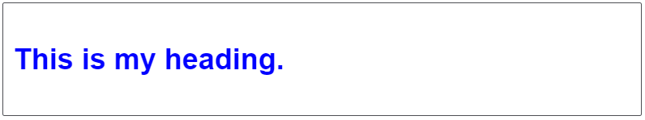
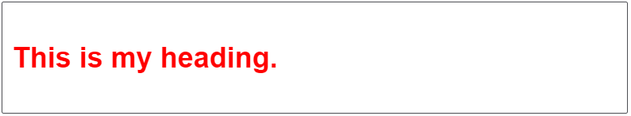
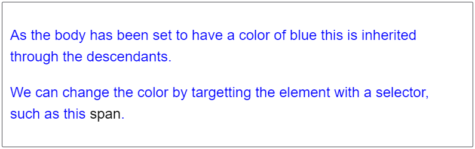
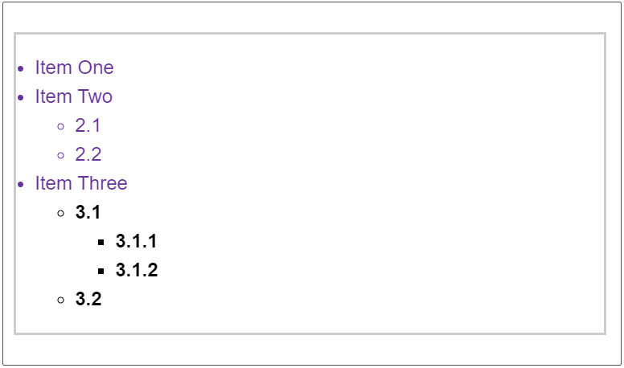
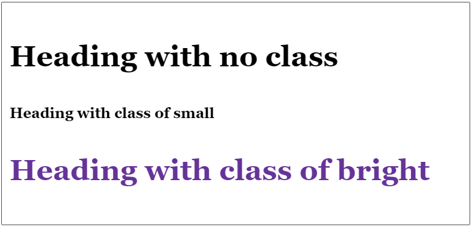

# CSS级联和继承

[原文链接developer.mozilla.org](https://developer.mozilla.org/zh-CN/docs/Learn/CSS/Building_blocks/Cascade_and_inheritance)

加深对CSS的一些最基本概念（级联，特异性和继承）的理解，这些概念控制CSS如何应用于HTML以及如何解决冲突。

与本课程的其他部分相比，本课程的学习似乎没有那么直接的相关性，而且学术性更高，但是对这些内容的理解将为您以后减轻很多痛苦！我们鼓励您仔细阅读本节，并在继续进行之前检查并了解概念。

## 1.层叠继承基本概念介绍

### 1.1.层叠

Stylesheets **cascade（样式表层叠）** — 简单的说，``css``规则的顺序很重要；当应用两条同级别的规则到一个元素的时候，写在后面的就是实际使用的规则。

下面的例子中，我们有两个关于 `h1` 的规则。`h1` 最后显示蓝色 — 这些规则有相同的优先级，所以顺序在最后的生效。



```css
h1 { 
	color: red; 
}
h1 { 
    color: blue; 
}
<h1>This is my heading.</h1>
```

### 1.2.优先级

浏览器根据选择器的优先级决定使用哪种样式。

类选择器比元素选择器更具体，所以类选择器优先级高，如下实例：



```css
.main-heading { 
    color: red; 
}
        
h1 { 
    color: blue; 
}
<h1 class="main-heading">This is my heading.</h1>
```

### 1.3.继承

继承也需要在上下文中去理解 —— 一些设置在父元素上的css属性是可以被子元素继承的，有些则不能。

举一个例子，如果你设置一个元素的 `color` 和 `font-family` ，每个在里面的元素也都会有相同的属性，除非你直接在元素上设置属性。



```css
body {
    color: blue;
}
span {
    color: black;
}
<p>As the body has been set to have a color of blue this is inherited through the descendants.</p>
<p>We can change the color by targetting the element with a selector, such as this <span>span</span>.</p>
```

一些属性是不能继承的 — 举个例子如果你在一个元素上设置 [`width`](https://developer.mozilla.org/zh-CN/docs/Web/CSS/width) 50% ，所有的后代不会是父元素的宽度的50% 。如果这个也可以继承的话，CSS就会很难使用了!


## 2.理解它们如何协同工作

这三个概念一起来控制css规则应用于哪个元素；在下面的内容中，我们将看到它们是如何协同工作的。有时候会感觉有些复杂，但是当你对css有更多经验的时候，你就可以记住它们，即便忘记了细节，可以在网上查到，有经验的开发人员也不会记得所有细节。


### 2.1.理解继承

我们从继承开始。下面的例子中我们有一个`ul`，里面有两个无序列表。我们已经给 ``<ul>`` 设置了 **border**， **padding** 和 **font color**.

**color** 应用在直接子元素，也影响其他后代 — 直接子元素``<li>``，和第一个嵌套列表中的子项。然后添加了一个 `special` 类到第二个嵌套列表其中使用了不同的颜色。然后通过它的子元素继承。



```css
.main {
    color: rebeccapurple;
    border: 2px solid #ccc;
    padding: 1em;
}

.special {
    color: black;
    font-weight: bold;
}

<ul class="main">
    <li>Item One</li>
    <li>Item Two
        <ul>
            <li>2.1</li>
            <li>2.2</li>
        </ul>
    </li>
    <li>Item Three
        <ul class="special">
            <li>3.1
                <ul>
                    <li>3.1.1</li>
                    <li>3.1.2</li>
                </ul>
            </li>
            <li>3.2</li>
        </ul>
    </li>
</ul>
```

像 widths (上面提到的), margins, padding, 和 borders 不会被继承。如果borders可以被继承，每个列表和列表项都会获得一个边框 — 可能就不是我们想要的结果!

哪些属性属于默认继承很大程度上是由常识决定的。

### 2.2.控制继承

CSS 为控制继承提供了四个特殊的通用属性值。每个css属性都接收这些值。

- inherit：设置该属性会使子元素属性和父元素相同。实际上，就是 "开启继承".
- initial：设置属性值和浏览器默认样式相同。如果浏览器默认样式中未设置且该属性是自然继承的，那么会设置为 `inherit` 。
- unset：将属性重置为自然值，也就是如果属性是自然继承那么就是 `inherit`，否则和 `initial`一样

> **注**: 还有一个新的属性, `revert`， 只有很少的浏览器支持。

下面的例子你可以通过修改css来查看它们的功能:

### 2.3.理解层叠

我们现在明白了为什么嵌套在html结构中的段落和应用于正文中的css颜色相同，从入门课程中，我们了解了如何将文档中的任何修改应用于某个对象的css，无论是把css指定某个元素还是创建一个类。现在，我们将要了解层叠如何定义在不止一个元素的时候怎么应用css规则。

有三个因素需要考虑，根据重要性排序如下，前面的更重要：

- 1.重要程度
- 2.重要程度
- 3.资源顺序

我们从下往上，看看浏览器是如何决定该应用哪个css规则的。

#### 2.3.1.资源顺序

我们已经看到了顺序对于层叠的重要性。如果你有超过一条规则，而且都是相同的权重，那么最后面的规则会应用。可以理解为后面的规则覆盖前面的规则，直到最后一个开始设置样式。

#### 2.3.2.优先级

在你了解了顺序的重要性后，会发现在一些情况下，有些规则在最后出现，但是却应用了前面的规则。这是因为前面的有更高的**优先级** — 它范围更小，因此浏览器就把它选择为元素的样式。

就像前面看到的，类选择器的权重大于元素选择器，因此类上定义的属性将覆盖应用于元素上的属性。

这里需要注意虽然我们考虑的是选择器，以及应用在选中对象上的规则，但不会覆盖所有规则，只有相同的属性。

这样可以避免重复的 CSS。一种常见的做法是给基本元素定义通用样式，然后给不同的元素创建对应的类。举个例子，在下面的样式中我给2级标题定义了通用样式，然后创建了一些类只修改部分属性的值。最初定义的值应用于所有标题，然后更具体的值通过对应类来实现。



```css
h2 {
    font-size: 2em;
    color: #000;
    font-family: Georgia, 'Times New Roman', Times, serif;
}
        
.small {
    font-size: 1em;
}
        
.bright {
    color: rebeccapurple;
}
<h2>Heading with no class</h2>
<h2 class="small">Heading with class of small</h2>
<h2 class="bright">Heading with class of bright</h2>
```

