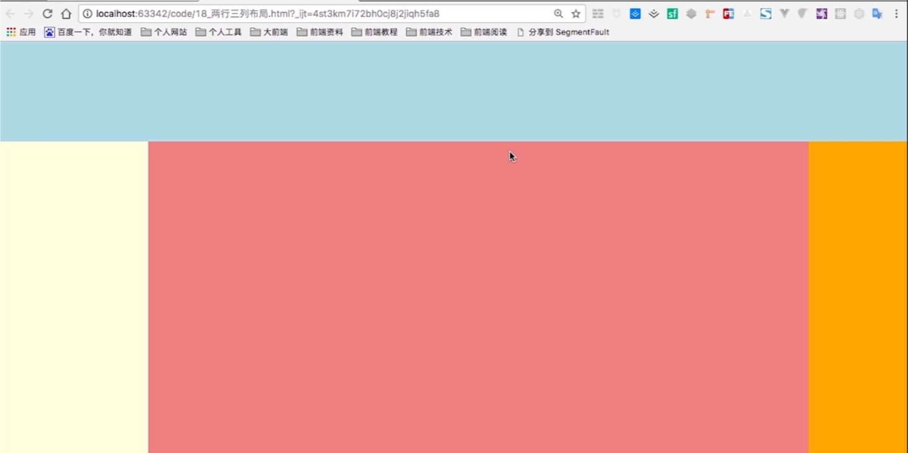

# CSS布局与盒子模型

## 1.CSS布局
**CSS常见布局**<br>
- 1.两行三列布局
- 2.三行两列布局

### 1.1.两行三列布局
非常常用的布局方式之一<br>
**布局效果如下**<br>
<br>

```html
	<style>
		html, body {
			margin: 0px;                /* 将外边距设置为0 */
		}
		header {
			background-color: lightblue;
			height: 150px;
		}
		#container {
			background-color: lightgray;
			height: 700px;
		}
		nav {
			background-color: lightcoral;
			height: 100%;
			width: 150px;
			float: left;
		}
		aside {
			background-color: lightgreen;
			height: 100%;
			width: 100px;
			float: right;
		}
	</style>
<body>
<header></header>
<div id="container">
	<nav></nav>
	<aside></aside>
	<article></article>
</div>
</body>
```

### 1.2.三行两列布局
非常常用的布局方式之一<br>
**布局效果如下**<br>
<br>

## 2.盒子模型
<br>

### 2.1.边框属性
```css
border        /* 简写属性,用于把针对四个边的属性设置在一个声明 */
border-style  /* 用于设置元素所有边框的样式,或者但对地为各边设置边框样式 */
border-width  /* 用于为元素的所有边框设置宽度,或者单独地为各边边框设置宽度 */
border-color  /* 设置元素的所有边框中可见部分的颜色,或为4个边分别设置颜色 */
```

### 2.2.内边距
```css
padding         /* 使用缩写属性设置在一个声明中的所有填充属性 */
padding-bottom  /* 设置元素的底部填充 */
padding-left    /* 设置元素的左部填充 */
padding-right   /* 设置元素的右部填充 */
padding-top     /* 设置元素的顶部填充 */
```

#### 2.2.1.内边距的属性
我们添加内边距的空间是从什么地方获得的?<br>
有两种方式,一是边界向外衍生,二是不衍生<br>
```css
box-sizing: border-box;  //不衍生
box-sizing: content-box; //向外衍生,默认
```

### 2.3.外边距
```css
margin           /* 简写属性.在一个声明中设置所有外边距属性 */
margin-bottom    /* 设置元素的下外边距 */
margin-left      /* 设置元素的左外边距 */
margin-right     /* 设置元素的右外边距 */
margin-top       /* 设置元素的上外边距 */
```