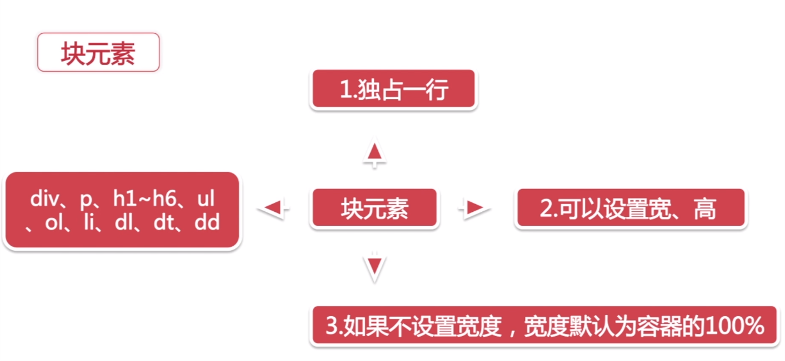
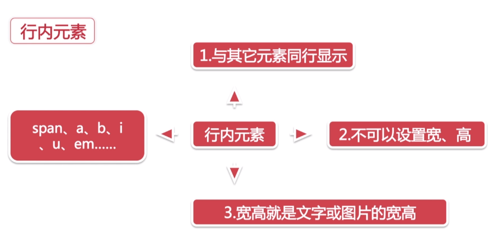
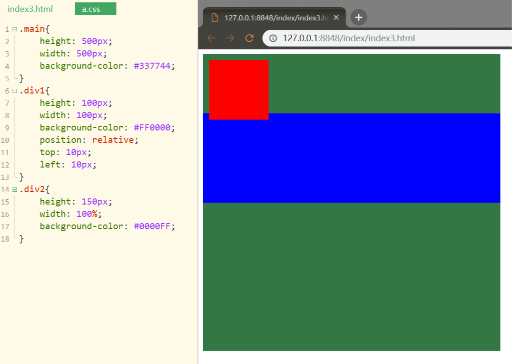
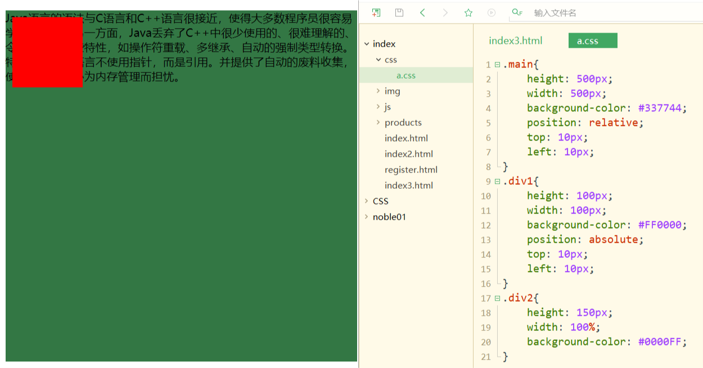
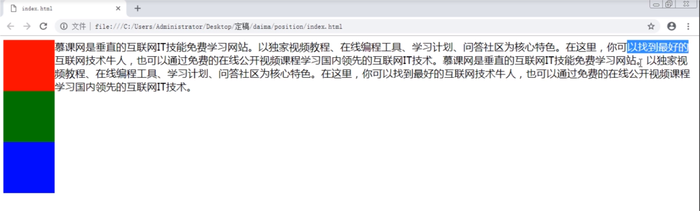
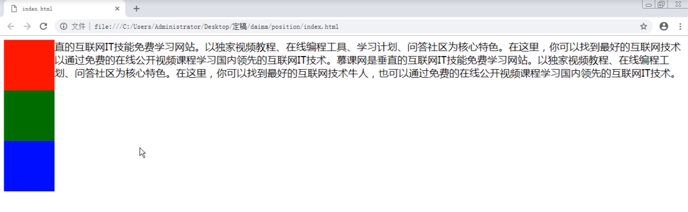

# CSS浮动和定位

## 1.HTML基本知识(浮动定位相关)

### 1.1.HTML排版方式 - 普通流(标准流)
默认状态,元素自动从左往右,从上往下排列.<br>


### 1.2.元素特征

#### 1.2.1.块元素
<br>

#### 1.2.2.行内元素
<br>

## 2.CSS Float(浮动)

### 2.1.CSS Float(浮动)的基础知识
- 1.会使元素向左移或向右移,只能左右,不能上下.
- 2.浮动元素碰到包含框或另一个浮动框,浮动停止
- 3.浮动元素之后的元素将围绕它,之前的不受影响
- 4.浮动元素会脱离标准流

```css
float: left;
float: right;
float: none;
float: inherit; /* 继承上级标签的浮动 */
```

### 2.2.清除浮动
```css
clear: left;
clear: right;
clear: both;
clear: inherit;
```

### 2.3.清除浮动的常用方法
#### 2.3.1.方法一
```css
.clearfix:after{
    content:".";
    display:block;
    height:0;
    visibility:hidden;
    clear:both;
}
.clearfix{*zoom:1;/* 触发hasLayout兼容IE 6,7 */}
```
clearfix加到要被清除浮动的父级标签中<br>

#### 2.3.2.方法二
在父级元素添加:<br>
```css
overflow: hidden;
zoom:1;
```

## 3.CSS定位
```css
position: (relative|absolute|static|fixed)   /* (相对|绝对|无定位|固定) */
```

### 3.1.相对定位
```css
position: relative;
top: 10px;
left: 10px;
```
**相对定位的偏移参考元素是元素本身,不会使元素脱离文档流**<br>
**元素的初始位置占据的空间会被保留.**<br>

实例演示:<br>
```html
<!DOCTYPE html>
<html>
	<head>
		<meta charset="utf-8">
		<title></title>
		<link rel="stylesheet" type="text/css" href="./css/a.css"/>
	</head>
	<body>
		<div class="main">
			<div class="div1"></div>
			<div class="div2"></div>
		</div>
	</body>
</html>
```
<br>

### 3.2.绝对定位
```css
position: absolute;
top: 10px;
left: 10px;
```
**据对定位元素相对于已定位的最近的祖先元素,<span style="color:red">父元素要求position的值不能是默认的static</span>，如果没有,那么它的位置就相对于最初的包含块(如body)**<br>
**绝对定位使得元素脱离文档流,就像float一样(在文档流的上层)**<br>

实例演示:<br>



### 3.3.固定定位
**相对于浏览器窗口进行定位.**<br>
```css
position: fixed;
```

## 4.CSS浮动和绝对定位的区别
CSS绝对定位,也能产生浮动的特性,当他们有明显的区别<br>

> 元素浮动后,文档流不会忽略浮动元素的占用空间,图片环绕就是这个效果<br>
> 在绝对定位中,文档流会忽略元素占用的空间<br>
> 如下图片所示

**Float特征:文字完全显示出来**<br>
<br>

**position:absolute;特征:文字被遮挡**<br>
<br>