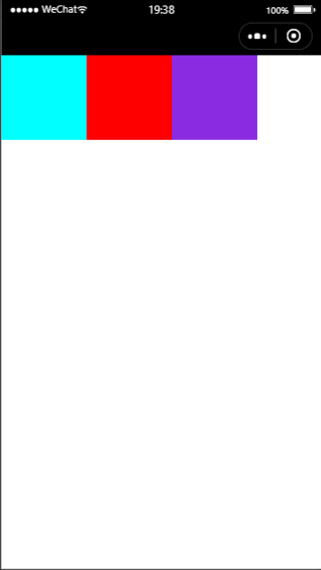
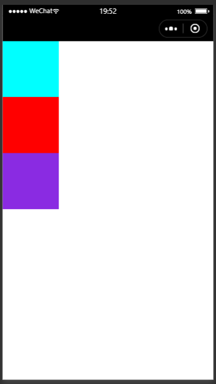
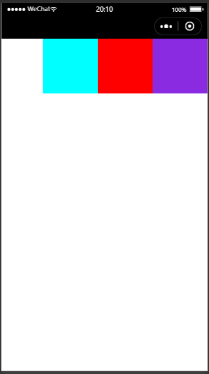
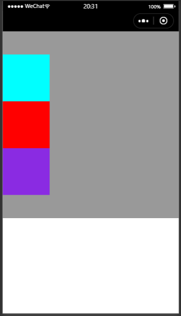
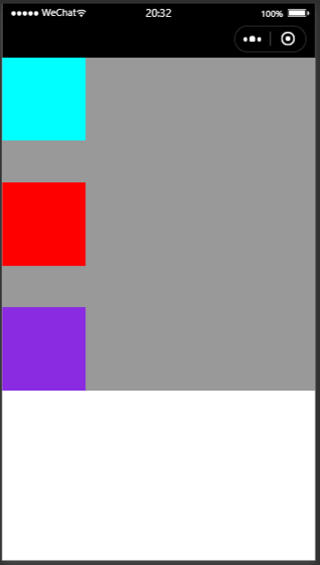
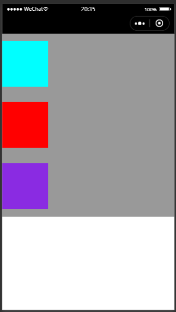
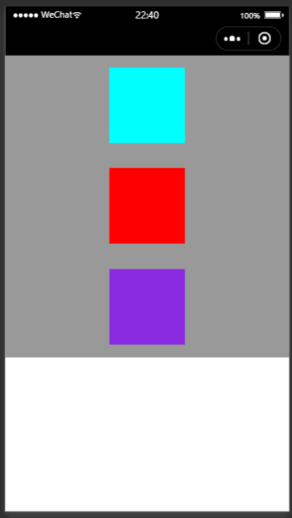

# flex布局

flex布局简称弹性布局，**他有2个重要的概念**：

- 1.container容器
- 2.item元素

flex布局可以控制item在container中的位置和分布。

flex布局有**两个重要概念**(二维平面需要两个变量)：

- 1.flex盒子有一个主轴(由justify-content控制)
- 2.flex盒子有一个交叉轴(由align-items控制)

默认的flex盒子主轴是从左到右水平方向的。交叉轴是数值方向从上到下。

## 01.基本结构和block属性消失

最基本的flex结构如下：

```html
<view class="container">
  <view class="block1" />
  <view class="block2" />
  <view class="block3" />
</view>
```


```css
.container {
  display: flex;
}
.block1 {
  height: 100px;
  width: 100px;
  background-color: aqua;
}
.block2 {
  height: 100px;
  width: 100px;
  background-color: red;
}
.block3 {
  height: 100px;
  width: 100px;
  background-color: blueviolet;
}
```



我们可以看到3个方框是出于同一行，已经消除了block属性。

## 02.flex-direction控制flex主轴和交叉轴方向

为了让item纵向排列类似原来的block属性，我们需要给container添加新属性flex-direction属性：

```css
.container {
  display: flex;
  flex-direction: column;//主轴从上到下
}
```



除了上述指定的column值，它还可以指定：

```css
flex-direction: column-reverse;//主轴从下到上
flex-direction: row-reverse;//主轴从左到右
```

## 03.justify-content 属性设置(控制主轴方向item的排布)

### 3.1.justify-content可以设置flex盒子主轴的起始点(item的对齐方式)：

```css
justify-content: flex-start;//默认起始点
justify-content: flex-end;//交换起始点和终点
```

举个例子：

```css
.container {
  display: flex;
  flex-direction: row;//正常情况row是左对齐
  justify-content: flex-end;//加入flex-end则为右对齐
}
```



### 3.2.justify-content: center;(item在当前顺序居中对齐)

```css
.container {
  display: flex;
  height: 400px;
  background-color: #999999;
  flex-direction: column;
  justify-content: center;
}
```



### 3.3.justify-content: space-between;

第一个元素在start处，最后一个元素在end处，其余元素在center。



### 3.4.justify-content: space-around;

等距离分别，每个item顺序方向两边的margin是相等的。




## 04.align-items属性：flex控制交叉轴方向上item的排布

```css
.container {
  display: flex;
  height: 400px;
  background-color: #999999;
  flex-direction: column;
  justify-content: space-around;
  align-items: center;
}
```

因为``flex-direction: column;``交叉轴是水平方向。



## 05.flex布局换行

```css
flex-wrap: wrap;
```

