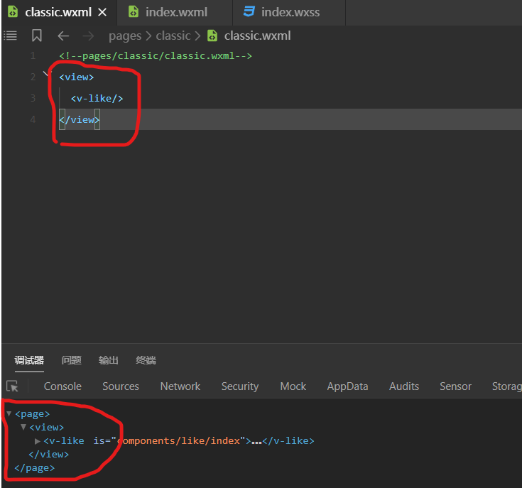

# 小程序细则

## 1.小程序尺寸单位与设计原则

当设计师以iphone6为模板设计页面时：

- 1.宽750px高1334px

当以上为设计原稿时，像素在小程序的换算单位是除以二。也就是说如果一个图片的大小是20px，则在小程序中他的大小是10px。

如果要换算成rpx单位，在iphone6上是1：1关系。


#### 1.1.rpx单位

rpx是自适应的像素单位，依据用户的手机屏幕大小，rpx会让图片大小放大或缩小。

- 1.关于border边框 和 字体大小是否要用rpx要认真考虑


## 2.page样式的巧妙应用

我们观察下图：



任何一个页面都会在外部包裹一个page元素。所以我们可以在page元素上加一些全局样式。

关于全局page样式有几个结论：

- 1.app.wxss文件的样式可以被page继承
- 2.app.wxss配置的样式，只有极少数会被组件继承(组件本身就需要封闭的环境，这点符合)
  - 2.1.字体样式可以被组件继承


## 3.消除无意义的空白

组件开发要消除无意义的留白，这些留白会影响我们外部使用组件时的排布。


## 4.behavior继承

多个组件有相同的properties，data，method，attached时，可以使用behavior继承关系。

单独创建一个继承文件(比如：classic-beh.js)：

```js
let classicBeh = Behavior({
  properties:{
    img: String,
    content: String
  },
  data:{

  },
  attached:function(){

  },
  methods:{

  }
})

export {classicBeh}
```

其他components的js可以继承上面设置的成员或方法。

```js
import {classicBeh} from "../classic-beh"
Component({
  /**
   * 组件的属性列表
   */
  behaviors:[classicBeh],
    .......
```

## 5.小程序事件-如何添加参数
[developDocument](https://developers.weixin.qq.com/miniprogram/dev/framework/view/wxml/event.html#%E4%BA%8B%E4%BB%B6%E8%AF%A6%E8%A7%A3)
### 5.1.setData
我们可以给事件触发传递参数：
```html
<view data-hi="Weixin" bindtap="tapName"> Click me! </view>
```
如上面的``data-hi="Weixin"``，``data-``是默认``substring``不能改变。

### 5.2.获取data
实现``tapName``函数：
```
tapName: function(event) {
    console.log(event)
}
```
查看``event``的值：
可以发现``hi=Weixin`` 在``currentTarget.dataset.hi``:
```json
{
  "type":"tap",
  "timeStamp":895,
  "target": {
    "id": "tapTest",
    "dataset":  {
      "hi":"Weixin"
    }
  },
  "currentTarget":  {
    "id": "tapTest",
    "dataset": {
      "hi":"Weixin"
    }
  },
  "detail": {
    "x":53,
    "y":14
  },
  "touches":[{
    "identifier":0,
    "pageX":53,
    "pageY":14,
    "clientX":53,
    "clientY":14
  }],
  "changedTouches":[{
    "identifier":0,
    "pageX":53,
    "pageY":14,
    "clientX":53,
    "clientY":14
  }]
}
```

## 6.自定义触发事件
自组建向父组件传递参数和事件。

在components(比如：like组件)事件中定义like事件：

```js
this.triggerEvent('like',{
    behavior:behavior,
},{})
```

在page页面中，使用这个like组件可以绑定like事件：

```html
<v-like bind:like="onLike"/>
```

接下来就可以在page页面对应的js文件中实现onLike方法。
```js
onLike:function(e){
    console.log(e) //在e中可以获得behavior的值
}
```


## 7.小程序storage

可以将数据存入storage，供其他组件调用。

```js
  _setLatestIndex(index){
    wx.setStorageSync('latest', index)
  }

  _getLatestIndex(){
    let index = wx.getStorageSync('latest')
    return index
  }
```

