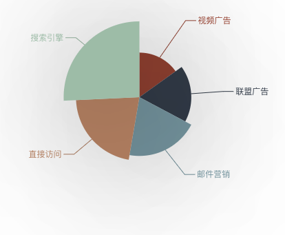

# 自定义图片-饼图

## 饼图基础参数
```js
const option = {
series : [
  {
    name: '访问来源',
    type: 'pie',
    radius: '55%',
    data:[
      {value:235, name:'视频广告'},
      {value:274, name:'联盟广告'},
      {value:310, name:'邮件营销'},
      {value:335, name:'直接访问'},
      {value:400, name:'搜索引擎'}
    ]
  }
]
}
```
饼图是根据明显的扇形弧度的不同来表达不同类目的数据占据的总数的百分比。相比于柱状图，饼图的数据格式更加简单，它数值是一维的，无需给出类目
饼图不在直角坐标系上实现，自然也不需要 xAxis 和 yAxis。


ECharts 中的 饼图 也支持通过设置 roseType 显示成南丁格尔图，操作如下：
```js
roseType: 'angle'
```


## Echart配置阴影
- 建立好一个基本的南丁格尔图后，我们可以为其添加一些通用的样式，例如阴影、透明度、颜色、边框颜色、边框宽度等。
- Echarts 的这些样式通常都是在系列的 itemStyle 中设置的。

下面来看看 Echarts 中阴影样式的配置：
```js
itemStyle: {
    normal: {
        // 阴影的大小
        shadowBlur: 200,
        // 阴影水平方向上的偏移
        shadowOffsetX: 0,
        // 阴影垂直方向上的偏移
        shadowOffsetY: 0,
        // 阴影颜色
        shadowColor: 'rgba(0, 0, 0, 0.5)'
    }
}
```



在 itemStyle 中有 normal 和 emphasis 两个选项，normal 选项显示的是正常展示下的样式，emphasis 是当鼠标 hover 时候的高亮样式。

上述示例里使用的是 normal ，是在正常的样式下加阴影，如果想要配置为在鼠标 hover 的时候突出阴影，可以使用下述代码：

```js
itemStyle: {
    emphasis: {
        shadowBlur: 200,
        shadowColor: 'rgba(0, 0, 0, 0.5)'
    }
}
```

## Echart设置深色背景和浅色背景
接下来我们通过修改背景颜色和文本颜色来把上述实例的主题变为深色主题。

因为背景色是全局的，所以直接在 option 下设置 backgroundColor 就可以了，具体操作如下：
```js
setOption({
    backgroundColor: '#2c343c'
})
```

背景色设置完成后，同样将文本的样式设置为全局的 textStyle，具体操作如下：
```js
setOption({
    textStyle: {
        color: 'rgba(255, 255, 255, 0.3)'
    }
})
```

如果不想设置全局的文本样式，也可以分别对每个系列进行设置，每个系列的文本设置在 label.normal.textStyle，操作如下：
```js
label: {
    normal: {
        textStyle: {
            color: 'rgba(255, 255, 255, 0.3)'
        }
    }
}
```

注意：label 和 labelLine 的样式有 normal 和 emphasis 两个状态，这与 itemStyle 相同。


## Echarts设置扇形的颜色
我们还可以根据实际需要对饼图中扇形的颜色进行设置，同样，扇形颜色的设置是在itemStyle中，操作如下：
```js
itemStyle: {
    normal: {
        // 设置扇形的颜色
        color: '#c23531',
        shadowBlur: 200,
        shadowColor: 'rgba(0, 0, 0, 0.5)'
    }
}
```


接下来我们来实现图形的层次感和空间感。
ECharts 中每个扇形颜色的可以通过分别设置 data 下的数据项实现，操作如下：
```js
data: [{
    value:400,
    name:'搜索引擎',
    itemStyle: {
        normal: {
            color: '#c23531'
        }
    }
}, ...]
```

## 完整option


```js
{
    title: {
      text: '饼图-南丁格尔', // 标题文本内容
      textStyle: { // 设置标题的文本样式
        color: '#ffffff'
      }
    },
    backgroundColor: '#2c343c',
    series: [
      {
        name: '访问来源',
        type: 'pie',
        roseType: 'angle',
        radius: '55%',
        itemStyle: {
          normal: {
            // 设置扇形的颜色
            color: '#c23531',
            shadowBlur: 200,
            shadowColor: 'rgba(0, 0, 0, 0.5)'
          }
        },
        label: {
          normal: {
            textStyle: {
              color: 'rgba(255, 255, 255, 0.3)'
            }
          }
        },
        labelLine: {
          normal: {
            lineStyle: { // 将标签的视觉引导线的颜色设为浅色
              color: 'rgba(255, 255, 255, 0.3)'
            }
          }
        },
        data: [
          {
            value: 235,
            name: '视频广告',
            itemStyle: {
              normal: {
                color: '#46211A'
              }
            }
          },
          {
            value: 274,
            name: '联盟广告',
            itemStyle: {
              normal: {
                color: '#612C22'
              }
            }
          },
          {
            value: 310,
            name: '邮件营销',
            itemStyle: {
              normal: {
                color: '#7A382A'
              }
            }
          },
          {
            value: 335,
            name: '直接访问',
            itemStyle: {
              normal: {
                color: '#8C3E2E'
              }
            }
          },
          {
            value: 400,
            name: '搜索引擎',
            itemStyle: {
              normal: {
                color: '#c23531'
              }
            }
          }
        ]
      }
    ]
}
```