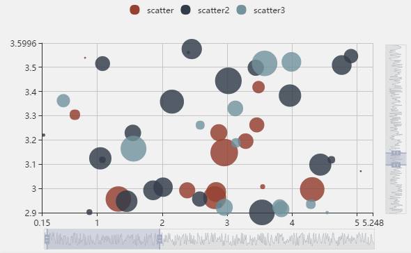
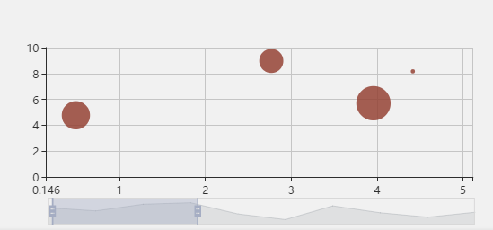
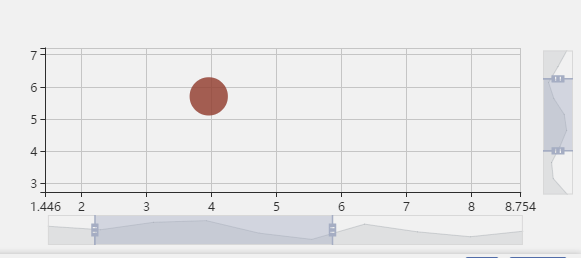

# 在图表中加入交互组件
ECharts有很多的交互组件：
- 图例组件 legend
- 标题组件 title
- 视觉映射组件 visualMap
- 数据区域缩放组件 dataZoom
- 时间线组件 timeline
- 提示框组件 tooltip

不一一讲解每个组件的加入，只通过介绍加入 数据区域缩放组件 dataZoom 就可以掌握 Echarts 交互组件的加入操作。

## Echarts 数据区域缩放组件（dataZoom）
数据可视化的基本交互需求是：概览数据整体，按照需要关注数据细节。

dataZoom 组件完美的在直角坐标系（grid）、极坐标系（polar）中实现了这一功能。



- dataZoom 组件是对数轴（axis） 进行 数据窗口缩放 和 数据窗口平移 操作。

>> 可以通过 dataZoom.xAxisIndex 或 dataZoom.yAxisIndex 来指定 dataZoom 控制哪个或哪些数轴。

- dataZoom 组件可同时存在多个，起到共同控制的作用。控制同一个数轴的组件，会自动联动。下面例子中会详细说明。
- dataZoom 的运行原理是通过 数据过滤 来达到 数据窗口缩放 的效果。数据过滤模式的设置不同，效果也不同，参见：[dataZoom.filterMode](https://echarts.apache.org/zh/option.html#dataZoom-inside.filterMode)
- dataZoom 的数据窗口范围的设置，目前支持两种形式：百分比形式：参见 dataZoom.start 和 dataZoom.end。绝对数值形式：参见 dataZoom.startValue 和 dataZoom.endValue。

dataZoom 组件支持的几种子组件：
- 内置型数据区域缩放组件（dataZoomInside）：内置于坐标系中。
- 滑动条型数据区域缩放组件（dataZoomSlider）：有单独的滑动条操作。
- 框选型数据区域缩放组件（dataZoomSelect）：全屏的选框进行数据区域缩放。入口和配置项均在 toolbox中。

### 1.Echarts 在代码加入 dataZoom 组件
先只在单独的一个横轴上加上 dataZoom 组件，代码示例如下：
```js
option = {
    xAxis: {
        type: 'value'
    },
    yAxis: {
        type: 'value'
    },
    dataZoom: [
        {   // 这个dataZoom组件，默认控制x轴。
            type: 'slider', // 这个 dataZoom 组件是 slider 型 dataZoom 组件
            start: 10,      // 左边在 10% 的位置。
            end: 60         // 右边在 60% 的位置。
        }
    ],
    series: [
        {
            type: 'scatter', // 这是个『散点图』
            itemStyle: {
                normal: {
                    opacity: 0.8
                }
            },
            symbolSize: function (val) {
                return val[2] * 40;
            },
            data: [["14.616","7.241","0.896"],["3.958","5.701","0.955"],["2.768","8.971","0.669"],["9.051","9.710","0.171"],["14.046","4.182","0.536"],["12.295","1.429","0.962"],["4.417","8.167","0.113"],["0.492","4.771","0.785"],["7.632","2.605","0.645"],["14.242","5.042","0.368"]]
        }
    ]
}
```
结果显示如下：


### 2.添加鼠轮滚动

接下来我们来实现在坐标系内进行拖动，以及用滚轮（或移动触屏上的两指滑动）进行缩放，方法很简单：再加上一个 inside 型的 dataZoom 组件即可。

具体的实现是直接在上面的 option.dataZoom 中增加：
```js
option = {
    ...,
    dataZoom: [
        {   // 这个dataZoom组件，默认控制x轴。
            type: 'slider', // 这个 dataZoom 组件是 slider 型 dataZoom 组件
            start: 10,      // 左边在 10% 的位置。
            end: 60         // 右边在 60% 的位置。
        },
        {   // 这个dataZoom组件，也控制x轴。
            type: 'inside', // 这个 dataZoom 组件是 inside 型 dataZoom 组件
            start: 10,      // 左边在 10% 的位置。
            end: 60         // 右边在 60% 的位置。
        }
    ],
    ...
}
```
执行上述代码就能在坐标系中进行滑动，以及使用滚轮缩放了。


### 3.y轴添加缩放
如果想 y 轴也能够缩放，那么在 y 轴上也加上 dataZoom 组件：
```js
option = {
    ...,
    dataZoom: [
        {
            type: 'slider',
            xAxisIndex: 0,
            start: 10,
            end: 60
        },
        {
            type: 'inside',
            xAxisIndex: 0,
            start: 10,
            end: 60
        },
        {
            type: 'slider',
            yAxisIndex: 0,
            start: 30,
            end: 80
        },
        {
            type: 'inside',
            yAxisIndex: 0,
            start: 30,
            end: 80
        }
    ],
    ...
}
```




## 提示框组件 tooltip
https://echarts.apache.org/zh/option.html#tooltip
提示框组件可以设置在多种地方：

- 可以设置在全局，即 tooltip

- 可以设置在坐标系中，即 grid.tooltip、polar.tooltip、single.tooltip

- 可以设置在系列中，即 series.tooltip

- 可以设置在系列的每个数据项中，即 series.data.tooltip
