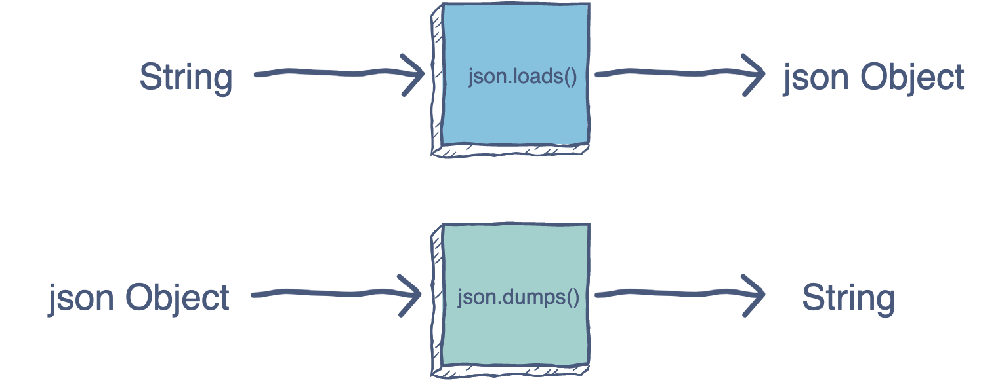

# python处理json字符串
json数据中使用``"``不能用``'``
- 1.json.dumps(): 对数据进行编码。
- 2.json.loads(): 对数据进行解码。



## 1.dump
```python
#!/usr/bin/python3
 
import json
 
# Python 字典类型转换为 JSON 对象
data = {
    'no' : 1,
    'name' : 'Runoob',
    'url' : 'http://www.runoob.com'
}
 
json_str = json.dumps(data)
print ("Python 原始数据：", repr(data))
print ("JSON 对象：", json_str)
```

#### python读取数据
```
Python 原始数据： {'url': 'http://www.runoob.com', 'no': 1, 'name': 'Runoob'}
JSON 对象： {"url": "http://www.runoob.com", "no": 1, "name": "Runoob"}
```

## 2.loads
```python
#!/usr/bin/python3
 
import json
 
# Python 字典类型转换为 JSON 对象
data1 = {
    'no' : 1,
    'name' : 'Runoob',
    'url' : 'http://www.runoob.com'
}
 
json_str = json.dumps(data1)
print ("Python 原始数据：", repr(data1))
print ("JSON 对象：", json_str)
 
# 将 JSON 对象转换为 Python 字典
data2 = json.loads(json_str)
print ("data2['name']: ", data2['name'])
print ("data2['url']: ", data2['url'])
```

#### python读取数据
```
Python 原始数据： {'name': 'Runoob', 'no': 1, 'url': 'http://www.runoob.com'}
JSON 对象： {"name": "Runoob", "no": 1, "url": "http://www.runoob.com"}
data2['name']:  Runoob
data2['url']:  http://www.runoob.com
```

## 3.文件读写与json
```python
# 写入 JSON 数据
with open('data.json', 'w') as f:
    json.dump(data, f)
 
# 读取数据
with open('data.json', 'r') as f:
    data = json.load(f)
```