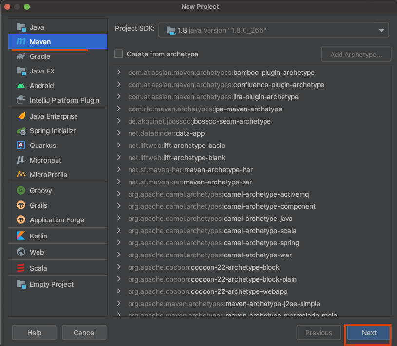
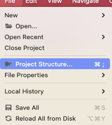
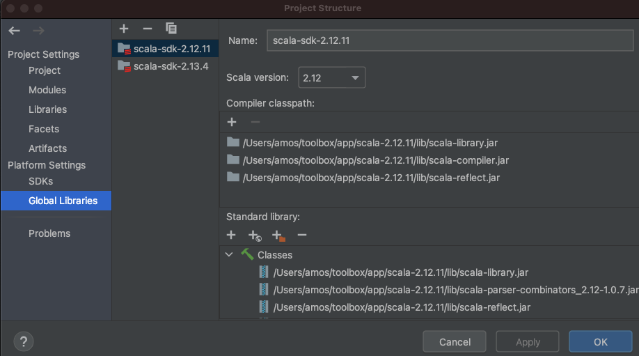
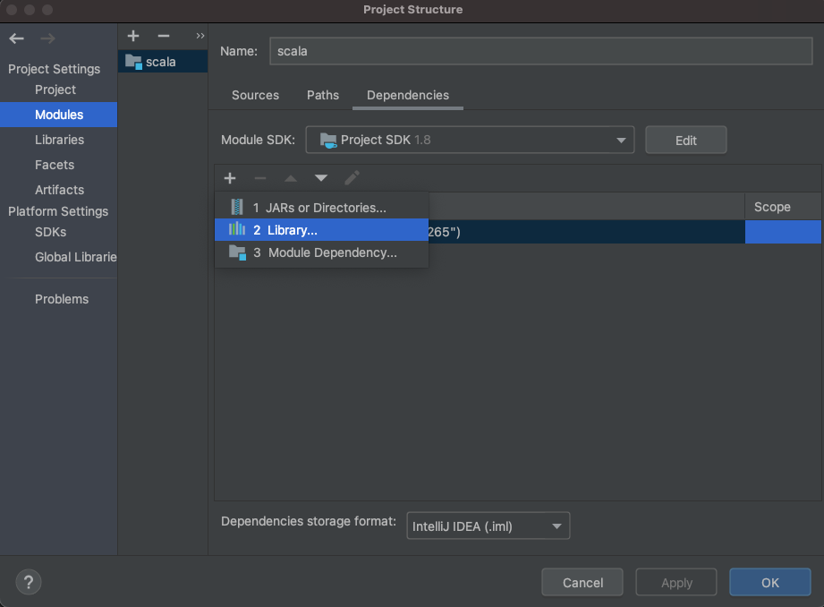
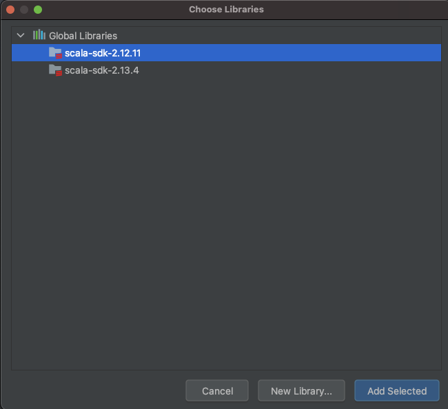
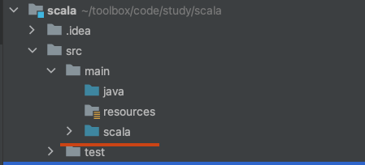

# idea与scala

## 创建maven的scala项目
不同环境scala版本不同会引出各种奇葩错误
### 1.准备开发环境










scala开发环境配置完成

### 2.准备打包依赖
pom中添加如下依赖
```xml
<dependency>
    <groupId>org.apache.spark</groupId>
    <artifactId>spark-core_2.11</artifactId>
    <version>2.4.3</version>
</dependency>
```