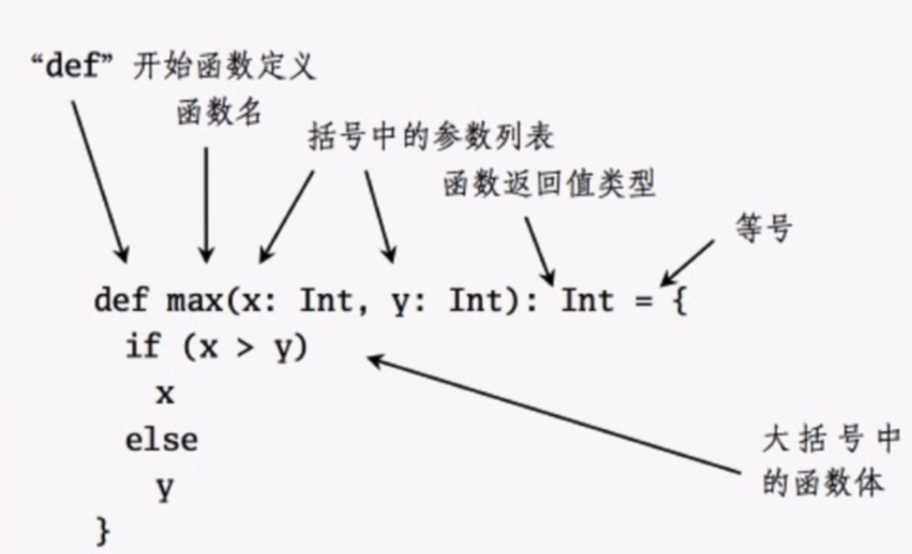

# 函数

## 01.定义
 
 
```scala
def 方法名(参数名:参数类型): 返回类型 = {
 // 括号内为方法体
 
 // 方法体的最后一行为返回值，不需要使用return
}
```
 
## 02.基本使用
```scala
 def main(args: Array[String]): Unit = {
    println(add(1,2))
    println(three()) // three后面的括号可以省略，但不建议
    println(sayHello("say hello"))
}

def add(x: Int, y: Int): Int = {
    x + y
}

def three() = 1 + 2

def sayHello(str: String): Unit = {
    println(str)
    str
}
```
```
3
3
say hello
()
```
 
## 03.默认参数
```scala
def sayHello(str: String = "hello world"): Unit = {
    println(str)
}
```

## 04.命名参数

## 05.可变参数
```scala
def sum(numbers: Int*) = {
    var result = 0
    for (number <- numbers) {
        result += number
    }
    result
}
```

## 06.循环表达式
```scala
1 to 10
Range(1, 10, 0)
1.until(10)
```