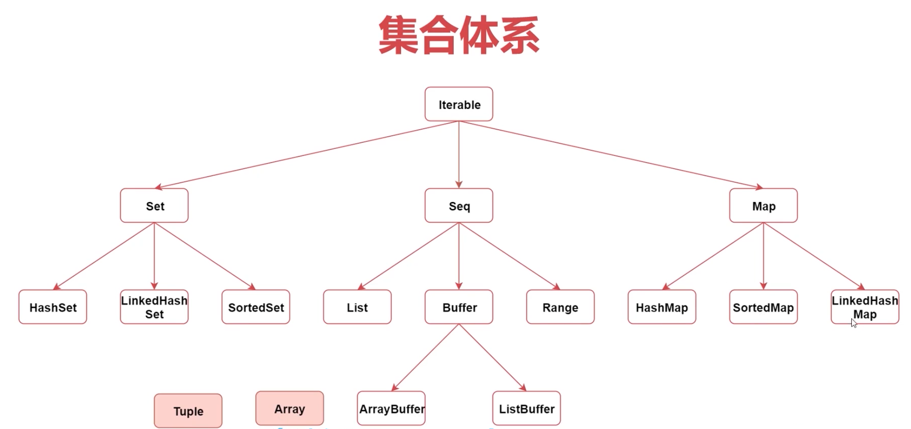

# 集合


- 1.Scala中的集合是分成可变和不可变两类集合
- 2.可变集合: scala.collection.mutable
- 3.不可变集合: scala.collection.immutable [默认]


## 01.数组
定长数组
```scala
val c = Array(2,3,4,5,6,7,8,9)
c.mkString(",")
c.sum
c.max
```

## 02.List
```scala
val l = scala.collection.mutable.ListBuffer[Int]()
l += 2
l ++= List(3,4,5)
    
l -= 2
l --= List(1,4)
println(l)
```

## 03.Set
```scala
val set = Set(1,2,3)
println(set.getClass.getName) // 

println(set.exists(_ % 2 == 0)) //true
println(set.drop(1)) //Set(2,3)
```

## 04.Map
```scala
// 空哈希表，键为字符串，值为整型
var A:Map[Char,Int] = Map()

// Map 键值对演示
val colors = Map("red" -> "#FF0000", "azure" -> "#F0FFFF")
A += ('I' -> 1)
A += ('J' -> 5)
A += ('K' -> 10)
A += ('L' -> 100)

colors.keys
colors.values
colors.isEmpty
```

## 05.元组
与列表一样，元组也是不可变的，但与列表不同的是元组可以包含不同类型的元素。
元组的值是通过将单个的值包含在圆括号中构成的。例如：
```scala
val t = (1, 3.14, "Fred")
val t = new Tuple3(1, 3.14, "Fred")
```