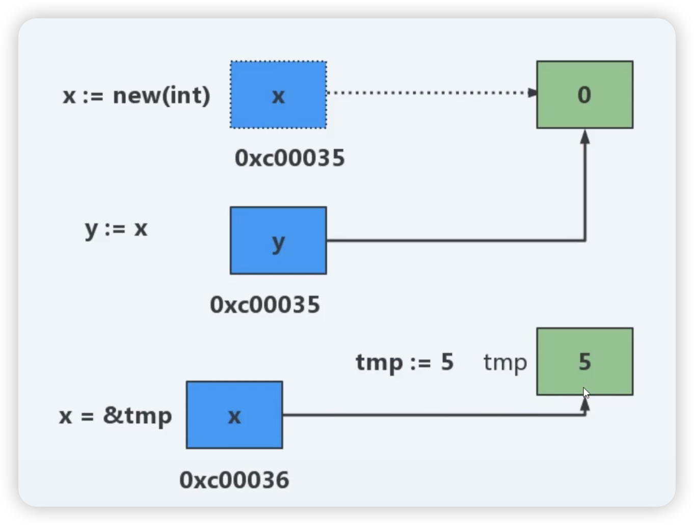
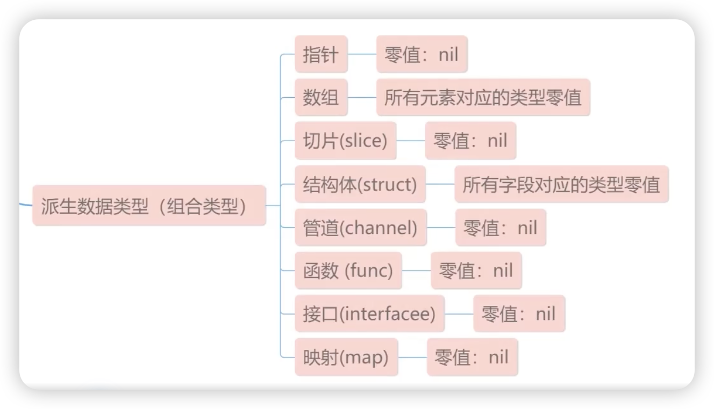
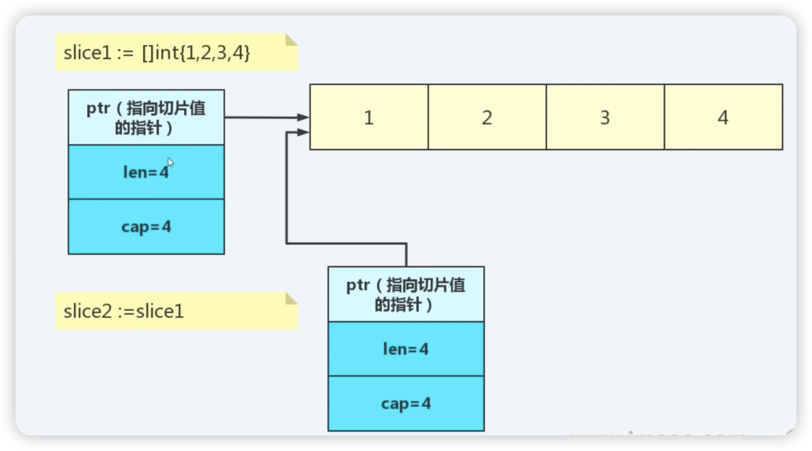

# 问题

- Go语言中哪些类型可以使用len？哪些类型可以使用cap？
- Go语言中哪些类型的值可以用组合字面量表示？
- Go语言的指针有哪些限制？
- Go语言中哪些类型的零值可以用nil来表示？
- float或切片可以作为map类型的key吗？
- Go 语言怎么使用变长参数函数？
- 调用函数传入结构体时，是传值还是传指针？


## Go语言中哪些类型可以使用len？哪些类型可以使用cap？

cap：数组，切片，通道
len： 数组，切片，映射，通道，字符串


需要注意：

1. 数组长度和容量固定且相等
2. 切片的容量长度和容量不能直接修改，可通过反射修改
3. 字符串的长度是字符串的字节数，可用rune统计字符个数


```go
func main() {
	var a [5]int
	fmt.Println("a.len", len(a), "a.cap", cap(a))
	b := []int{1, 2, 3}
	fmt.Println("b.len", len(b), "b.cap", cap(b))
	b = append(b, 4)
	fmt.Println("b.len", len(b), "b.cap", cap(b))

	m := map[string]int{}
	m["k1"] = 1
	fmt.Println("m.len", len(m))

	ch := make(chan int, 10)
	fmt.Println("ch.len", len(ch), cap(ch))

	//数组的长度和容量在编译阶段被估值
	const arrLen = len(a)
	const arrCap = cap(a)

	//通过反射可以修改切片的长度
	s := make([]string, 1, 6)

	//注意，len要比cap小
	reflect.ValueOf(&s).Elem().SetLen(2)
	fmt.Println("s.len", len(s), "s.cap", cap(s))
	//cap只能小于等于当前值
	reflect.ValueOf(&s).Elem().SetCap(5)
	fmt.Println("s.len", len(s), "s.cap", cap(s))

	str := "go面试"
	fmt.Println("str.len", len(str)) //unicode编码中，一个中文字符占3个字节
	fmt.Println("str.runeLen", len([]rune(str)))
}

```

输出：

```shell
a.len 5 a.cap 5
b.len 3 b.cap 3
b.len 4 b.cap 6
m.len 1
ch.len 0 10
s.len 2 s.cap 6
s.len 2 s.cap 5
str.len 8
str.runeLen 4
```


## Go语言中哪些类型的值可以用组合字面量表示？


### 类型值
1. 一个类型的实例称为此类型的一个值
2. 一个类型可以有很多不同的值，其中一个为它的零值
3. 每个类型都会有自己的零值，零值可以看做是这个类型的默认值


### 类型值的呈现方式
字面量
具名常量
变量和表达式


#### 字面量

一个值的字面形式称为一个字面量

1. 整型值的面量形式：十进制、八进制、十六进制和二进制形式
2. 浮点数：1.11,1.11e2，100.e+2
3. 虚部字面量形式：1.12i,1.12E2i,0x16i（0+22i）
4. rune的字面量：‘a'，\141，\×61'，\u0061'\U00000061'
5. 字符串的字面量：“中文”，hello
6. 函数字面量：func （x int, y string, z string）（s string，'e error）
7. 用来表示结构体类型 和容器类型（数组、切片和映射）值
   表示形式为T{}


**数组的组合字面量表示**

```go
[4]int｛1, 2, 3, 4｝
[4]int｛1:1, 2:2, 3:3, 4:4｝
[...]Jint｛1, 2, 3, 4｝
```

**切片的组合字面量表示**

```
[]int{1,2,3,4}
```

**映射的组合字面量表示**

```
map[string]int{"k1":1, "k2":2}
```


## 一些概念


### 具名常量

```
//const n = 3.1416//具名常量
//const Pi = n //具名常量
```


### 表达式

```
ch：= make（chan int, 10）
a += 5
a>0
f//一个类型为func0的表达式
f() //函数的调用
```


## Go语言的指针有哪些限制？

### Go语言的指针
1. 一个指针变量本身存储的只是一个内存地址
2. 一个内存地址在32位系统上占4个字节；在64位系统上占8个字节
3. 内存地址一般用整数的16进制来表示，比如：Oxc000012450


当一个变量被声明的时候，Go运行时将为此变量开辟一段内存
此内存的起始地址即此变量的地


### 理解指针

```
x：= new（int） //声明指针x
y：= x//将x的地址值赋值给y
tmp：= 5
x=&tmp//将tmp地址值赋值给x
fmt.Println（"x=",X,*x,"y=",y,*y）
```



### 多维指针

```go
var ptr *int   //一维指针
var pptr **int // 二维指针
var ppptr ***int // 三维指针
```

### Go语言中哪些值不可被寻址？
1. 映射的元素
2. 字符串的字节元素
3. 常量包级别的函数以及用作函数值的方法等


### 如何获取一个指针值？
內置函数new
直接使用&操作符


### 指针有什么用？
提供了一种间接的途径来访问和修改一些值


### Go指针有哪些限制？

??????

1. Go指针不支持直接进行算术运算
2. 一个指针类型的值不能被随意转换另一个指针类型
3. 一个指针值不能随意跟其他指针类型的值进行比较
4. 一个指针值不能随意被赋值给其它任意类型的指针值


#### 指针类型转换的条件（满足任意一个）
1. 底层类型一致且有一个是无名类型
2. 都是无名类型，且他们的基类型的底层类型一致


#### 以下类型不属于无名类型
1. 预声明类型
2. 自定义类型（自定义泛型除外）
3. 泛型的实例化类型
4. 用在自定义泛型中的类型参数类型


## Go语言中哪些类型的零值可以用nil来表示？



### Go语言的零值
1. 每种类型都有一个零值，零值可以看做是这个类型的默认值
2. 布尔类型的零值是false
3. 数值类型的零值都是0


### Go语言的nil
1. 不同数据类型的nil值的尺寸是不同的
2. nil值不一定是可以相互比较的，主要取决了该类型是否可以比较
3. 可以比较的两个nil值不一定相等


## float或切片可以作为map类型的key吗？

在Go语言中，只有可比较的类型的才能作为map的key

可以使用float作为map的key，但不推荐，可能因为精度的问题，出现key覆盖的情况。

### Go语言中哪些类型是不可比较的？

1. slice
2. map
3. 含有不可比较类型的数组
4. 含有不可比较类型的结构体


## Go 语言怎么使用变长参数函数？

1. 变长参数的使用需要注意的问题
2. 函数只能有一个变长参数，且只能是参数列表中最后一个形参
3. 变长参数在函数体内是切片类型，也就是说…T等同于[]T
4. 形参的类型和实参必须一致，包括接口类型

## 调用函数传入结构体时，是传值还是传指针？

### Go语言函数传值
函数的参数传递只有值传递，且传递的实参都是原始数据的一份拷贝


### 转变对引用类型的理解
切片，映射，通道和函数包含底层间接值部，在Go语言中赋值操作和函数调用传参都是将原始值的直接部分复制给了目标值。

如果原始值含有间接部分，则在赋值后，目标值和原始值的直接部分将引用着相同的间接部分。也就是说，两个值共享了底层的间接值部


### 切片传值理解

#### 切片的底层结构

```go
type _slice struct｛
elements unsafe.Pointer // 引用着底层的元素
len int // 当前的元素个致
cap int // 切片的容量
｝
```

#### 拷贝过程



slice1和slice2都共享了底层同一个ptr地址(间接值部)

1. 如果直接改变slice2.ptr指向的内存地址，slice1不受影响
2. 如果按照下标修改slice2.ptr某个元素的值，slice1也同样被修改

### 字符串传值理解

#### 字符串的底层结构

```go
type _string struct｛
elements *byte // 引用着底层的byte元素
len int // 字符串的长度
}
```

字符串中的字符是不允许我们改变内部byte的值的。在编译时就报错。

```go
func main() {
	s := "amos"
	fmt.Printf("add:%+v,s:%s,\n", &s, s)
	changeStr(s)
	fmt.Printf("add:%+v,s:%s,\n", &s, s)
}

func changeStr(s string) {
	s = "hello"
	fmt.Printf("add:%+v,s:%s,\n", &s, s)
}
```

输出

```shell
add:0x1400010a230,s:amos,
add:0x1400010a250,s:hello,
add:0x1400010a230,s:amos,
```


### map传参理解

#### map的底层结构

```
type _map *hashtablelmpl
//官方标准编译器是使用哈希表来实现映射的
```

有间接值部，内层修改数据会影响外面

