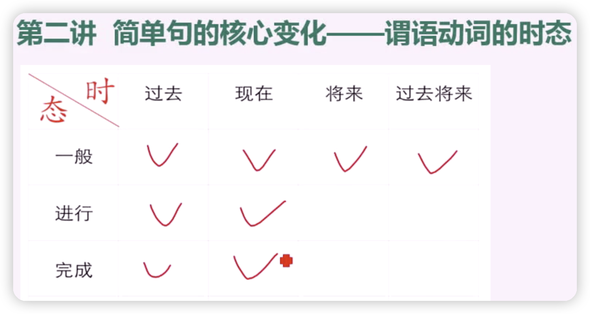

# 简单句的核心变化（谓语动词的时态/情态/语态）

## 需要重点掌握的8种时态

## 一般过去时

形式：V.过去式（did）

完全发生在过去的事情，现在已经结束。

## 一般现在时

形式：V.原形/V.第三人称单数（do/does）

## 一般将来时

形式：

will +V原型

am/is/are going to + V原型

## 过去将来时

形式：

would+V原型

was/were going to + V原型

过去将来时不会单独出现，上下文中一定存在过去时

## 过去/现在进行时

形式：be + doing

## 现在完成时

形式：have/has + done

（截止到现在，这事完成结果如何）

## 现在完成进行时

## 过去完成时

形式：had + done

不会单独出现，上下文中一定存在过去时

# TODO

寻找雅思听力真题：精听，跟读。