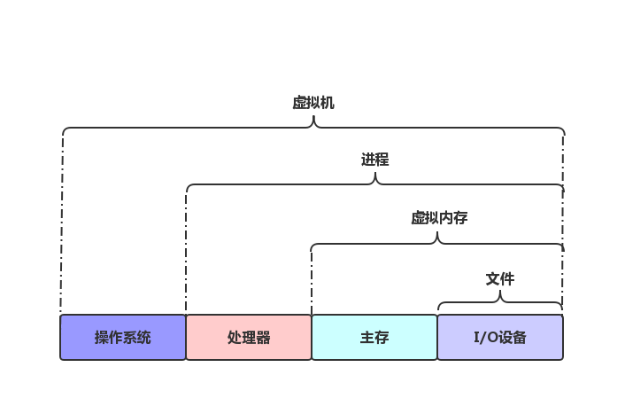

# 操作系统

我们要解决两个问题： 
- 1.为什么学习操作系统？这些概念能给我们带来什么价值？
- 2.操作系统的内容包括什么？

## 1.为什么学习操作系统知识
操作系统，我们的直观感受就是： **冯诺依曼体系结构的计算机硬件** 和 **应用程序** 之间的 **一层抽象**。 
所以 操作系统 相关知识是复杂应用程序优化和复杂系统架构的必要知识储备。 

## 2.操作系统的内容包括什么
为了掌握知识量大又广且复杂的操作系统相关知识，我们需要系统学习。而系统学习最好的方法就是建立模型。 

#### 模型如下
操作系统的目标是运行得更快，同时做的更多。 
可以提炼出2个概念 **并行** 和 **抽象** 

### 2.1.并行
- 1.CPU指令的并行执行
- 2.进程线程的并行

### 2.2.抽象
 

- 1.文件抽象所有的I/O设备(包括网络)
- 2.虚拟内存抽象，让所有的进程以为自己独占所有主存空间
- 3.进程是运行着的程序抽象
- 4.虚拟机是对整个操作系统的抽象

## 3.操作系统内容的概述
- 1.计算机中一切都用二进制表示，不同的上下文中，二进制有不同的解释方式
- 2.高级语言的编译-装载-执行过程
    - 2.1.编译器如何工作
    - 2.2.处理器如何"顺序"运行指令
    - 2.3.共享库的链接
- 3.高速缓存的重要性(CPU的3级缓存)
- 4.操作系统如何管理硬件(虚拟内存的实现原理，I/O，进程线程等)
