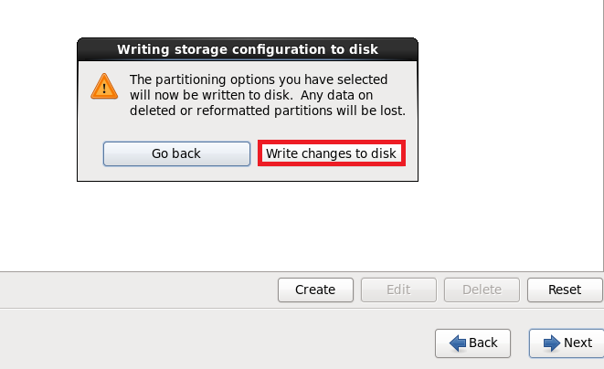

# Linux系统安装
我们开始安装系统，如下：<br>
<br>

选择系统语言：<br>
<br>

<br>

选择安装磁盘类型，我们选择第一个。<br>
<br>

我们同样清空磁盘。<br>
<br>

设置主机名：<br>
<br>

选择时区，注意图中提示。<br>
<br>

设置主机密码。<br>
<br>

选择磁盘的规划方法。我们选择最后一个“自定义”.<br>
<br>

磁盘规划，如下：<br>
<br>
<br>
<br>
<br>
<br>

我们格式化磁盘。<br>
<br>
确定！<br>
<br>

点击Next<br>
<br>

我们采用最小化安装。<br>
<br>

我们再安装一些其他工具。<br>
<br>

<br>

以上步骤完成，我们就可以点击Next安装系统了。<br>

# CentOS6.9系统基本规划

## 1.网络规划
网络配置文件在``/etc/sysconfig/network-scripts/``下。<br>
下面是网络配置文件的一个模板：<br>
```
DEVICE=eth0
TYPE=Ethernet
ONBOOT=yes
NM_CONTROLLED=yes
BOOTPROTO=none
IPADDR=10.0.0.22
NETMASK=255.255.255.0
DNS1=223.5.5.5
DNS2=223.6.6.6
GATEWAY=10.0.0.254
USERCTL=yes
PEERDNS=yes
IPV6INIT=no
```

## 2.其他CentOS6.9系统优化参考下面文档
[CentOS6.9系统优化及克隆](https://github.com/pitifulnoble/computer_net/blob/master/Linux%E5%AD%A6%E4%B9%A0/%E7%9B%B8%E5%85%B3%E8%AE%BE%E7%BD%AE%E5%92%8C%E5%91%BD%E4%BB%A4/Linux%E5%9F%BA%E7%A1%80/03.CentOS%E4%BC%98%E5%8C%96_vm%E5%85%8B%E9%9A%86.md)<br>