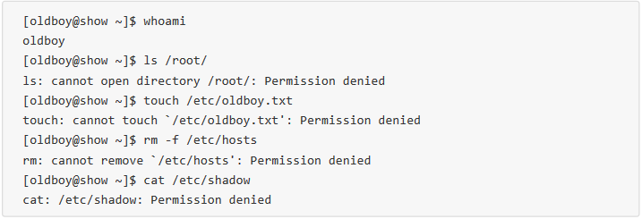

# Linux硬件部分总结

## 企业面试题1：你用过的服务器型号有哪些？配置如何？
先上一张图： 
 
用过dell的R710，是两路的最多有6个硬盘插槽 

## 企业面试题2：程序、进程和守护进程的区别
程序： 
可以是一段代码，一个01文件或文件综合是写在存储器中 比如硬盘 
进程： 
进程可以理解为运行着的程序 
守护进程： 
可以理解为一直运行的进程，应用程序的进程在程序关闭时就可能不在了，
但守护进程在计算机开机时就一直存在，知道关机 

## 企业面试题3：提升用户体验的网站解决方案
__运维职责：__ 运行和维护服务器 
- 1.数据不能丢
- 2.保证网站7*24小时运行
- 3.用户体验要 好打开网站速度

## 企业面试题4：buffer与cache的区别？
写buffer，读cache 
程序运行要缓存，比如在线看视频，为了提高用户体验，
防止出现卡顿的显现，计算机会事先下载视频后面的内容，这时就写在buffer中 
程序要运行了，需要数据就去在cache中查找 
buffer和cache都在内存中 
