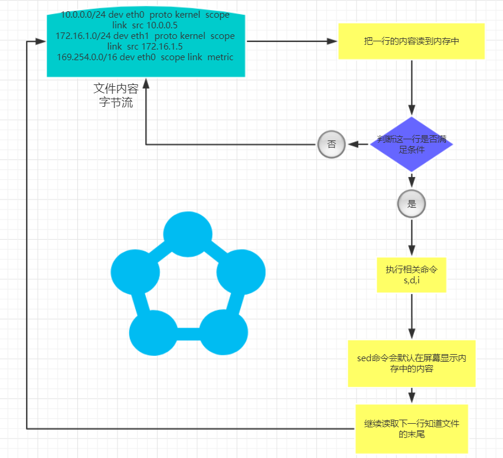

# 正则表达式与通配符
## 特殊符号
- ' '     所见即所得<br>
- " "     特殊符号会被解析<br>
- \` `     相当于 $()先运行命令，然后留下结果<br>
-
- \>       重定向<br>
- \>>      追加重定向<br>
- 2>       错误重定向<br>
- 2>>      错误追加重定向<br>
-
- ~        表示当前用户的家目录<br>
- !        查找并允许历史命令，危险<br>
- \#       注释<br>
- $        取变量的内容 | awk中表示行号 | 表示普通用户的命令提示符<br>
- \*       所有<br>
- \\       撬棍 | 转义字符<br>
- &&       前一个命令运行成功然后运行后一个命令<br>
- ||       前一个命令运行失败然后运行后一个命令<br>

## 通配符
- \*       所有<br>
- {}       生成序列<br>
    eg1:<br>
    echo {1..10}<br>
    1 2 3 4 5 6 7 8 9 10<br>
    eg2:<br>
    cp noble.txt{,.bak}<br>

## 正则表达式
__1.注意：__<br>
- 正则表达式按照行处理
- 禁止使用中文符号
- 给grep和egrep配置别名，并追加到/etc/profile中
    ``alias grep='grep --color=auto'``
    ``alias egrep=egrep --color=auto``
- 正则表达式与通配符的区别
    通配符-------用来匹配和查找文件名---------- *.txt *.log以.txt .log结尾的文件------大部分命令都可以使用<br>
    正则---------在文件中匹配内容-------------- 包含noble的行-------------------------Linux三剑客<br>
__2.正则表达式的分类__<br>
基础正则------- ^ $ . * \[] \[^]  basic regular expression BRE----------grep,sed,awk<br>
扩展正则------- | + {} () ?           extended regular expression ERE------egrp,sed -r,awk<br>

__3.正则表达式练习__<br>
创建环境~/noble.txt<br>
```
I am noble
I learn Linux C

I like badminton ball,billiard and chinese chess!
my github is https://github.com/pitifulnoble
my e-mail address is pitifulnoble@outlook.com
my QQ num is 2803420877.

my dear,I am not noble,but NOBLE!
```

__4.正则表达式的 -on 参数__<br>
``grep -o '.' noble``<br>
-o ：打印每次匹配的字符(当前行的其他字符不再打印)，并且占一行，可以查看grep每次都匹配了什么。<br>
-n ：打印行号<br>
__5.正则表达式的 \ 转义字符和 -v参数__<br>
``grep '\.$' noble``<br>
-v 参数表示取反<br>


__6.正则表达式的符号__<br>
- \* --------前一个字符连续出现0次以上 >=0<br>
- \[]--------表示任意一个中括号中的内容<br>
- \[^]-------表示任意一个中括号中的内容不要<br>
- ^ ---------表示行开始<br>
- $ ---------表示行结束<br>

<br>

扩展正则：<br>
- \+ --------前一个字符连续出现1次以上 >=1 加号经常和中括号一起使用<br>
    eg：<br>
    取出文件中的单词<br>
    ``egrep '[A-Za-z]+' noble -o``<br>

- \| --------或者,比中括号的强大之处再用，竖线可以“或者”多个字符，但中括号只能用单个字符<br>
- () --------使括号中的内容相当于一个整体，或者是反向引用。<br>
    反向引用eg：<br>
    ``echo 1234|sed -r 's#(.*)#stu\1#g'``<br>
- {n,m} ------前一个字符连续出现至少n次，最多m次,经常和中括号一起使用<br>
- ? ----------前一个字符连续出现0次或1次<br>
注意：<br>
grep 'A*' noble-----将匹配所有内容。<br>

## sed 命令
sed命令执行过程：<br>
<br>

### 0.准备练习环境：
```
cat>>noble.txt<<EOF
101,noble,CEO
102,luffy,CTO
103,laowang,COO
104,honghong,CFO
105,yaya,CIO
EOF
```
### 1.打印匹配的行号
```
sed -n -e '/build/='  /etc/cli.cfg
[cli_rebuild]
28
```
### 2.显示某行到某行<br>
    ``sed -n '1,3p' noble.txt``<br>
    ```
    101,noble,CEO
    102,luffy,CTO
    103,laowang,COO
    ```

### 3.匹配功能（和grep类似）使用'//'包裹<br>
    ``sed -n '/noble/p' noble.txt``<br>
    ```
    101,noble,CEO
    ```
    ``sed -n '/noble/,/^104/p' noble.txt`` <br>
    ```
    101,noble,CEO
    102,luffy,CTO
    103,laowang,COO
    104,honghong,CFO
    ```
### 4.显示某行和某行用；分隔命令<br>
    ``sed -n '1p;3p' noble.txt ``<br>
    ```
    101,noble,CEO
    103,laowang,COO
    ```
### 5.增加一行使用a或i命令<br>
    ``sed '1i 100,alun,UFO' noble.txt ``<br>
    ```
    100,alun,UFO
    101,noble,CEO
    102,luffy,CTO
    103,laowang,COO
    104,honghong,CFO
    105,yaya,CIO
    ```
### 6.删除命令使用d<br>
    ``sed '1d' noble.txt ``<br>
    ```
    102,luffy,CTO
    103,laowang,COO
    104,honghong,CFO
    105,yaya,CIO
    ```
    带正则的删除方法<br>
    ``sed '/Alex/d' person.txt``<br>
    ```
    101,oldold,CEO
    102,zhangyao,CTO
    104,yy,CFO
    105,feixue,CIO
    ```
    ``sed -n '/^$/!p' person.txt``<br>
    删除空格 **!表示取反,主要!的位置**<br>
### 7.替换<br>
sed 's###g' -i

### 8.后向引用
    ```
    echo 123456|sed -r 's#(.*)#<\1>#g'
    ```
    - -r 表示支持扩展正则
    - \1表示引用前面第一个括号中的内容。

### 9.查找行号
    ``sed -n -e '/yy/=' person.txt``<br>
    ```
    7
    ```
    同``cat -n person.txt | sed -n '/yy/p' |awk '{print $1}'``<br>
    
## awk命令
### 1.awk最常用的方法,取出某一行的某一列
$NF 是最后一列

``awk -F ":" 'NR==2{print $1,$2,$NF}' /etc/passwd``<br>
```
bin x
```

### 2.awk从某一列到最后一列的内容
```
history|awk -F " " '{for (i=2;i<=NF;i++)printf("%s ", $i);print ""}'
```


### 3.awk的运行规则:<br>
**匹配-->动作**<br>
``awk '匹配{动作}'``<br
逐一读取文件中的内容,判断该行是否匹配,匹配则执行动作,否则读取下一行直到文件结尾.<br>

awk学习运行环境准备<br>
```
cat >>~/noble.txt<<EOF
noble    wang   24362346 :250:100:175
yaya     tushan 37455473 :155:90:201
honghong tushan 48654734 :250:60:50
sandou   li     46756568 :250:80:75
tongren  shi    46746732 :250:100:175
sina     ya     53563563 :50:95:135
jinjian  zhu    48252525 :250:169:300
lao      wang   86363572 :250:100:175
EOF
```
- 1.显示noble的姓氏和ID号码<br>
    将正则表达式做伪 **匹配**<br>
    ``awk '/noble/{print $1,$2,$3}' noble.txt``<br>

    在awk的花括号外码的~表示包含的意思。第一列中包含noble的行。<br>
    ``awk '$1~/^noble/{print $1,$2,$3}' noble.txt``<br>

- 2.显示所有以48开头的ID号码的人的全名和ID号码
    ``awk '$3~/48/{print $0}' noble.txt``<br>
- 3.显示所有ID号码最后一位数字是2或6的人的全名
    ``awk '$3~/[26]$/{print $0}' noble.txt``<br>
- 4.显示noble的捐款，每个值都以$开头，如 $250$100$175
    ``grep noble noble.txt|awk '{print $4}'|sed 's#:#$#g'``<br>
    gsub是awk中的替换函数吧//中的内容替换为""中的内容。
    ``awk '/noble/{gsub(/:/,"$",$4);print}' noble.txt``<br>

### 4.awk的特殊动作BEGIN{}和END{}
BEGIN{}在awk命令中最先执行一次.<br>
END{}命令在awk命令中最后执行一次<br>
- 5.使用awk进行统计计算
    统计/etc/services文件中的空行<br>
    ``awk '/^$/{i=i+1}END{print i}' /etc/services``<br>

### 5.awk的数组
awk的数组下标可以是字符串!!!<br>
```
http://www.noble.com/index.html
http://blog.noble.com/index.html
http://post.noble.com/index.html
http://www.noble.com/index.html
http://blog.noble.com/index.html
http://www.noble.com/index.html
http://sss.noble.com/index.html
```
计算上述文件中有多少个域名<br>
``awk -F "[/.]+" '{h[$2]++}END{for(i in h) print i,h[i]}' noble``<br>

### 6.显示文件中的非空行
```
grep -v '^$' noble
sed '/^$/d' noble
sed '/^$/!p' noble
awk '!/^$/' noble
```

### 7.显示一个文件中单词的个数
``awk '{for(i=1;i<NF;i++)h[$i]++}END{for(j in h)print j,h[j]}' noble``<br>

### 8.去重复
```shell
CodingAnts@ubuntu:~/awk$ cat dup
hello world
awk
coding ants
hello world
awk
hello world
awk
coding ants
coding ants
```

```shell
CodingAnts@ubuntu:~/awk$ awk '!a[$0]++' dup
hello world
awk
coding ants
```
