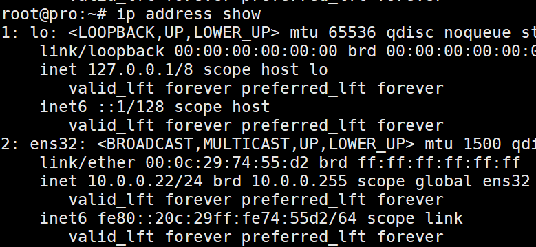
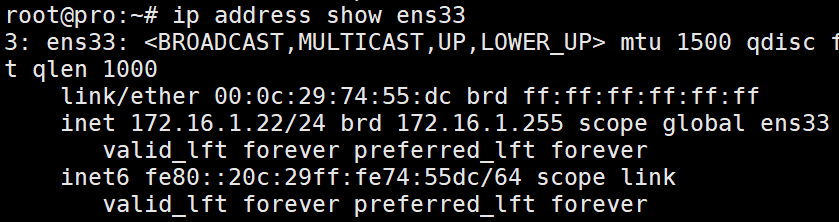

# Linux网络管理
## 1.IP地址查看与设置
#### 1.查看当前机器的ip地址(查)
命令：<br>
``ip address show``简写为``ip a s``<br>
<br>

``ip address show ens33``<br>
<br>

#### 2.添加一个ip地址(增)
给``ens33``网卡增加一个ip地址：<br>
``ip addr add 192.111.1.21/24 dev ens33``<br>

#### 3.删除ip地址(删)
删除``ens33``一个ip地址：<br>
``ip addr del 192.111.1.21/24 dev ens33``<br>

##### 关闭某个网卡
命令：<br>
``ip link set up ens33``<br>

##### 打开某个网卡
命令：<br>
``ip link set down ens33``<br>

## 2.路由设置与查看
### 1.默认路由/网关
#### 1.查看默认网关(查)
命令：<br>
``ip route``<br>

#### 2.增加修改默认路由(增/改)
命令：<br>
``ip route add default via 192.168.0.150/24``<br>

### 2.特定网段/网关
#### 1.查看默认网关(查)
命令：<br>
``ip route``<br>

#### 2.增加网段
``ip route add 192.16.1.0/24 dev ens33``<br>
相对使用上面这个命令，有更好的解决方法。<br>
一个网卡就绑定一个网段，如果机器需要和本地多个网段的计算机通信，比如内网和外网，就使用两个网卡，一个绑定内网网段，另一个绑定外网网段，把默认网关设置成外网网卡的网关就可，这些配置通过修改配置文件实现。<br>

##### 1.ubuntu网络配置文件修改方法
地址：https://websiteforstudents.com/configure-static-ip-addresses-on-ubuntu-18-04-beta/<br>
在 /etc/netplan目录下创建一个新文件<br>
50-cloud-init.yaml<br>
```
network:
  version: 2
  ethernets:
    ens32:
      addresses: [10.0.0.22/24]
      gateway4: 10.0.0.254
      nameservers:
        search: [lab,home]
        addresses: [223.5.5.5,223.6.6.6]
      optional: true
```
文件配置好后执行以下两个命令。<br>
``netplan try``<br>
``netplan apply``<br>

##### 2.CentOS网络配置文件的修改方法
在``/etc/sysconfig/network-scripts/``目录下：<br>
