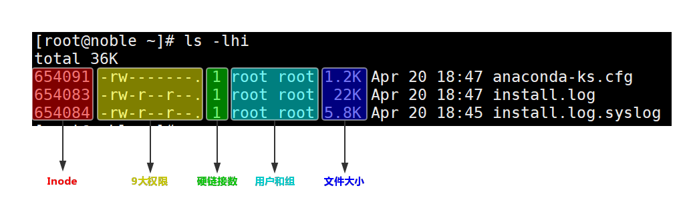
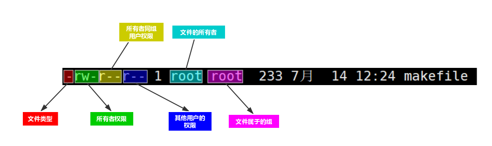

# 文件管理
有一篇文章讲解文件系统相关概念：<br>
[文件系统](../../Linux系统课程/6.文件系统.md)<br>

## 1.相关概念
使用命令``ls -lhi``查看文件：<br>
<br>

### 1.文件类型
```
f file        普通文件
d directory   目录
l softlink    软连接
p pipe        管道
```
#### 1.普通文件分类
对普通file文件我们可以使用``file + <文件名>``查看文件的详细信息。<br>
常见的类型有以下几种：<br>
- ELF 64-bit LSB executable 可运行的通常是命令
- ASCII text 可编辑文本
- gzip compressed data 压缩文件

### 2.文件权限
```
-rw-r--r-- 1 root root  233 7月  14 12:24 makefile
```
权限有三个种类：<br>
- r 读
- w 写
- x 执行

文件有9大权限，如上实例中的第一例信息。<br>
``-``表示没有权限，特别的第一个表示文件的类型``-``表示普通文件。<br>

<br>


### 3.目录权限
目录的权限标识符和文件一样也使用rwx表示：<br>
- r 查看目录里的内容
- w 可以在目录里面创建，删除，重命名文件
- x 可以进入(cd)到这个目录

<br>

### 4.文件的系统属性
说系统属性是为了区别一般9项权限和类型。<br>
我们使用两个命令查看它的系统属性：``lsattr``,``chattr``<br>
- lsattr 查看文件的系统属性
- chattr 改变文件的系统属性 通常就使用 a 和 i 两个属性
  - a 表示文件只能追加
  - i 表示不可改变(无敌)

__命令的使用方法__<br>
lsattr：<br>
```shell
root@pro:/c/file/test# lsattr
--------------e--- ./my_shell.c
--------------e--- ./makefile
root@pro:/c/file/test# lsattr makefile
--------------e--- makefile
```

chattr：<br>
```
root@pro:/c/file/test# chattr +a makefile
root@pro:/c/file/test# lsattr makefile
-----a--------e--- makefile
root@pro:/c/file/test# chattr -a +i makefile
root@pro:/c/file/test# lsattr makefile
----i---------e--- makefile
```


### 3.文件的三个时间
- mtime ----modified time 文件的修改时间   最常用的
- atime ----access time 文件的访问时间，每cat一次就会变
- ctime ----change time 文件的属性改变时间

我们可以使用stat命令查看文件的时间。<br>
```
root@pro:/c/file/test# stat makefile
  File: makefile
  Size: 233       	Blocks: 8          IO Block: 4096   regular file
Device: 806h/2054d	Inode: 4325390     Links: 1
Access: (0644/-rw-r--r--)  Uid: (    0/    root)   Gid: (    0/    root)
Access: 2018-07-15 17:46:48.692811240 +0800
Modify: 2018-07-14 12:24:32.275962904 +0800
Change: 2018-07-14 12:24:32.275962904 +0800
 Birth: -
```


## 2.相关命令


### 1.查看文件的的inode
``ls -i``<br>
上面这条命令可以查看某个文件的inode<br>

### 2.查看系统的inode使用情况
``df -i``<br>
和查看剩余存储空间的命令：``df -h``<br>

### 3.格式化文件系统
当要把哪个目录格式化时使用``mkfs``<br>
``mkfs.ext4 /dev/sdc``格式化sdc盘。<br>


## 2.经典案例 磁盘空间不足
### 1.普通情况下block空间不足
#### 第一步
使用``df -h``命令查看是哪个分区满了<br>

#### 第二步
``du -sh``查看哪个目录占用空间大。<br>
可以使用``du -sh /*|grep G``查看以G为存储单位的大文件。<br>

#### 第三步
清除不需要的大文件。<br>

### 2.inode用完了
#### 第一步
使用``df -h``命令查看有空间，但当我们创建文件时发现显示磁盘空间不足。<br>
使用``df -i``查看inode使用情况，发现inode使用完了。<br>

#### 第二步
查找小文件，把他们干掉。<br>
