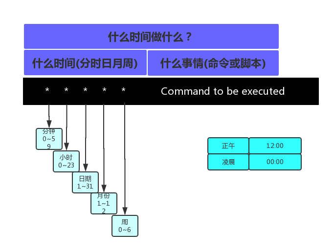

# 定时任务

## 1.定时任务的分类
定时任务有系统定时任务和用户定时任务的区分。<br>
系统的定时任何和四个文件有关：<br>
- /etc/cron.hourly
- /etc/cron.daily
- /etc/cron.weekly
- /etc/cron.monthly

系统会自动运行里面的内容，有时候木马程序会潜藏在里面。<br>

用户定时任务主要使用的命令：<br>
- crontab -l 用户定时任务的查看
- crontab -e 用户定时任务的编辑

## 2.使用定时任务
定时任务的使用步骤：<br>
- 命令测试
- 把命令放入脚本
- 测试脚本是否可以正常使用
- 写定时任务
- 检查结果


### 1.里程碑一
确认定时任务是否允许：<br>
```
ps -ef|grap crond
```

确认定时任务是否开机自启动：<br>
```
chkconfig |grep crond
```
或<br>
```
systemctl status crond
```

### 2.里程碑二
基本语法：<br>
<br>

定时任务的符号：<br>
- \* 表示每 例如(* * * * *)表示每分钟
- / 表示(每隔) 例如(*/5 * * * *)表示每隔5分钟
- \- 表示范围 例如7-8


### 3.里程碑三

#### 实例一：<br>
每五分钟同步一下系统时间<br>
__步骤一：__<br>
确认命令是否正确：<br>
在终端执行：<br>
```shell
/user/sbin/ntpdate ntpl.aliyun.com
```
命令没有问题再继续。<br>

__步骤二：__<br>
把命令写入定时任务：<br>
```shell
#sync time by noble 2018-8-19
*/5 * * * * /user/sbin/ntpdate ntpl.aliyun.com   >/dev/null 2>&1
```

__步骤三：__<br>
检查是否成功。<br>
- 1.查看定时任务``tail -f /var/log/cron``
- 2.查看定时任务执行的结果是否按计划中的实现了

#### 实例二
每天上午7点到11点 运行一个命令<br>
```
#command by noble 2018-8-19
00 07-11 * * * command
```
注意每次写小时的时候，一定要注意分钟 整点00。<br>

#### 实例三
每分钟把自己的名字追加到``~/file``文件中<br>
```shell
#add by noble 2018-8-19
* * * * * echo "noble">>~/file 2>&1
```
当脚本或命令的结果存在追加到文件中时，不用定向到黑洞。否则可能磁盘的inode被耗空<br>
常见的现象是：<br>
```
You have new mail in /var/spool/mail/root
```
如果邮件服务被关闭，那么我们什么都看不到。<br>

## 3.定时任务谏言
- 1.定时任务一定要有注释
- 2.定时任务最好使用脚本，不要直接使用命令(例如%等)
- 3.定时中的脚本使用``sh``运行
- 4.定时任务中-命令或脚本结果(无论正确或错误)定向到黑洞(>/dev/null 2>&1)或追加到文件
- 5.定向任务中避免大量的显示内容
- 6.打包命令 tar使用相对路径
- 7.定时任务中的脚本尽量使用绝对路径
