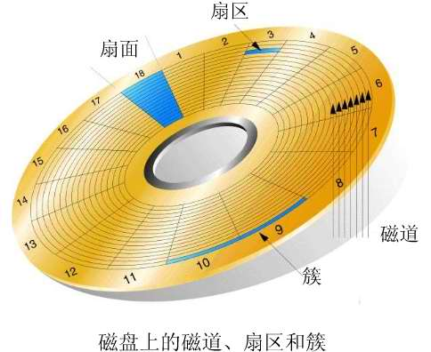

# 磁盘管理

## 1.磁盘知识体系总览
<br>

## 1.磁盘的结构
### 1.磁盘的外部结构
磁盘的外部结构主要有：盘片，主轴，磁头<br>

SAS硬盘(服务器用的硬盘)的转速：<br>
- 7.2k 1TB~10TB
- 10k  300G~1.8G
- 15k  300G~900G

### 2.磁盘接口
磁盘接口SATA，SAS，PCL-E<br>
SATA多用于家庭计算机，SAS是专门为服务器而生的，PCI-E主要用于快速设备，以前用于网卡等，现在也用于固态硬盘的接口。<br>

__SATA:__<br>
线下或者给自己用的，容量大，比较便宜。<br>
10k 2T 3T 4T
__SAS:__<br>
服务器的标配 线上/生产环境使用<br>
15k 300G 600G
__PCL-E:__<br>
大量的读写 要求很高的性能 数据量小<br>

#### 1.SATA接口
<br>
<br>

#### 2.SAS
<br>

#### 3.PCL-E
<br>

### 3.机械硬盘的简述
如下图，主要描述了机械硬盘的各个组成的名称和对磁盘相关区域的命名。<br>
<br>
<br>

根据上面两张图，我们可以得到计算磁盘容量的方法：<br>
- 磁盘容量=柱面容量*柱面数量
- 柱面容量=磁道容量*磁头数量
- 磁道容量=扇区容量*每个磁道的数量
(每个扇区的大小是512个字节 固定的)


## 2.raid
raid的目的 获得更大的容量 获得更高的性能 获得更高的安全性。<br>
<br>


## 3.分区
分区分为主分区和逻辑分区，在过去的操作系统中必须要有主分区，现在的操作系统可以没有。在磁盘上，第一个分区即0磁头0磁道1扇区，存放446bytes的MBR主引导记录和64bytes的磁盘分区表(可以放四个指针每个指针指向对应的主分区地址，最后一个指针，指向逻辑分区表的开始)，最后两个字节存放分区结束标志(55AA)。如下图：<br>
<br>

__重要概念区分：__<br>
我们重新审视一下，MBR主引导和文件系统的区别。<br>
MBR主引导 用来划分磁盘的隔断，也就是我们常说的给硬盘分区，有主分区和逻辑分区之分<br>
文件系统 每当我们格式化一个磁盘或硬盘时，就是在给这个磁盘写入文件系统，文件系统的作用是 怎么使用这个磁盘 怎么利用这个磁盘上的每个block，它实现的原理等等。详细的原理可以参考下面的文章：<br>
[文件系统](https://github.com/pitifulnoble/computer_net/blob/master/Linux%E5%AD%A6%E4%B9%A0/Linux%E7%B3%BB%E7%BB%9F%E8%AF%BE%E7%A8%8B/6.%E6%96%87%E4%BB%B6%E7%B3%BB%E7%BB%9F.md)<br>

### 1.分区的命名
硬盘命名：<br>
- 第一块sas硬盘：sda
- 第二块sas硬盘：sdb
- 第三块sas硬盘：sdc

分区命名：<br>
- 主分区/扩展分区：1-4
- 逻辑分区：从5开始

## 3.磁盘命令管理
### 1.里程碑一
使用命令``fdisk -l``查看磁盘信息。<br>

### 2.里程碑二
使用fdisk和parted进行磁盘的分区。<br>
fdisk可以操控硬盘小于2T的磁盘。<br>

__步骤一：__<br>
执行命令：<br>
```
fdisk -cu /dev/sdb
```
进入磁盘分区管理程序，``-u``表示按照扇区分区，``-c``表示关闭DOS兼容模式。<br>

常用命令：<br>
- m 帮助信息
- n add a new partition
- d delete a partition
- p print the partition table
- q quit without saving chages
- w write table to disk and exit

```
[root@noble ~]# fdisk -cu /dev/sdb
Device contains neither a valid DOS partition table, nor Sun, SGI or OSF disklabel
Building a new DOS disklabel with disk identifier 0xd6b6334a.
Changes will remain in memory only, until you decide to write them.
After that, of course, the previous content won't be recoverable.

Warning: invalid flag 0x0000 of partition table 4 will be corrected by w(rite)
```
我们看到有一个警告，是因为没有MBR，我们可以不用理会，当我们创建好分区后写入的同时也会格式化。<br>

__步骤二：__<br>
创建主分区命令如下：<br>

```
Command (m for help): n
Command action
   e   extended
   p   primary partition (1-4)
p
Partition number (1-4): 1
First sector (2048-208895, default 2048):
Using default value 2048
Last sector, +sectors or +size{K,M,G} (2048-208895, default 208895): +30M #默认数字是扇区的个数，程序提供一种方便的写法是+size{KM,G}

Command (m for help): p

Disk /dev/sdb: 106 MB, 106954752 bytes
64 heads, 32 sectors/track, 102 cylinders, total 208896 sectors
Units = sectors of 1 * 512 = 512 bytes
Sector size (logical/physical): 512 bytes / 512 bytes
I/O size (minimum/optimal): 512 bytes / 512 bytes
Disk identifier: 0xd6b6334a

   Device Boot      Start         End      Blocks   Id  System
/dev/sdb1            2048       63487       30720   83  Linux
```
创建逻辑分区，我们要创建逻辑分区要先创建扩展分区：<br>

```
Command (m for help): n
Command action
   e   extended
   p   primary partition (1-4)
e
Partition number (1-4): 2
First sector (63488-208895, default 63488):
Using default value 63488
Last sector, +sectors or +size{K,M,G} (63488-208895, default 208895):
Using default value 208895

Command (m for help): p

Disk /dev/sdb: 106 MB, 106954752 bytes
64 heads, 32 sectors/track, 102 cylinders, total 208896 sectors
Units = sectors of 1 * 512 = 512 bytes
Sector size (logical/physical): 512 bytes / 512 bytes
I/O size (minimum/optimal): 512 bytes / 512 bytes
Disk identifier: 0xd6b6334a

   Device Boot      Start         End      Blocks   Id  System
/dev/sdb1            2048       63487       30720   83  Linux
/dev/sdb2           63488      208895       72704    5  Extended

# 逻辑分区创建成功

Command (m for help): n
Command action
   l   logical (5 or over)
   p   primary partition (1-4)
l
First sector (65536-208895, default 65536):
Using default value 65536
Last sector, +sectors or +size{K,M,G} (65536-208895, default 208895): +30M

Command (m for help): p

Disk /dev/sdb: 106 MB, 106954752 bytes
64 heads, 32 sectors/track, 102 cylinders, total 208896 sectors
Units = sectors of 1 * 512 = 512 bytes
Sector size (logical/physical): 512 bytes / 512 bytes
I/O size (minimum/optimal): 512 bytes / 512 bytes
Disk identifier: 0xd6b6334a

   Device Boot      Start         End      Blocks   Id  System
/dev/sdb1            2048       63487       30720   83  Linux
/dev/sdb2           63488      208895       72704    5  Extended
/dev/sdb5           65536      126975       30720   83  Linux
```
__注意的点：__<br>
- 1.创建逻辑分区时要先创建扩展分区
- 2.通常情况下会把磁盘剩余的全部容量分给扩展分区


__步骤三：__<br>
我们这时要把创建的分区信息保存下来，同时格式化硬盘：<br>

```
Command (m for help): p

Disk /dev/sdb: 106 MB, 106954752 bytes
64 heads, 32 sectors/track, 102 cylinders, total 208896 sectors
Units = sectors of 1 * 512 = 512 bytes
Sector size (logical/physical): 512 bytes / 512 bytes
I/O size (minimum/optimal): 512 bytes / 512 bytes
Disk identifier: 0xd6b6334a

   Device Boot      Start         End      Blocks   Id  System
/dev/sdb1            2048       63487       30720   83  Linux
/dev/sdb2           63488      208895       72704    5  Extended
/dev/sdb5           65536      126975       30720   83  Linux

Command (m for help): w
The partition table has been altered!

Calling ioctl() to re-read partition table.
Syncing disks.
[root@noble ~]#
```

__步骤四：__<br>
我们现在已经创建好了磁盘分区，现在要给磁盘写入文件系统了。<br>
```
partprobe /dev/sdb
```
上面的命令告诉操作系统，磁盘主引导MBR和分区有变化。<br>

```
mkfs.ext4 /dev/sdb1
```
上面这条命令是文件系统的写入，也就是我们常说的格式化。<br>
每当我们使用这条命令时，有可能会出现一段提示：<br>
```
mke2fs 1.41.12 (17-May-2010)
Filesystem label=
OS type: Linux
Block size=1024 (log=0)
Fragment size=1024 (log=0)
Stride=0 blocks, Stripe width=0 blocks
25896 inodes, 103424 blocks
5171 blocks (5.00%) reserved for the super user
First data block=1
Maximum filesystem blocks=67371008
13 block groups
8192 blocks per group, 8192 fragments per group
1992 inodes per group
Superblock backups stored on blocks:
	8193, 24577, 40961, 57345, 73729

Writing inode tables: done
Creating journal (4096 blocks): done
Writing superblocks and filesystem accounting information: done

This filesystem will be automatically checked every 27 mounts or
180 days, whichever comes first.  Use tune2fs -c or -i to override.
```
这是说磁盘的自动检查，对于我们自己添加的磁盘不用检查，可以使用命令关闭，在提示中已经提到：<br>
```
tune2fs -c 0 -i 0 /dev/sdb1
```

## 4.磁盘挂载
命令如下：<br>
```
mount /dev/sdb1 /mnt/
```
意思是把``/dev/sdb1`` 挂载到``/mnt/``<br>

### 1.永久挂载
#### 1.方法一
把命令``/bin/mount /dev/sdb1 /mnt/``放到``/etc/rc.local``文件中。<br>

#### 2.方法二
编辑``/etc/fstab``文件。
文件内容如下：<br>
```shell
UUID=74b810c1-f4cf-4d52-8621-f1437794bbb3 /                       ext4    defaults        1 1
UUID=ffb610a4-0dca-42ea-8a57-0717e5f1d13f /boot                   ext4    defaults        1 2
UUID=77be1e4b-0bff-45f0-8d3a-b5d524f89d06 swap                    swap    defaults        0 0
```
每列的含义是：<br>
- 第一列 UUID就是设备的名称
- 第二列 是挂载的目录
- 第三例 是文件系统
- 第四列 第一个数字 表示是否备份，1表示备份，0表示不备份
- 最后一列 表示是否对磁盘进行检查 只有系统盘需要检查 我们加入的磁盘不用检查 使用数字0(否则在系统开机时，可能开不了机)

我们在文件中写下：<br>
```shell
/dev/sdb1            /mnt              ext4        defaults         0 0
```
