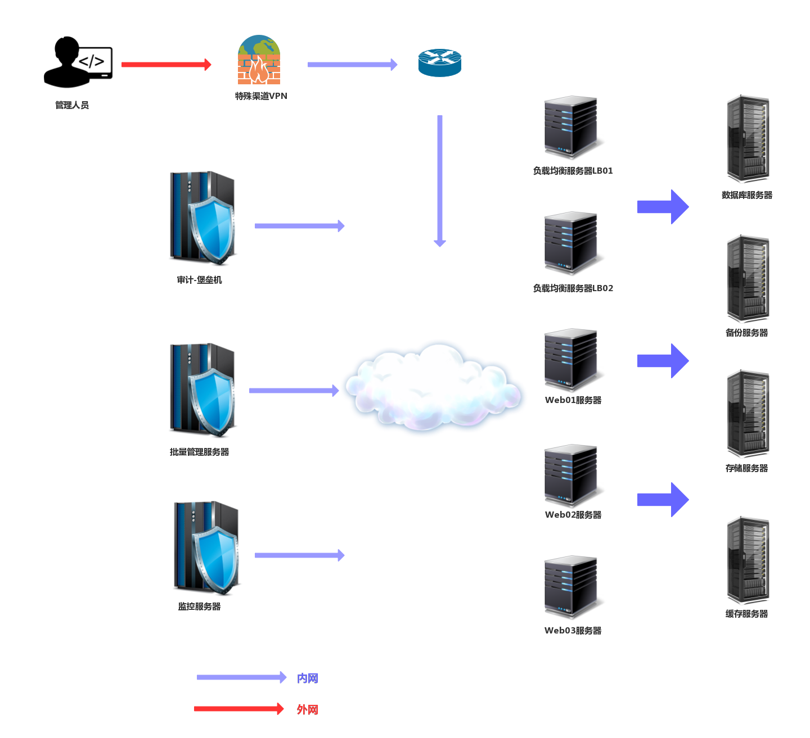
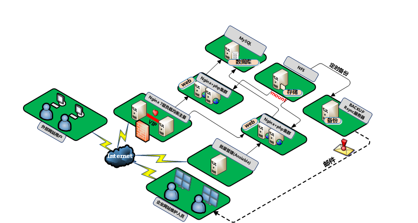
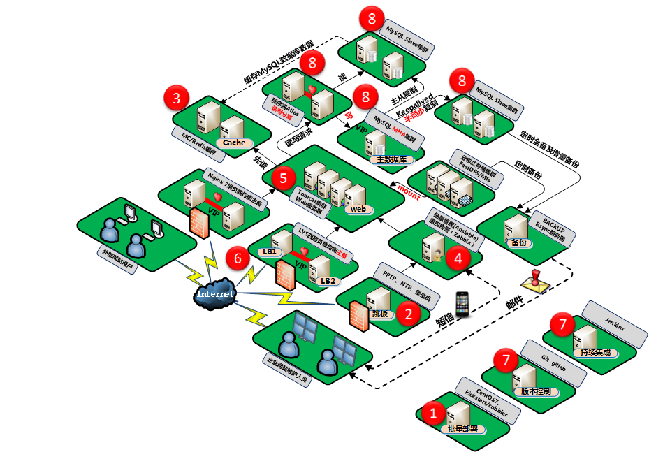

# 集群架构项目介绍
# 1.引言

## 1.1项目简介
集群架构搭建项目 使用多台计算机协同维护一个web集群架构，该项目的搭建需要对Linux系统相关操作有熟练的掌握。整个搭建过程及其环境配置均模拟真实企业工作环境，提高实验者动手能力和解决实际问题的能力。帮助实验者从学生到职场人士的平稳过渡，并使学生基本达到企业用人单位的基本技术水平要求。 
该项目的优势在于通过实际搭建企业网络集群，对企业网络有更深入的认知，整个项目的实现不需要特别稀缺的设备，仅需使用软件就可以虚拟所需的所有资源，实验者只需要一台电脑便可以实现该项目。 
该项目的模拟实景图如下： 

 

# 2.需求分析
## 2.2项目需求分析
### 2.2.1硬件方面
因为需要同时运行多台操作系统(该项目使用CentOS6和CentOS7)，所以对实验要求有一台16G的计算机。 

### 2.2.2软件方面
所有的服务器均采用CentOS，我们模拟在VMware软件上，为此我们需要以下软件： 
- 1.CentOS操作系统镜像
- 2.MySQL-5.6.34
- 3.Nginx-1.12.2
- 4.PHP-5.5.32
- 5.WordPress-4.7.3-zh_CN

### 2.2.3技术能力要求
web集群搭建要求实验者对Linux系统的配置，使用有基本的熟悉度，了解网络管理，定时任务，用户管理等。 
在搭建web站点时要熟悉基本的Nginx配置文件的编写方法和原理。熟悉MySQL语句的使用等。

## 2.3方案演示
完成该项目便可以搭建一台可以使用的web网站，我们以WordPress举例，如下： 
 

# 3.系统总体设计

## 3.2.方案架构

### 3.2.1方案原理
在第一代作品中我们使用如下技术实现web集群架构： 
- 1.SSH远程连接服务器
- 2.使用RFS+Ipcbind服务实现多台web服务器的用户数据同步
- 3.使用Rsync服务备份用户数据
- 4.LNMP架构实现web集群
- 5.使用Nginx负载均衡实现负载功能
- 6.使用Keepalived服务解决单点故障问题

在第二代作品中我们要模拟一个2000+的集群架构，为此在第一代作品的基础上实现以下功能： 
- 1.使用LVS+Keepalived代替Nginx的负载功能
- 2.使用Memcached服务同步内存数据
- 3.加入监视系统Zabbix
- 4.加入VPN安全通道
- 5.使用java+Tomcat代替LNMP架构
- 6.加入NTP时间服务器

### 3.2.2方案部署效果图
#### 第一代作品效果图： 
 

#### 第二代作品效果图： 
 

### 3.2.3方案模块关系
#### IP地址划分

|功能|主机名|IP|软件|架构|
|----|-----|--|----|----|
| Nginx反向代理  | VIP  | 10.0.0.3  |   |   |
| Nginx反向代理   | lb01  | 10.0.0.5  | Nginx  | CentOS6  |
| Nginx反向代理   | lb02  | 10.0.0.6  | Nginx  | CentOS6  |
| Nginx Web服务器   | web01  | 10.0.0.7  | Nginx  | CentOS6  |
| Nginx Web服务器   | web02  | 10.0.0.8  | Nginx  | CentOS6  |
| Nginx Web服务器   | web03  | 10.0.0.9  | Nginx  | CentOS6  |
| LVS反向代理   |  VIP   | 10.0.0.13  |     |  |
| LVS反向代理   |  lb03   | 10.0.0.15  |  LVS   | CentOS7 |
| LVS反向代理   |  lb03   | 10.0.0.16  |  LVS   | CentOS7 |
| Tomcat Web服务器  | web04  |  10.0.0.17 | Tomcat  | CentOS7  |
| Tomcat Web服务器  | web06  |  10.0.0.18 | Tomcat  | CentOS7  |
| 缓存数据库  | cache01  |  10.0.0.21 | Memcached  | CentOS7  |
| 共享存储  | nfs  | 10.0.0.31  | NFS  | CentOS6  |
| 备份存储  | backup  | 10.0.0.41  | Rsync  | CentOS6  |
| 数据库  | db01  | 10.0.0.51  | MySQL主  | CentOS6  |
| 数据库  | db02  | 10.0.0.52  | MySQL从  | CentOS6  |
| 数据库  | db03  | 10.0.0.53  | MySQL从MHA  | CentOS6  |
| 数据库  | VIP  | 10.0.0.55  | MHA VIP  | CentOS6  |
| 管理服务器  | m01  | 10.0.0.61  | Zabbix  | CentOS7  |
| 管理服务器  | m02  | 10.0.0.62  | PPTP/NTP  | CentOS7  |
| 管理服务器  | gitlab  | 10.0.0.63  | GitLab  | CentOS7  |
| 管理服务器  | Jenkins  | 10.0.0.64  | Jenkins  | CentOS7  |

## 3.3方案子系统

### 3.3.1方案总系统

### 3.3.2方案总流程
