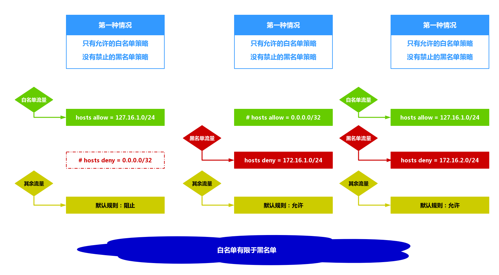

# 期中架构rsync服务
__rsync远程数据备份方式__<br>
- Access via remote shell:
    - Pull: rsync [OPTION...] [USER@]HOST:SRC... [DEST]
    - Push: rsync [OPTION...] SRC... [USER@]HOST:DEST
    - -v 显示传输的文件
    - -z 压缩 在公司局域网 带宽很大 一般可默认
    - -a 保持文件状态 传输后不变
    - -p 传输时显示百分比
    - -e 使用的信道协议
    - --exclude= 排除
    - --exclude-from= 加上一个文件 排除
    - --bwlimit=RATE 实现数据过程显示传输 单位是kbytes

举例：<br>
``rsync -avz /etc/hosts rsync_backup@172.16.1.41::backup``<br>

__scp远程数据备份方式__<br>
- scp命令 把本地的文件传输到远端的机器(需要密码)
  - -r:递归目录传输文件
  - -p:保存同步数据的属性信息不变
实例：<br>
``scp -rp /tmp/ 172.16.1.31:/tmp/``<br>

__rsync守护进程__<br>
- 服务端部署
    - 1.确认软件是否安装
        - rpm -qa|grep rsync
    - 2.进行软件服务配置文件编写
        - vim /etc/rsyncd.conf

        ```
        #rsync_config
        #created by Noble at 2017
        ##rsyncd.conf start##
        uid = rsync
        gid = rsync
        use chroot = no
        max connections = 200
        timeout = 300
        pid file = /var/run/rsyncd.pid
        lock file = /var/run/rsync.lock
        log file = /var/log/rsyncd.log
        ignore errors
        read only = false
        list = false
        hosts allow = 172.16.1.0/24
        hosts deny = 0.0.0.0/32
        auth users = rsync_backup
        secrets file = /etc/rsync.password
        [backup]
        comment = "backup dir by noble"
        path = /backup
        ```

    - 3.创建备份目录管理用户
        - useradd rsync -M -s /sbin/nologin
    - 4.创建备份目录，并进行授权
        - mkdir /backup
        - chown -R rsync.rsync /backup/
    - 5.创建认证用户授权密码文件，并对密码文件进行授权
        - echo 'rsync_backup:asd123!@#' >>/etc/rsync.password
        - chmod 600 /etc/rsync.password
    - 6.启动程序服务
        - rsync --daemon
        - ps -ef|grep rsync
        - netstat -lntup |grep 873
- 客户端部署
    - 确认软件是否安装
        - rpm -qa|grep rsync
    - 创建认证密码文件
        - echo 'asd123!@#' >>/etc/rsync.password
        - chmod 600 /etc/rsync.password
    - 进行数据备份测试
        - rsync -avz /etc/hosts rsync_backup@172.16.1.41::backup --password-file=/etc/rsync.password

# rsync服务高级使用
## 1.实现备份的数据分目录整理
实现方法是在文件``/etc/rsyncd.conf``增添新的标签。<br>
原来的文件：<br>
```
##rsyncd.conf start##
uid = rsync
gid = rsync
use chroot = no
max connections = 200
timeout = 300
pid file = /var/run/rsyncd.pid
lock file = /var/run/rsync.lock
log file = /var/log/rsyncd.log
ignore errors
read only = false
list = false
hosts allow = 172.16.1.0/24
hosts deny = 0.0.0.0/32
auth users = rsync_backup
secrets file = /etc/rsync.password
[backup]
comment = "backup dir by noble"
path = /backup
```

我们在最后再添加一个标签：<br>
```
##rsyncd.conf start##
uid = rsync
gid = rsync
use chroot = no
max connections = 200
timeout = 300
pid file = /var/run/rsyncd.pid
lock file = /var/run/rsync.lock
log file = /var/log/rsyncd.log
ignore errors
read only = false
list = false
hosts allow = 172.16.1.0/24
hosts deny = 0.0.0.0/32
auth users = rsync_backup
secrets file = /etc/rsync.password

[backup]
comment = "backup dir by noble"
path = /backup
[backup02]
comment = "backup dir by noble"
path = /backup02
```
然后我们要创建目录``/backup02``<br>
``mkdir /backup02/``<br>

然后更改目录的权限：<br>
``chown -R rsync.rsync /backup02``<br>

然后我们再执行命令测试一下(把backup改为backup02)：<br>
``rsync -avz /etc/hosts rsync_backup@172.16.1.41::backup02 --password-file=/etc/rsync.password``<br>
如果我们看到在``/backup02``目录下面有没有同步的数据。<br>

**总结**<br>
我们通过上面的添加新标签的方法解决同步时的目录规划问题。<br>

## 2.实现备份的数据子目录划分
如果我们要在备份目录的下面创建子目录来备份数据 则不需要再创建 新的标签。<br>
我们在原理的目录下面加上``/src/``就会在``/backup/``目录下面追加创建``/src/``(注意要有``/``)目录。并备份。<br>
``rsync -avz /etc/hosts rsync_backup@172.16.1.41::backup02/src/ --password-file=/etc/rsync.password``<br>

## 3.访问控制设置
Rsync访问控制配置原理如下：<br>
<br>
关于访问控制的信息也同样是在文件``/etc/rsyncd.conf``中配置。<br>

## 3.Rsync无差异同步
当我们想要是备份目录中的数据与被同步的目录中的数据完全一致时，可以使用无差异同步。<br>
``rsync -avz /test_dir/ --delete rsync_backup@172.16.1.41::backup01 --password-file=/etc/rsync.password``<br>
- 说明：一定要谨慎使用，否则可能会清空备份目录；
  - 如果要快速清空目录数据，也可以使用无差异同步清空
