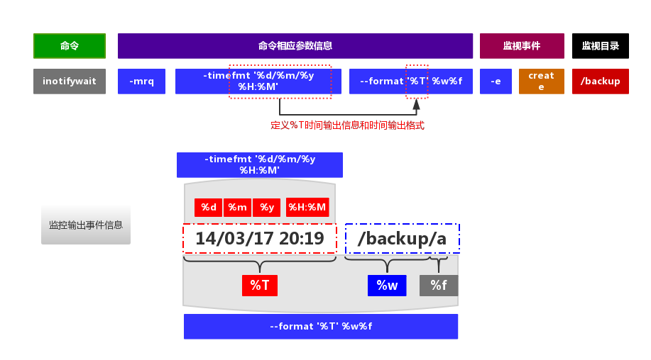

期中架构-第四章-实时同步服务知识梳理
======================================================================

__01. 课程概念介绍__<br>
- 1.为什么要用实时同步服务
    - 因为定时任务有缺陷，一分钟以内的数据无法进行同步，容易造成数据丢失

- 2.实时同步工作原理
    - a 创建要存储数据的目录
    - b 利用实时同步的软件监控我们进行备份的数据目录
    - c 利用rsync服务进行数据推送传输备份

__02. 实时同步服务软件部署__<br>
    a inotify+rsync实现实时同步备份

- 第一个里程：将inotify软件安装成功<br>
	``yum install -y inotify-tools`` 要安装到rsync客户端上。<br>

	说明：操作系统的yum源文件中，是否存在epel源<br>

	``wget -O /etc/yum.repos.d/epel.repo http://mirrors.aliyun.com/repo/epel-6.repo``

	```
	[root@nfs01 ~]# rpm -ql inotify-tools
  /usr/bin/inotifywait                <--- 实现对数据目录信息变化监控（重点了解的命令）
  /usr/bin/inotifywatch               <--- 监控数据信息变化，对变化的数据进行统计

  [root@nfs01 ~]# cd /proc/sys/fs/inotify/
  [root@nfs01 inotify]# ll
  总用量 0
  -rw-r--r-- 1 root root 0 2018-02-25 19:45 max_queued_events
  -rw-r--r-- 1 root root 0 2018-02-25 19:45 max_user_instances
  -rw-r--r-- 1 root root 0 2018-02-25 19:45 max_user_watches
  ```

    - max_user_watches:	设置inotifywait或inotifywatch命令可以监视的文件数量（单进程）
	                    默认只能监控8192个文件

    - max_user_instances:	设置每个用户可以运行的inotifywait或inotifywatch命令的进程数
	                    默认每个用户可以开启inotify服务128个进程

    - max_queued_events:	设置inotify实例事件（event）队列可容纳的事件数量
                        默认监控事件队列长度为16384

- 第二个里程：将rsync守护进程模式部署完毕
    - rsync服务端部署
        - a 检查rsync软件是否已经安装
        - b 编写rsync软件主配置文件
        - c 创建备份目录管理用户
        - d 创建备份目录，并进行授权
        - e 创建认证文件，编写认证用户和密码信息，设置文件权限为600
        - f 启动rsync守护进程服务

    - rsync客户端部署
        - a 检查rsync软件是否已经安装
        - b 创建认证文件，编写认证用户密码信息即可，设置文件权限为600
        - c 利用客户端进行数据同步测试


- 第三个里程：要让inotify软件和rsync软件服务建立连接（shell脚本）
	rsync软件应用命令：<br>
	``rsync -avz /etc/hosts rsync_backup@172.16.1.41::backup --password-file=/etc/rsync.password``


	- inotify软件应用命令inotifywait：
	    ```
        inotifywait
        -m|--monitor	         始终保持事件监听状态
        -r                     进行递归监控
        -q|--quiet             将无用的输出信息，不进行显示
        --timefmt <fmt>        设定日期的格式
                               man strftime 获取更多时间参数信息
        --format <fmt>         命令执行过程中，输出的信息格式
        -e                     指定监控的事件信息
        ```
	man inotifywait 查看所有参数说明和所有可以监控的事件信息<br>

  总结主要用到的事件信息：<br>
	create创建、delete删除、moved_to移入、close_write修改<br>
  下图是对inotifywait命令应用的视图：<br>
  <br>
	inotifywait -mrq --timefmt "%F" --format "%T %w%f Event information:%e" /data  <-- 相对完整的命令应用<br>
	inotifywait -mrq --timefmt "%F" --format "%T %w%f Event information:%e" -e create /data   <-- 指定监控什么事件信息<br>

	inotifywait -mrq --format "%w%f" -e create,delete,moved_to,close_write  /data<br>
	以上为实现实时同步过程，所需要的重要监控命令<br>

    编写脚本：实现inotify与rsync软件结合<br>

     ```
     #!/bin/bash
     ####################
     inotifywait -mrq --format "%w%f" -e create,delete,moved_to,close_write  /data|\
     while read line
     do
     rsync -az --delete /data/ rsync_backup@172.16.1.41::backup --password-file=/etc/rsync.password
     done
     ```

	shell循环语法总结：<br>
	for循环       for xx in 循环条件内容信息;do xxx;done<br>
	while循环     while 循环条件；do xx ；done    <-- 只要条件满足，就一直循环<br>
	              while true；do xx ；done         <-- 死循环<br>

	运维工作中编写自动化脚本规范：
	1. 先完成基本功能需求
	2. 优化完善脚本内容
	3. 写上一些注释说明信息
	4. 进行反复测试

- 第四个里程：最终的测试<br>
	```sh -x intofy.sh```

__b sersync+rsync实现实时同步备份__<br>

- 第一个里程：下载安装sersync软件<br>
	先进行软件下载，把软件包上传到系统中<br>
    ```
    unzip sersync_installdir_64bit.zip
    cd sersync_installdir_64bit
    mv sersync /usr/local/
    tree
    ```

- 第二个里程：编写sersync配置文件

    ```
    [root@nfs01 sersync]# cd /usr/local/sersync/conf/
    [root@nfs01 conf]# ll
    总用量 4
    -rw-r--r-- 1 root root 2214 2011-10-26 11:54 confxml.xml
	```

	```
     6     <filter start="false">
     7         <exclude expression="(.*)\.svn"></exclude>
     8         <exclude expression="(.*)\.gz"></exclude>
     9         <exclude expression="^info/*"></exclude>
    10         <exclude expression="^static/*"></exclude>
    11     </filter>
   ```

   说明：实现同步数据过滤排除功能<br>
   ```
    12     <inotify>
    13         <delete start="true"/>
    14         <createFolder start="true"/>
    15         <createFile start="false"/>
    16         <closeWrite start="true"/>
    17         <moveFrom start="true"/>
    18         <moveTo start="true"/>
    19         <attrib start="false"/>
    20         <modify start="false"/>
    21     </inotify>
    ```
	说明：类似于inotify的-e参数功能，指定监控的事件信息<br>

	```
    23     <sersync>
    24         <localpath watch="/data">
    25             <remote ip="172.16.1.41" name="backup"/>
    26             <!--<remote ip="192.168.8.39" name="tongbu"/>-->
    27             <!--<remote ip="192.168.8.40" name="tongbu"/>-->
    28         </localpath>
    29         <rsync>
    30             <commonParams params="-az"/>
    31             <auth start="true" users="rsync_backup" passwordfile="/etc/rsync.password"/>
    32             <userDefinedPort start="false" port="874"/><!-- port=874 -->
    33             <timeout start="false" time="100"/><!-- timeout=100 -->
    34             <ssh start="false"/>
    35         </rsync>
    ```
	 说明：以上内容是数据相关的配置信息，是必须进行修改调整配置<br>

- 第三个里程：应用sersync软件，实现实时同步
    ```
    [root@nfs01 conf]# cd /usr/local/sersync/
    [root@nfs01 sersync]# cd bin/
    [root@nfs01 bin]# ll
    总用量 1768
    -rw-r--r-- 1 root root 1810128 2011-10-26 14:19 sersync
    sersync命令参数：
    参数-d:              启用守护进程模式
    参数-r:              在监控前，将监控目录与远程主机用rsync命令推送一遍（测试）
    参数-n:              指定开启守护线程的数量，默认为10个
    参数-o:              指定配置文件，默认使用confxml.xml文件

    ./sersync -dro /usr/local/sersync/conf/confxml.xml
    ```

__03. 实时同步软件概念介绍__<br>
    inotify软件<br>
    Inotify是一种强大的，细粒度的。异步的文件系统事件监控机制，linux内核从2.6.13起，
    加入了Inotify支持，通过Inotify可以监控文件系统中添加、删除，修改、移动等各种事件，
	利用这个内核接口，第三方软件就可以监控文件系统下文件的各种变化情况，
	而inotify-tools正是实施这样监控的软件	<br>
	软件参考链接：https://github.com/rvoicilas/inotify-tools/wiki<br>

sersync软件<br>
Sersync项目利用inotify与rsync技术实现对服务器数据实时同步的解决方案，
其中inotify用于监控sersync所在服务器上文件系统的事件变化，
rsync是目前广泛使用的本地及异地数据同步工具，
其优点是只对变化的目录数据操作，甚至是一个文件不同的部分进行同步，
所以其优势大大超过使用挂接文件系统或scp等方式进行镜像同步。<br>
软件参考链接：https://github.com/wsgzao/sersync<br>

下一个章节：ssh远程连接服务+ansible批量管理服务
