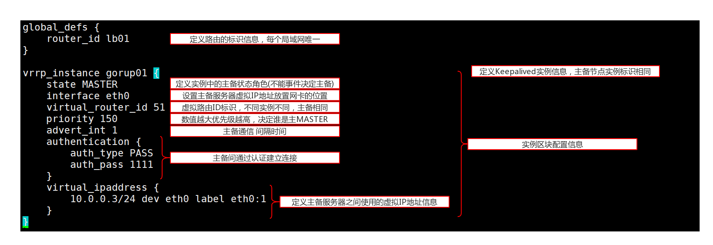

# 期中集群架构keepalived高可用集群


## 1. keepalived服务概念说明
keepalived软件能干什么?<br>
Keepalived软件起初是专为LVS负载均衡软件设计的，<br>
用来管理并监控LVS集群系统中各个服务节点的状态，后来又加入了可以实现高可用的VRRP功能<br>

Keepalived软件主要是通过VRRP协议实现高可用功能的。<br>
VRRP是Virtual Router Redundancy Protocol（虚拟路由器冗余协议）的缩写，
VRRP出现的目的就是为了解决静态路由单点故障问题的，它能够保证当个别节点宕机时，
整个网络可以不间断地运行<br>

keepalived软件工作原理？(重点)<br>
### 原理<br>
1）VRRP协议，全称Virtual Router Redundancy Protocol，中文名为虚拟路由冗余协议，
   VRRP的出现是为了解决静态路由的单点故障。<br>
2）VRRP是用过IP多播的方式（默认多播地址（224.0.0.18））实现高可用对之间通信的。<br>
3）工作时主节点发包，备节点接包，当备节点接收不到主节点发的数据包的时候，
   就启动接管程序接管主节点的资源。备节点可以有多个，通过优先级竞选，
   但一般Keepalived系统运维工作中都是一对。<br>


### keepalived软件主要功能？<br>
- ①.管理LVS负载均衡软件<br>
- ②.实现对LVS集群节点健康检查功能<br>
- ③.作为系统网络服务的高可用功能<br>


## 2. 部署keepalived高可用服务：

### 1.确认反向代理服务是否工作正常
#### 第一个里程：在lb01/lb02上测试web服务器是否可以正常
```
curl -H host:www.noble.org 10.0.0.7/noble.html
curl -H host:www.noble.org 10.0.0.8/noble.html
curl -H host:www.noble.org 10.0.0.9/noble.html
curl -H host:bbs.noble.org 10.0.0.7/noble.html
curl -H host:bbs.noble.org 10.0.0.8/noble.html
curl -H host:bbs.noble.org 10.0.0.9/noble.html
```

#### 第二个里程：在浏览器上测试访问lb01/lb02
测试前同步lb01和lb02配置文件：<br>
```
scp -rp /application/nginx/conf/nginx.conf 10.0.0.6:/application/nginx/conf/
```

解析hosts文件，将域名解析为10.0.0.5，进行测试访问<br>
解析hosts文件，将域名解析为10.0.0.6，进行测试访问<br>


### 2.安装部署高可用keepalived服务
#### 第一个里程：安装keepalived服务软件<br>
```
yum install -y keepalived

/etc/init.d/keepalived start
```

#### 第二个里程：编写keepalived配置文件<br>
``vim /etc/keepalived/keepalived.conf``<br>

```
man keepalived.conf   --- 配置文件说明信息<br>

配置文件结构：
GLOBAL CONFIGURATION  --- 全局配置（\*）
VRRPD CONFIGURATION   --- vrrp配置（*）
LVS CONFIGURATION     --- LVS服务相关配置
```

##### 1.对keepalived服务配置文件编写的解读
<br>

##### lb01主负载均衡器配置<br>
```
global_defs {
    router_id lb01
}

vrrp_instance gorup01 {
    state MASTER
    interface eth0
    virtual_router_id 51
    priority 150
    advert_int 1
    authentication {
        auth_type PASS
        auth_pass 1111
    }
    virtual_ipaddress {
        10.0.0.3/24 dev eth0 label eth0:1
    }
}


/etc/init.d/keepalived reload
```

##### lb02配置信息<br>
```
global_defs {
    router_id lb02
}

vrrp_instance group01 {
    state BACKUP
    interface eth0
    virtual_router_id 51
    priority 100
    advert_int 1
    authentication {
        auth_type PASS
        auth_pass 1111
    }
    virtual_ipaddress {
        10.0.0.3/24 dev eth0 label eth0:1
    }
}


/etc/init.d/keepalived reload
```
### 3.进行测试访问
使用本地浏览器访问``blog.noble.org``观察是否正常。<br>

更新到这里。。。。<br>

## 3. 部署keepalived高可用服务问题
同时在keepalived高可用集群中，出现了两个虚拟IP地址信息，这种情况就称为脑裂<br>

脑裂情况出现原因：<br>
- 1.心跳线出现问题
  - 网卡配置有问题
  - 交换设备有问题
  - 线缆连接有问题

- 2.有防火墙软件阻止问题
- 3.virtual_router_id配置数值不正确


总之：只要备服务器收不到组播包，就会成为主，而主资源没有释放，就会出现脑裂<br>

利用shell脚本实现监控管理：<br>
备用设备有VIP就是表示不正常<br>
- 01.真正实现主备切换<br>
- 02.出现脑裂情况了<br>


```
#!/bin/bash
check_info=$(ip a|grep -c 10.0.0.3)
if [ $check_info -ne 0 ]
then
   echo "keepalived server error!!!"
fi
```

## 4. 实现nginx反向代理监控虚拟IP地址
### 编写nginx反向代理配置
```
server {
    listen      10.0.0.3:80;
    server_name  www.noble.org;
    root   html;
    index  index.html index.htm;
    location / {
        proxy_pass http://noble;
        proxy_set_header host $host;
        proxy_set_header X-Forwarded-For $remote_addr;
    }
}
server {
    listen       10.0.0.3:80;
    server_name  bbs.noble.org;
    root   html;
    index  index.html index.htm;
    location / {
        proxy_pass http://noble;
        proxy_set_header host $host;
        proxy_set_header X-Forwarded-For $remote_addr;
    }
}
```

```
/application/nginx/sbin/nginx -s stop
/application/nginx/sbin/nginx
netstat -lntup|grep nginx
tcp        0      0 10.0.0.3:80                 0.0.0.0:*                 LISTEN      53334/nginx
```

实现监听本地网卡上没有的IP地址<br>
``echo 'net.ipv4.ip_nonlocal_bind = 1' >>/etc/sysctl.conf``<br>
``sysctl -p``

## 5. 将keepalived服务和反向代理nginx服务建立联系
nginx反向代理服务停止，keepalived服务也停止
### 1.编写脚本
```
#!/bin/bash
web_info=$(ps -ef|grep [n]ginx|wc -l)
if [ $web_info -lt 2 ]
then
   /etc/init.d/keepalived stop
fi
```

### 2.运行脚本，实现监控nginx服务
编辑keepalived服务配置文件<br>
```
vrrp_script check_web {
    #定义一个监控脚本，脚本必须有执行权限
    script "/server/scripts/check_web.sh"
    #指定脚本间隔时间
    interval 2
    #脚本执行完成，让优先级值和权重值进行运算，从而实现主备切换
    weight 2
}

track_script {
     check_web
}
```
``chmod +x check_web.sh``   --- 修改脚本可执行权限

## 6. 实现高可用集群架构中双主配置（互为主备配置）

#### lb01
```
vrrp_instance gorup01 {
state MASTER
interface eth0
virtual_router_id 51
priority 150
advert_int 1
authentication {
    auth_type PASS
    auth_pass 1111
}
virtual_ipaddress {
    10.0.0.3/24 dev eth0 label eth0:1
   }
}
vrrp_instance gorup02 {
    state BACKUP
    interface eth0
    virtual_router_id 52
    priority 100
    advert_int 1
    authentication {
        auth_type PASS
        auth_pass 1111
    }
    virtual_ipaddress {
        10.0.0.4/24 dev eth0 label eth0:1
    }
}
```


 #### lb02

```
vrrp_instance gorup01 {
state BACKUP
interface eth0
virtual_router_id 51
priority 100
advert_int 1
authentication {
    auth_type PASS
    auth_pass 1111
}
virtual_ipaddress {
    10.0.0.3/24 dev eth0 label eth0:1
   }
}
vrrp_instance gorup02 {
    state MASTER
    interface eth0
    virtual_router_id 52
    priority 150
    advert_int 1
    authentication {
        auth_type PASS
        auth_pass 1111
    }
    virtual_ipaddress {
        10.0.0.4/24 dev eth0 label eth0:1
    }
}
```

修改nginx反向代理监控地址信息
