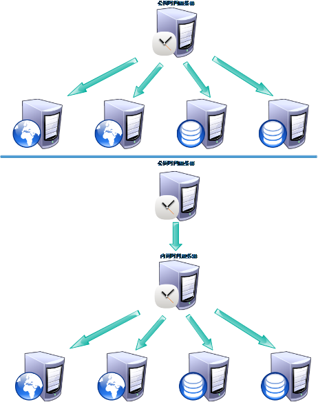

# NTP时间服务

客户端同步时间的命令:<br>
```shell
ntpdate [ipaddress]
```
## NTP（Network Time Protocol，网络时间协议）
NTP是用来使网络中的各个计算机时间同步的一种协议。
它的用途是把计算机的时钟同步到世界协调时UTC，
其精度在局域网内可达0.1ms，
在互联网上绝大多数的地方其精度可以达到1-50ms。<br>
<br>

NTP服务器就是利用NTP协议提供时间同步服务的<br>
ntp软件（支持ntp协议）     CentOS6自带 CentOS7需要安装的<br>
chrony软件（支持ntp协议）  CentOS7自带<br>
<br>


### 环境准备
从CentOS7模板机全新克隆一台新主机<br>
IP规划为10.0.0.62/172.16.1.62，主机名为m02<br>

### 安装NTP软件
```
yum -y install ntp
rpm -qa ntp
```

红帽官网：<br>
https://access.redhat.com/documentation/en-us/red_hat_enterprise_linux/7/html-single/system_administrators_guide/<br>

### 配置NTP软件

我们可以更改的配置文件是以下部分。<br>
``[root@m02 ~]# vim /etc/ntp.conf``<br>

```
# permit the source to query or modify the service on this system.
#restrict default nomodify notrap nopeer noquery
restrict default nomodify

# Permit all access over the loopback interface.  This could
# be tightened as well, but to do so would effect some of
# the administrative functions.
restrict 172.16.1.0/24 10.0.0.0/24
restrict ::1

# Hosts on local network are less restricted.
#restrict 192.168.1.0 mask 255.255.255.0 nomodify notrap

# Use public servers from the pool.ntp.org project.
# Please consider joining the pool (http://www.pool.ntp.org/join.html).
server ntp1.aliyun.com iburst
server ntp2.aliyun.com iburst
server ntp3.aliyun.com iburst
server ntp4.aliyun.com iburst
```
上面的代码是从ntp的配置文件中复制的，表示我们用户只需更改这段配置文件。<br>

``# restrict default nomodify notrap nopeer noquery``
- restrict
- default
- nomodify 不允许用户更改本ntp的服务器
- notrap
- nopeer
- noquery 不让用户查看ntp服务器的状态

下面的这段表示那段ip可以访问本ntp服务器<br>
```
# Permit all access over the loopback interface.  This could
# be tightened as well, but to do so would effect some of
# the administrative functions.
restrict 172.16.1.0/24 10.0.0.0/24
restrict ::1
```

此NTP服务器从下面这些主机获取时间信息。<br>
```
server ntp1.aliyun.com iburst
server ntp2.aliyun.com iburst
server ntp3.aliyun.com iburst
server ntp4.aliyun.com iburst
```

下面的实例是我们的一般配置方法。<br>

```
#6 row
cp /etc/ntp.conf{,.ori}
[root@m02 ~]# vim /etc/ntp.conf
# restrict default nomodify notrap nopeer noquery
restrict default nomodify

# nomodify客户端可以同步
restrict 172.16.1.0/24 10.0.0.0/24


# 将默认时间同步源注释改用可用源
# server 0.centos.pool.ntp.org iburst
# server 1.centos.pool.ntp.org iburst
# server 2.centos.pool.ntp.org iburst
# server 3.centos.pool.ntp.org iburst
server ntp1.aliyun.com
```


### 启动NTP

``systemctl start ntpd``

### ntp服务器的常用命令
```
ntpq -p  ntp服务器使用该命令查看上级时间服务器状态
ntpstat   客户端(非ntp服务器)使用该命令查看时间同步服务器的状态
```

其他服务器使用``ntpdata ntp服务器的ip``同步时间。<br>

## Chrony时间服务
比ntp更优秀<br>
chrony的一个好处是，当chrony服务器和网络上的时间服务器连接出现问题时，不会影响它的工作，比如断网。而NTP服务器不行。<br>
chrony的另一个好处是，文件配置比NTP更简单。<br>

```
systemctl status chrony
vim /etc/chrony.conf
```

只需改两处，前几行是网络上的时间服务器，如下：<br>
```
server ntp1.aliyum.com iburst
server ntp2.aliyum.com iburst
server ntp3.aliyum.com iburst
server ntp4.aliyum.com iburst
```

在26行是如需访问本服务器的ip配置：<br>
```
25 # Allow NTP client access from local network.
26 allow 172.16.1.0/24
27 allow 10.0.0.0/24
```

然后重启chorny服务。<br>
``systemctl restart chronyd.server``
