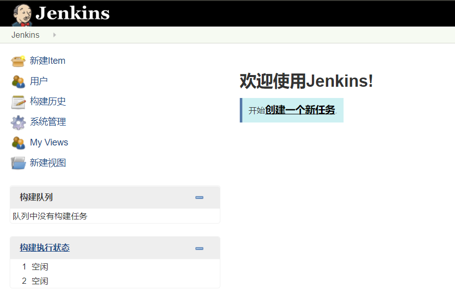

# GitLab
GItLab官网：[https://about.gitlab.com/](https://about.gitlab.com/)<br>
本文档中使用的GItLab版本为10.2.2，系统环境是CentOS7.<br>

## 1.开源代码三部曲 安装、配置、启动
### 1.安装
从[清华镜像网站](https://mirrors.tuna.tsinghua.edu.cn/gitlab-ce/)下载rpm包，根据[GitLab官网公布的安装方法](https://about.gitlab.com/install/)解决依赖，然后使用``rpm -ivh``按装rpm包。<br>

### 2.配置
GItLab的配置文件默认位置：``/etc/gitlab/gitlab.rb``<br>
在配置文件的第13行更改external_url的参数为适当的值，比如具体的IP地址``external_url 'http://120.79.0.29'``等。<br>

更改过配置文件后必须执行命令：<br>
```
sudo gitlab-ctl reconfigure
```

### 3.重启
```
gitlab-ctl restart
```

### 4.查看服务启动情况
```
[root@node1 tools]# gitlab-ctl status
run: gitaly: (pid 13286) 54s; run: log: (pid 12855) 116s
run: gitlab-monitor: (pid 13303) 53s; run: log: (pid 12953) 104s
run: gitlab-workhorse: (pid 13311) 53s; run: log: (pid 12798) 135s
run: logrotate: (pid 13319) 52s; run: log: (pid 12827) 122s
run: nginx: (pid 13326) 52s; run: log: (pid 12810) 129s
run: node-exporter: (pid 13331) 51s; run: log: (pid 12903) 110s
run: postgres-exporter: (pid 13336) 51s; run: log: (pid 13056) 86s
run: postgresql: (pid 13343) 50s; run: log: (pid 12577) 179s
run: prometheus: (pid 13353) 50s; run: log: (pid 13026) 92s
run: redis: (pid 13395) 50s; run: log: (pid 12517) 185s
run: redis-exporter: (pid 13400) 49s; run: log: (pid 12970) 98s
run: sidekiq: (pid 13409) 47s; run: log: (pid 12781) 141s
run: unicorn: (pid 13420) 47s; run: log: (pid 12742) 147s
```

### 5.使用本地browser访问GItLab的80端口检测

## 2.GitLab基本使用

### 1.root用户登录
GitLab有一个root初始管理员用户。我们注册登录后做以下基本配置。<br>

### 2.取消用户注册选项
为了运维管理方便，我们禁止用户自己注册用户，通常有管理员分配用户。<br>
<br>

## GitLab其他功能略过

# Jenkins

## 1.Jenkins安装部署
本文档使用Jenkins-2.99版本，从[清华镜像网站](https://mirrors.tuna.tsinghua.edu.cn/jenkins/redhat/)下载rpm包。<br>

## 1.安装JDK
Jenkins是Java代码编写的，所以我们要准备好Java环境。<br>

## 2.下载rpm包并安装
在清华镜像下载好后需要使用``rpm -ivh``安装，之后使用``systemctl start jenkins``启动jenkins。<br>

## 3.Jenkins基本配置

### 1.里程碑一 访问Jenkins首页
使用web浏览器访问安装Jenkins服务器的8080端口。<br>
<br>
根据页面提示，找到初始密码并登陆。<br>

### 2.基本环境介绍
登陆后，我们需要加载一段时间，Jenkins此时在联网检查可安装的插件。加载结束后执行以下操作。<br>
<br>
<br>

接下来我们就进入Jenkins工作界面了。<br>
<br>

### 3.Jenkins插件管理
Jenkins的功能强大是因为有一个插件生态。<br>
Jenkins的插件安装通常有两种方法，第一种方法是从Jenkins页面上的链接直接下载：<br>
<br>
这种方法速度很慢，如果插件数量多的话，则需要非常久的时间。<br>

Jenkins另一种安装插件的方法是将插件文件直接拷贝到插件目录下。<br>
我们从[清华镜像](https://mirrors.tuna.tsinghua.edu.cn/jenkins/plugins/)下载好插件。<br>
Jenkins的插件目录位置是：<br>
```
/var/lib/jenkins/plugins
```

### 4.Jenkins目录介绍
Jenkins的配置文件目录：``/etc/sysconfig/jenkins``<br>
Jenkins主要工作目录：``/var/lib/jenkins``<br>
在工作目录``/var/lib/jenkins``下有一个``job``目录，该目录下面是我们创建的所以项目主目录。<br>
当我们执行过"构建" 后在Jenkins主要工作目录下会有``workspace``目录，里面是构建工程的工作结果。<br>


## 4.Jenkins实战
### 1.Jenkins创建简单工程并构建
创建工程如下：<br>
<br>

选择工程名称，该工程名称不建议更改，因为每次更改名称Jenkins会重新创建新文件，而且久文件不会删除。<br>
<br>

在Genaral中有一个必选，就是及时清理不必要的构建。<br>
<br>

我们在构建中添加要执行的步骤，我们这里就执行一个pwd命令。<br>
<br>

我们点击保存后就，就会到达该项目的主界面:<br>
<br>

我们构建完成后，看看构建的输出，说明构建的目录在Jenkins主目录下的workspace中。<br>
<br>
<br>

在workspace目录的freejob2下，没有任何文件，因为我们构建的工程只有pwd一个命令，没有生成选项。<br>
<br>

我们到jobs目录下看看：<br>
<br>

这个目录记载了整个构建工程的信息
<br>

### 2.Jenkins拉取GitLab代码

#### 里程碑一 更改用户权限
Jenkins服务在Linux上面是以Jenkins普通用户启动的。我们将它更改为root用户。<br>
打开``/etc/sysconfig/jenkins``文件，将第29行更改为：<br>
```
JENKINS_USER="root"
```

#### 里程碑二 本地用户可访问GitLab
Jenkins服务映射的用户，在里程碑一中已经更改为本地的root用户。我们要保证该用户可以登录到GitLab主机，并拖下仓库。也就是给本地的root用户做过认证。<br>