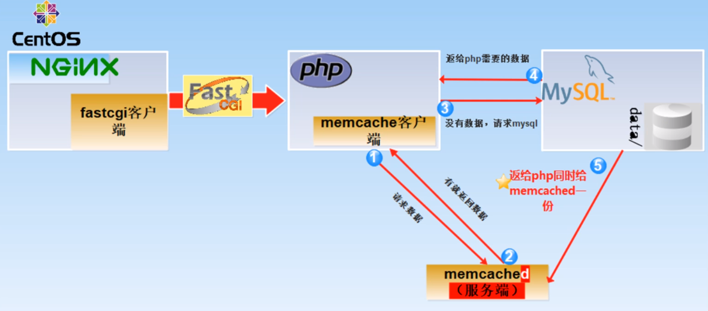
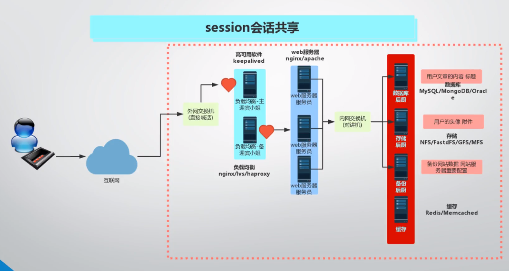

# Memcached使用

Memcached是一种开源,高性能,纯缓存的服务软件.<br>
官网:[http://memcached.org/](http://memcached.org/)<br>

## 1.Memcached常用工作场景

### 1.1.提高数据库的访问速度
<br>

- 1.用户请求需要访问数据库
- 2.php访问memcached寻找数据
    - 2.1.存在数据则返回
    - 2.2.不存在数据,memcache访问MySQL查找并返回,并将查找结果在memcache中保留一份


### 1.2.在1.1.的基础上实现分布搭建
<br>
我们将memcached服务端搭建在特定ip上,这样就满足当有多态Web服务器的场景下,用户数据保持一致的情况<br>

## 2.Memcached服务端的搭建
```
yum install -y memcached nc telnet
```