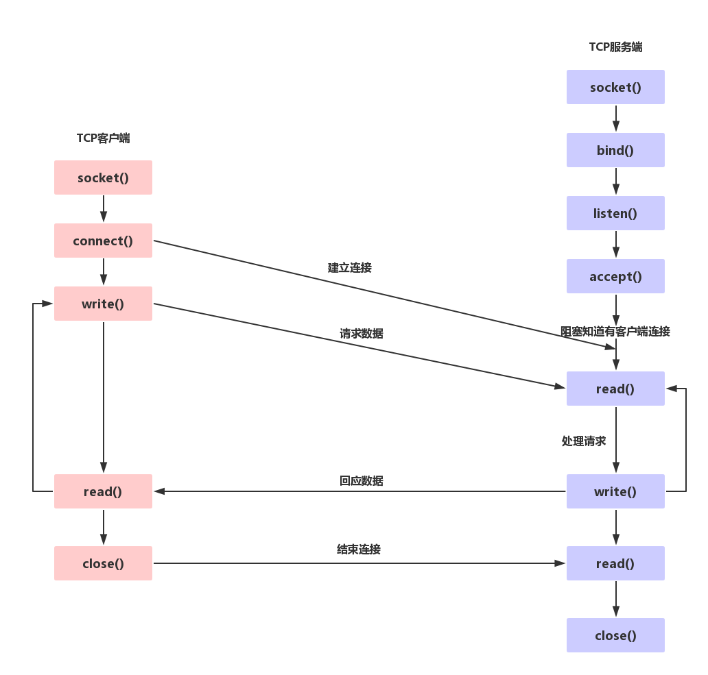

# socket编程

## 1.预备知识
### 1.网络字节序
内存中的多字节数据相对于内存地址而言有大端和小端之分，磁盘文件中的多字节数据相对于文件中的偏移地址也有大端和小端之分。网络数据流同样有大端小端之分。<br>
``TCP/IP``协议规定，网络数据流应采取大端字节序。而我们的电脑(笔记本)一般都是小端存储数据。<br>

## 2.使用的函数
```c
int socket(int domain, int type, int protocol);
int setsockopt(int sockfd, int level, int optname, const void *optval, socklen_t optlen);
int bind(int sockfd, const struct sockaddr *addr, socklen_t addrlen);
int listen(int sockfd, int backlog);
int accept(int sockfd, struct sockaddr *addr, socklen_t *addrlen);
int connect(int sockfd, const struct sockaddr *addr, socklen_t addrlen);
```

### 1.字节序转换函数
为了解决数据的大小端问题，有一组转换函数供我们调用<br>
```c
#include <arpa/inet.h>
uint32_t htonl(uint32_t hostlong);
uint16_t htons(uint16_t hostshort);
uint32_t ntohl(uint32_t netlong);
uint16_t ntohs(uint16_t netshort);
```
``h``表示``host``，n表示network，``l``表示32位长整数，``s``表示16位短整数。<br>
如果主机是小端字节序，这些函数将参数做相应的大小端转换然后返回，如果主机是大端字节序，这些函数不做转换，将参数原封不动地返回。<br>

<hr>

<br>

### 2.socket函数
``socket()``函数打开一个网络通讯端口，如果成功的话，就像``open()``函数一样返回一个文件描述符，应用程序可以像读写文件一样使用``read/write``在网络上收发数据包，如``果socket()``调用出错则返回``-1``。<br>
```c
#include <sys/types.h>
#include <sys/socket.h>
int socket(int domain, int type, int protocol);
```
**参数介绍**<br>
- 1.domain:
  - 1.AF_INET 使用IPv4地址协议
  - 2.AF_INET6 使用IPv6地址协议
  - 3.AF_UNIX 本地协议，用来本机多进程通信
- 2.type:
  - 1.SOCK_STREAM 当第三个参数protocol是0时，表示使用TCP链接
  - 2.SOCK_DGRAM 当第三个参数protocol是0时，表示使用：UDP链接
- 3.protocol:
  - 传0表示使用默认协议

### 3.bind函数
服务器程序所监听的网络地址和端口号通常是固定不变的，客户端程序得知服务器程序的地址和端口号后就可以向服务器发起连接，因此服务器需要调用bind绑定一个固定的网络地址和端口号。<br>
```c
#include <sys/types.h>
#include <sys/socket.h>
int bind(int sockfd, const struct sockaddr *addr, socklen_t addrlen);
```
**参数介绍**<br>
- 1.``sockfd``:
  - 传递``socket()``函数返回的文件描述符
- 2.``*addr``:
  - 是一个结构体，在下面详细论述
- 3.``addrlen``
  - 传递``addr``的字节数``sizeof(addr)``

#### struct sockaddr
``strcut sockaddr`` 很多网络编程函数诞生早于``IPv4``协议，那时候都使用的是``sockaddr``结构体,为了向前兼容，现在sockaddr退化成了（void *）的作用，传递一个地址给函数，至于这个函数是``sockaddr_in``还是``sockaddr_in6``，由地址族确定，然后函数内部再强制类型转化为所需的地址类型<br>
```c
struct sockaddr {
  sa_family_t sa_family;                     /* address family, AF_xxx */
  char sa_data[14];                          /* 14 bytes of protocol address */
};

struct sockaddr_in {
  __kernel_sa_family_t sin_family;          /* Address family */
  __be16 sin_port;                          /* Port number */
  struct in_addr sin_addr;                  /* Internet address */

  /* Pad to size of `struct sockaddr'. */
  unsigned char __pad[__SOCK_SIZE__ - sizeof(short int) - sizeof(unsigned short int) - sizeof(struct in_addr)];
};

/* Internet address. */
struct in_addr {
  __be32 s_addr;
};

struct sockaddr_in6 {
  unsigned short int sin6_family;           /* AF_INET6 */
  __be16 sin6_port;                         /* Transport layer port # */
  __be32 sin6_flowinfo;                     /* IPv6 flow information */
  struct in6_addr sin6_addr;                /* IPv6 address */
  __u32 sin6_scope_id;                      /* scope id (new in RFC2553) */
};

struct in6_addr {
  union {
      __u8 u6_addr8[16];
      __be16 u6_addr16[8];
      __be32 u6_addr32[4];
  } in6_u;
  #define s6_addr in6_u.u6_addr8
  #define s6_addr16 in6_u.u6_addr16
  #define s6_addr32 in6_u.u6_addr32
};

#define UNIX_PATH_MAX 108
struct sockaddr_un {
  __kernel_sa_family_t sun_family;             /* AF_UNIX */
  char sun_path[UNIX_PATH_MAX];                /* pathname */
};
```

``Pv4``和``IPv6``的地址格式定义在``netinet/in.h``中，``IPv4``地址用``sockaddr_in``结构体表示，包括16位端口号和32位IP地址，``IPv6``地址用``sockaddr_in6``结构体表示，包括16位端口号、128位``IP``地址和一些控制字段。``UNIX Domain Socket``的地址格式定义在``sys/un.h``中，用``sockaddr_un``结构体表示。各种socket地址结构体的开头都是相同的，前16位表示整个结构体的长度（并不是所有UNIX的实现都有长度字段，如Linux就没有），后16位表示地址类型。``IPv4``、``IPv6``和``Unix Domain Socket``的地址类型分别定义为常数``AF_INET``、``AF_INET6``、``AF_UNIX``。这样，只要取得某种``sockaddr``结构体的首地址，不需要知道具体是哪种类型的``sockaddr``结构体，就可以根据地址类型字段确定结构体中的内容。因此，``socket API``可以接受各种类型的``sockaddr``结构体指针做参数，例如``bind``、``accept``、``connect``等函数，这些函数的参数应该设计成``void *``类型以便接受各种类型的指针，但是``sock API``的实现早于``ANSI C``标准化，那时还没有``void *``类型，因此这些函数的参数都用``struct sockaddr *``类型表示，在传递参数之前要强制类型转换一下，例如：<br>
```c
struct sockaddr_in servaddr;
/* initialize servaddr */
bind(listen_fd, (struct sockaddr *)&servaddr, sizeof(servaddr));
```

我们现在回到``bind()``函数。``bind()``的作用是将参数``sockfd``和``addr``绑定在一起，使sockfd这个用于网络通讯的文件描述符监听``addr``所描述的地址和端口号。前面讲过，``struct sockaddr *``是一个通用指针类型，``addr``参数实际上可以接受多种协议的``sockaddr``结构体，而它们的长度各不相同，所以需要第三个参数``addrlen``指定结构体的长度。如：<br>
```c
struct sockaddr_in servaddr;
bzero(&servaddr, sizeof(servaddr));//功能和memset类似
servaddr.sin_family = AF_INET;
servaddr.sin_addr.s_addr = htonl(INADDR_ANY);
servaddr.sin_port = htons(8000);
```
上述代码的解释：首先将整个结构体清零，然后设置地址类型为AF_INET，网络地址为``INADDR_ANY``，这个宏表示本地的任意``IP``地址，因为服务器可能有多个网卡，每个网卡也可能绑定多个IP地址，这样设置可以在所有的IP地址上监听，直到与某个客户端建立了连接时才确定下来到底用哪个``IP``地址，端口号为``8000``。<br>

### 4.listen()函数
``listen()``函数是用来设置``socket``链接相关参数，并不会阻塞，当调用``accept()``函数时才会发生阻塞。<br>
```c
#include <sys/types.h>
#include <sys/socket.h>
int listen(int sockfd, int backlog);
```
**参数介绍**<br>
- 1.``sockfd``:
  - ``socket``函数产生的文件描述符
- 2.``backlog``:
  - 允许的最大链接总数

### 5.accept()函数
```c
#include <sys/types.h>
#include <sys/socket.h>
int accept(int sockfd, struct sockaddr *addr, socklen_t *addrlen);
```
**参数介绍**<br>
- 1.``sockfd``:
  - ``socket``函数产生的文件描述符
- 2.``addr``:
  - 传出参数，返回链接客户端地址信息，含IP地址和端口号
- 3.``addrlen``:
  - 传入传出参数，传出``sizeof(addr)``大小，函数返回时返回真正接收到的地址结构体的大小
- 4.``accept``函数成功返回一个新的``socket``文件描述符，用于和客户端通信，失败返回-1，设置``errno``

实例：<br>
```c
while (1) {
cliaddr_len = sizeof(cliaddr);
connfd = accept(listenfd, (struct sockaddr *)&cliaddr, &cliaddr_len);
n = read(connfd, buf, MAXLINE);
......
close(connfd);
}
```
整个是一个``while``死循环，每次循环处理一个客户端连接。由于``cliaddr_len``是传入传出参数，每次调用``accept()``之前应该重新赋初值。``accept()``的参数``listenfd``是先前的``socket``编程描述符，而``accept()``的返回值是另外一个文件描述符``connfd``，之后与客户端之间就通过这个``connfd``通讯，最后关闭``connfd``断开连接，而不关闭``listenfd``，再次回到循环开头``listenfd``仍然用作``accept``的参数。``accept()``成功返回一个文件描述符，出错返回``-1``。

### 6.connect函数
```c
#include <sys/types.h>
#include <sys/socket.h>
int connect(int sockfd, const struct sockaddr *addr, socklen_t addrlen);
```
**参数介绍:**<br>
- 1.``sockdf``:
  - ``socket``函数产生的文件描述符
- 2.``addr``:
  - 传入参数，指定服务器地址信息，含IP地址和端口
- 3.``addrlen``:
  - 传入传出参数，传入``sizeof(addr)``大小
- 返回值:成功返回``0``，失败返回``-1``，设置``errno``

客户端需要调用``connect()``连接服务器，connect和bind的参数形式一致，区别在于``bind``的参数是自己的地址，而``connect``的参数是对方的地址。``connect()``成功返回``0``，出错返回``-1``。<br>

### 7.IP地址的转换函数
当客户端连接服务器时，需要将服务器的ip地址写入到``addr``中使用下面的两个函数：<br>
```c
#include <arpa/inet.h>
int inet_pton(int af, const char *src, void *dst);
const char *inet_ntop(int af, const void *src,char *dst, socklen_t size);
```
**参数介绍:**<br>
- 1.``af``:
  - 1.``AF_INET`` 表示IPv4地址
  - 2.``AF_INET6`` 表示IPv6地址
- 2.``src``:
  - 表示字符串``string``类型的``ip``地址(如：``192.168.1.1``)
- 3.``dst``:
  - 结构体``struct sockaddr_in``等类型中的地址参数
    (``inet_pton(AF_INET,argv[1],&serv_addr.sin_addr.s_addr);``)

## 3.一个简单的实例
```c
/*
*server
*/
#include<stdio.h>
#include<sys/socket.h>
#include<sys/types.h>
#include<unistd.h>
#include<string.h>
#include<ctype.h>
#include<arpa/inet.h>
#define SERV_PORT 8000

int main()
{
        int sfd,cfd,len,i;
        struct sockaddr_in serv_addr,client_addr;
        char buf[4096];
        socklen_t addr_len;
        //create socket
        sfd = socket(AF_INET,SOCK_STREAM,0);

        //bind IP address
        memset(&serv_addr,0,sizeof(serv_addr));
        serv_addr.sin_family = AF_INET;
        serv_addr.sin_port = htons(SERV_PORT);
        serv_addr.sin_addr.s_addr=htonl(INADDR_ANY);
        bind(sfd,(struct sockaddr *)&serv_addr,sizeof(serv_addr));

        //configuer listen...
        listen(sfd,128);

        //listen...
        addr_len = sizeof(client_addr);
        cfd = accept(sfd,(struct sockaddr *)&client_addr,&addr_len);

        while(1){
          len=read(cfd,buf,sizeof(buf));

          for(i=0;i<len;i++)
          {
                  buf[i]=toupper(buf[i]);
          }
          write(cfd,buf,len);
        }
        close(cfd);
        close(sfd);
        return 0;
}
```

```c
/*
*client
*/
#include<stdio.h>
#include<unistd.h>
#include<sys/types.h>
#include<sys/socket.h>
#include<string.h>
#include<arpa/inet.h>
#define SERV_PORT 8000

int main(int argc,char *argv[])
{
        int sfd,len;
        struct sockaddr_in serv_addr;
        char buf[4096];
        if(argc<2)
        {
                fprintf(stderr,"client ser_ip\n");
                return -1;
        }
        sfd = socket(AF_INET,SOCK_STREAM,0);

        memset(&serv_addr,0,sizeof(serv_addr));
        serv_addr.sin_family=AF_INET;
        serv_addr.sin_port=htons(SERV_PORT);
        inet_pton(AF_INET,argv[1],&serv_addr.sin_addr.s_addr);

        connect(sfd,(struct sockaddr *)&serv_addr,sizeof(serv_addr));
        while(1){
                fgets(buf,sizeof(buf),stdin);
                write(sfd,buf,strlen(buf));
                len=read(sfd,buf,sizeof(buf));
                write(STDOUT_FILENO,buf,len);
        }
        return 0;
}
```
