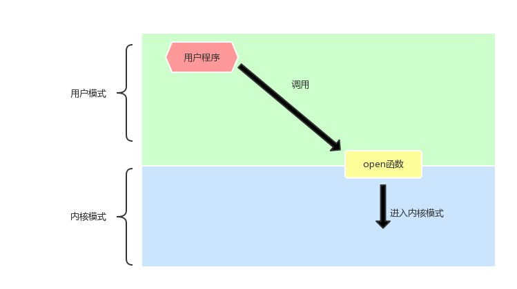

# 系统函数 open_close

## 1.重要概念


- 1.Linux系统分为用户模式和系统内核<br>
  这种区分的目的是为了保护内核模式中的数据，防止因为用户程序不当而影响内核程序。<br>

  <br>

- 2.系统调用<br>
  系统调用是指，在用户空间，调用系统函数，使程序的执行转换为内核模式。<br>

- 3.umask值<br>
  umask是Linux系统内部文件和目录创建的缺省权限。<br>
  root用户的umask值是022对应文件默认权限是644，目录默认权限是755。普通用户的umask值是022对应文件默认权限是664，文件是775。<br>


## 2.open_close函数
### 1.函数原型
```C
int open(const char *pathname, int flags);
int open(const char *pathname, int flags, mode_t mode);
int close(int fd);
```

### 2.常用参数
```
O_RDONLY、O_WRONLY、O_RDWR
O_APPEND、O_CREAT、O_EXCL、 O_TRUNC、 O_NONBLOCK
```
前三个分别是只读，只写，读写。<br>
- O_APPEND 追加(O_APPEND必须和写的模式一起使用，只有O_APPEND是不能写的)
- O_CREAT 文件不存在，创建
- O_EXCL 确保这个调用创建文件，如果和``O_CREAT``一起存在，如果文件以及存在，则open函数返回失败。<br>
- O_TRUNC 文件截断为0
- O_NONBLOCK 设置O_NONBLOCK  |  O_WRONLY 与阻塞有关

__我们看一个实例__<br>
```C
#include<unistd.h>
#include<stdio.h>
#include<fcntl.h>
int main(void)
{
  int fd = open("./noble",O_RDONLY | O_CREAT | O_TRUNC,0644)
  printf("fd = %d\n",fd);
  close(fd);
  return 0;
}
```

### 3.open常见错误
当open返回值为-1时，表示open函数失败。<br>
此时open函数会设置``errno``为特定的值，表示错误类型<br>
```C
#include<unistd.h>
#include<stdio.h>
#include<fcntl.h>
#include<errno.h>
int main(void)
{
  int fd = open("./noble",O_RDONLY | O_CREAT | O_TRUNC,0644)
  printf("fd = %d\n",fd);
  printf("errno=%d\n",errno);
  close(fd);
  return 0;
}
```

- 1.打开文件不存在
- 2.以只写的方式打开只读文件(打开文件没有对应权限)
- 3.以只读的方式打开目录
- 4.没有加mode即644等
