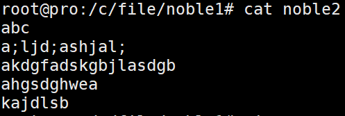
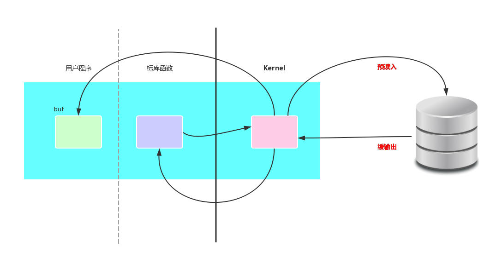

# read_write函数 和缓冲

## 1.函数原型
```C
ssize_t read(int fd, void *buf, size_t count);
ssize_t write(int fd, const void *buf, size_t count);
```

## 2.使用实例
```C
#include<unistd.h>
#include<fcntl.h>
#include<stdio.h>
#include<errno.h>
int main(void)
{
        char buf[1024];
        int ret = 0;
        int fd = open("./noble",O_RDWR);
        printf("sizeof[buf]=%ld\n",sizeof(buf));
        printf("fd = %d\n",fd);
        printf("errno= %d\n",errno);
        while ((ret = read(fd,buf,sizeof(buf)))!= 0)
        {
                write(STDOUT_FILENO,buf,ret);
        }
        close(fd);
        printf("closs ok ...\n");
        return 0;
}
```
## 3.使用read()函数实现复制功能
```C
//copy.c
#include<stdio.h>
#include<unistd.h>
#include<fcntl.h>

int main(int argc,char *argv[])
{
        int fd1=0;
        int fd2=0;
        int ret=0;
        char buf[1024];
        fd1 = open(argv[1],O_RDONLY);
        fd2 = open(argv[2],O_WRONLY | O_TRUNC | O_CREAT);
        for(;(ret=read(fd1,buf,sizeof(buf)))!=0;)//注意这里括号的使用，因为少一个括号，在这里栽过不少坑
        {
                write(fd2,buf,ret);
        }

        close(fd1);
        close(fd2);
        return 0;
}
```

<br><br>
<br>

__特别说明：__<br>
如果我们想要使用read函数阅读标准输入的内容，可以使用下面的文件标识符。<br>
```
STDIN_FILENO    0
STDOUT_FILENO   1
STDERR_FILENO   2
```

注意区分的是：``stdin``,``stdout``,``stderr``的类型是``FILE*``<br>

## 4.缓冲问题
在使用read-write时用户需要定义一个用户级别缓冲区，这个大小由用户设定，在上述代码中缓冲区是buf数组，大小是1024。<br>
而在标库函数中有一个默认缓冲区大小一般是4096，在内核区也有一个缓冲区，大小一般也是4096，如下图：<br>
<br>
系统为提提高IO速度，一次读或写满kernel区的缓冲区，在标库函数中的缓冲区也是同样的作用。<br>
基于上面这一点，再加上一个条件：每次切换 用户-系统 模式，所花费的时间较长。可以得出一个结论:<br>
使用缓冲区为1byte的read-write函数和使用标库fgetc()-fput()函数读写文件，看似都是每次读写一个字节的内容，但read-write函数读写的速度比标库fgetc()-fput()函数读写速度慢的多。<br>
原因就是标库每次存满自己的缓冲区时才调用系统函数，所以花费时间少。<br>
但使用标库函数也会带来问题，因为必须要让缓冲区写满，才会调用read-write函数所以对于即时通讯的需求不太合适。<br>

## 5.一个错误处理函数perror()
这个函数是标库函数``<stdio.h>``，原型如下：<br>
``void perror(const char *s);``<br>
这个函数根据当前errno的值打印对应的错误输出，括号里的是用户自己定义的字符串，它和错误输出拼接起来一起实现。<br>
``perror("open error");``<br>
<br>
