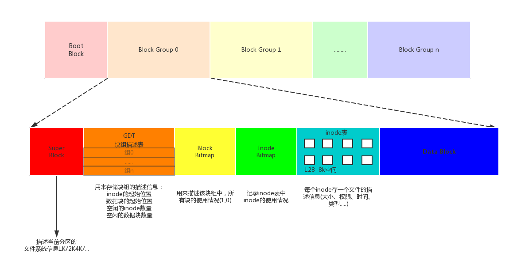
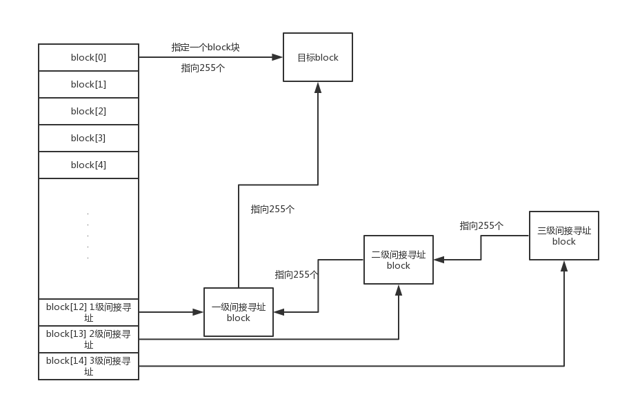
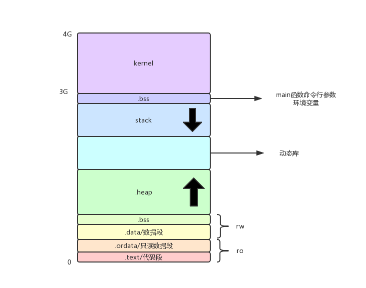
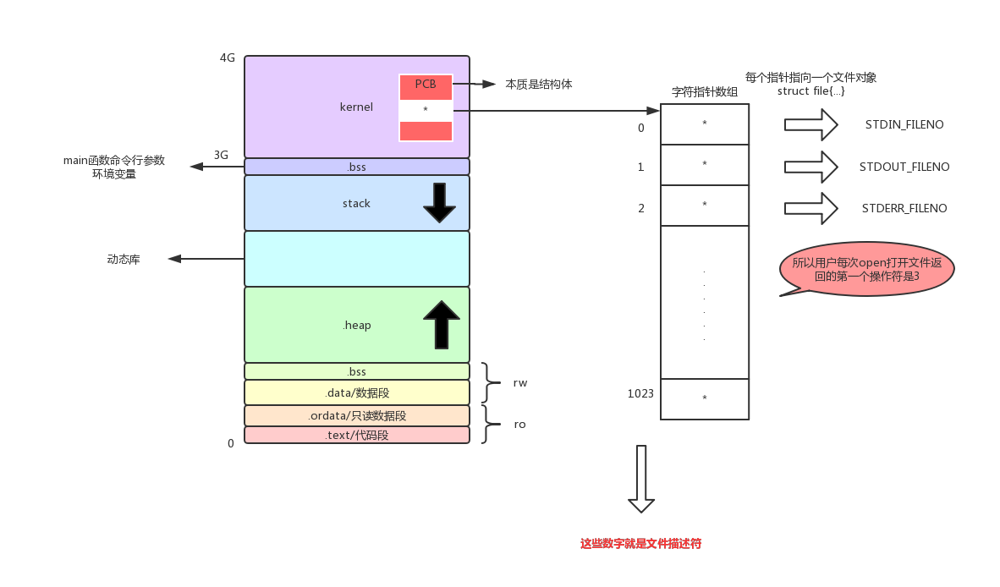
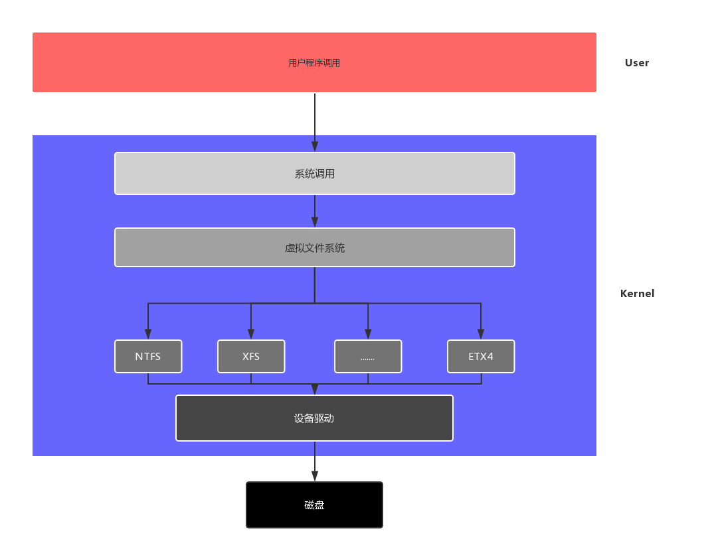

# 文件系统
## 1.文件存储原理
在Linux系统中通过dentry、inode管理文件。<br>
__inode__<br>
本质是结构体，存储文件的属性信息。如：权限、类型、大小、时间、用户组、盘块位置等。<br>
大多数的inode都存放在磁盘上，少量常用、近期使用的inode会被缓存到内存中。<br>

__dentry__<br>
目录项，本质依然是结构体，重要的成员变量有两个{文件名，inode......}，而文件内容保存在磁盘盘块上。<br>

## 2.文件系统
文件系统，是一组规则，规定对文件的存储和读取的一般方法。文件系统在磁盘格式化时被确定。<br>
常见的文件系统有：fat32 ntfs exfat ext2 ext3 ext4<br>

我们知道，一个磁盘可以划分成多个分区，每个分区必须先用格式化工具,格式化成某种格式的文件系统，然后才能存储文件，格式化的过程会在磁盘上写一些管理存储布局的信息。下图是一个磁盘分区格式化成ext2文件系统后的存储布局。<br>

<br>
__澄清一个概念：__<br>Linux系统中的分区是以文件目录实现的，如``/root``这是逻辑问题。这和磁盘存储功能的实现没有关系，存储实现是通过分组块，inode，超级快等实现的。现在做出这样的理解和自己知识储备匮乏有关。<br>
ext2把整个文件系统(可能有多个磁盘组成)分成如上模式。一个启动块，和其他块组。每个块组(Block Group)的大小是8192个块。<br>

__问题1：__ 为什么每个块组(Block Group)大小是8192bit？<br>
我们用1个块(block)作为位图保存本块组 block的使用情况（bit为1表示对应的block被使用，bit为0表示对应的block空闲），1个block是1024bit，共有1024*8=8192个bit，所以，每个块组(Block Group)最多只能是81292个bit。<br>

__其他相关概念：__<br>
文件所有的描述信息：存储在inode表中(借助超级快、快组描述符表、块位图、inode位图来找到它)。<br>
文件的数据：存储在，数据块中(data block)。<br>


文件系统中存储的最小单位是块（Block），一个块究竟多大是在格式化时确定的，例如mke2fs的-b选项可以设定块大小为1024、2048或4096字节。而上图中启动块（BootBlock）的大小是确定的，就是1KB，启动块是由PC标准规定的，用来存储磁盘分区信息和启动信息，任何文件系统都不能使用启动块。启动块之后才是ext2文件系统的开始，ext2文件系统将整个分区划成若干个同样大小的块组（Block Group），每个块组都由以下部分组成。<br>


__超级块（Super Block）__<br> 描述整个文件系统信息，例如块大小、文件系统版本号、上次mount的时间等等。超级块在每个块组(可认为是分区)的开头都有一份拷贝。<br>


__块组描述符表（GDT，Group Descriptor Table）__ <br>
块组描述符（Group Descriptor）存储一个块组的描述信息，例如在这个块组中从哪里开始是inode表，从哪里开始是数据块，空闲的inode和数据块还有多少个等等。<br>
块组描述符表：有很多的块组描述符组成的数组<br>
整个文件系统分成多少个块组就对应有多少个块组描述符。和超级块类似，块组描述符表也有多次靠谱详细信息可见[http://blog.51cto.com/laokaddk/1221998](http://blog.51cto.com/laokaddk/1221998)，这些信息是非常重要的，一旦超级块意外损坏就会丢失整个分区的数据，一旦块组描述符意外损坏就会丢失整个块组的数据，因此它们都有多份拷贝。通常内核只用到第0个块组中的拷贝，当执行e2fsck检查文件系统一致性时，第0个块组中的超级块和块组描述符表就会拷贝到其它块组，这样当第0个块组的开头意外损坏时就可以用其它拷贝来恢复，从而减少损失。<br>
- 1.并不是所有的块组都有超级块和快组描述符。
- 2.块组描述符GDT并不是只管理自己这个块组的信息，相反，它管理的是所有的块组的信息。

__块位图（Block Bitmap）__<br>
块位图就是用来描述整个块组中哪些块已用哪些块空闲的，它本身占一个块，其中的每个bit代表本块组中的一个块，这个bit为1表示该块已用，这个bit为0表示该块空闲可用。<br>
一个磁盘块组中的块是这样利用的：数据块存储所有文件的数据，比如某个分区的块大小是1024字节，某个文件是2049字节，那么就需要三个数据块来存，即使第三个块只存了一个字节也需要占用一个整块；超级块、块组描述符表、块位图、inode位图、inode表这几部分存储该块组的描述信息。<br>


__inode位图（inode Bitmap）__<br> 和块位图类似，本身占一个块，其中每个bit表示一个inode是否空闲可用。<br>


__inode表（inode Table）__<br> 我们知道，一个文件除了数据需要存储之外，一些描述信息也需要存储，例如文件类型（常规、目录、符号链接等），权限，文件大小，创建/修改/访问时间等，也就是ls -l命令看到的那些信息，这些信息存在inode中而不是数据块中。每个文件都有一个inode，一个块组中的所有inode组成了inode表。inode表占多少个块在格式化时就要决定并写入块组描述符中，mke2fs格式化工具的默认策略是一个块组有多少个8KB就分配多少个inode。由于数据块占了整个块组的绝大部分，也可以近似认为数据块有多少个8KB就分配多少个inode，换句话说，如果平均每个文件的大小是8KB，当分区存满的时候inode表会得到比较充分的利用，数据块也不浪费。如果这个分区存的都是很大的文件（比如电影），则数据块用完的时候inode会有一些浪费，如果这个分区存的都是很小的文件（比如源代码），则有可能数据块还没用完inode就已经用完了，数据块可能有很大的浪费。如果用户在格式化时能够对这个分区以后要存储的文件大小做一个预测，也可以用mke2fs的-i参数手动指定每多少个字节分配一个inode。<br>

__inode表中每个inode的大小：ext2、ext3中128字节，ext4中256字节。__<br>


__数据块（Data Block）__<br> 根据不同的文件类型有以下几种情况：<br>
对于常规文件，文件的数据存储在数据块中。<br>
对于目录，注意这个概念：目录也是一种文件，是一种特殊类型的文件。<br>
对于符号链接，如果目标路径名较短则直接保存在inode中以便更快地查找，如果目标路径名较长则分配一个数据块来保存。<br>
设备文件、FIFO和socket等特殊文件没有数据块，设备文件的主设备号和次设备号保存在inode中。<br>

## 3.数据块寻址
ext2使用的是间接寻址<br>
如果一个文件有多个数据块，这些数据块很可能不是连续存放的。这些数据块通过inode中的索引项Block来找到<br>
这样的索引项一共有15个，Block[0]--Block[14]，每个索引项占4字节。前12个索引项都表示块的编号，如Block[0]保存27，表示第27个块是该文件的数据块。<br>
如果块的大小是1KB，这种方法可以表示从0-12KB的文件。如果剩下的三个索引项也这么用，那就只能表示最大15KB的文件了。这是远远不够的。<br>
剩下的3个索引项Block[12]、Block[13]、Block[14]都是间接索引。假设块的大小为b，那么一个间接寻址块中可以存放b/4个索引项，指向b/4个数据块。<br>
<br>
如：b=1KB，那么Block[0]--Block[12]都用上，最大可以表示 1024/4 + 12 = 268K大小的文件。虽然大很多，但仍然不够用。<br>
于是有了二级间接寻址块Block[13]，三级间接寻址块Block[14]。这样1K的块最大可以表示16.06GB大小的文件。<br>

## 4.文件描述符

### 1.PCB进程控制
<br>
<br>
上面这张图反应了PCB文件控制表的工作原理。<br>
结构体PCB 的成员变量file_struct *file 指向文件描述符表。<br>
- 从应用程序使用角度，该指针可理解记忆成一个字符指针数组，下标0/1/2/3/4...找到文件结构体。
- 本质是一个键值对0、1、2...都分别对应具体地址。但键值对使用的特性是自动映射，我们只操作键不直接使用值。
- 新打开文件返回文件描述符表中未使用的最小文件描述符。
```
STDIN_FILENO    0
STDOUT_FILENO   1
STDERR_FILENO   2
```

### 2.FILE结构体
在Linux下面这个文件中有FILE结果体的定义，在ubuntu上测试<br>
``/usr/src/linux-headers-4.15.0-24/include/linux/fs.h``<br>
打开上面的文件，然后查找struct file<br>
主要包含文件描述符、文件读写位置、IO缓冲区三部分内容。 <br>
```C
struct file {
		...
		文件的偏移量；
		文件的访问权限；
		文件的打开标志；
		文件内核缓冲区的首地址；
		struct operations * f_op;
		...
	};
```

## 4.虚拟文件系统
虚拟文件系统的目的是同一所有文件系统。我们在Linux系统中可以看到其他文件系统的文件和目录，并像使用Linux自己的文件系统一样可以操纵这些文件，比如：一台计算机是双系统，有Linux系统和Windows，我们在LInux系统下，可以看到Windows分区中的文件，并可以使用ls等命令操纵这些文件。虚拟文件系统的实现原理如下：<br>
<br>

## 5.MMU虚拟内存映射
实现逻辑内存(虚拟内存)和物理内存的映射。
