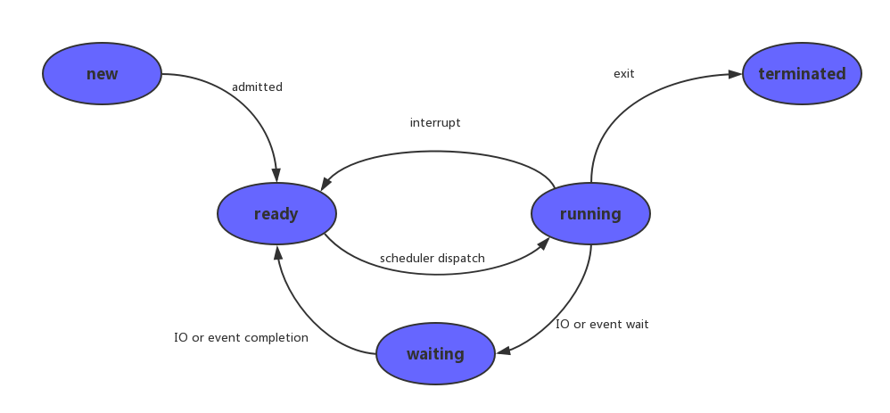

# 进程相关概念

## 1.进程控制块PCB
我们知道，每个进程在内核中都有一个进程控制块（PCB）来维护进程相关的信息，Linux内核的进程控制块是task_struct结构体。<br>
``/usr/src/linux-headers-3.16.0-30/include/linux/sched.h``
文件中可以查看struct task_struct 结构体定义。其内部成员有很多，我们重点掌握以下部分即可：<br>
- 进程id。系统中每个进程有唯一的id，在C语言中用pid_t类型表示，其实就是一个非负整数。
- 进程的状态，有就绪、运行、挂起、停止等状态。
- 进程切换时需要保存和恢复的一些CPU寄存器。
- 描述虚拟地址空间的信息。
- 描述控制终端的信息。
- 当前工作目录（Current Working Directory）。
- umask掩码。
- 文件描述符表，包含很多指向file结构体的指针。
- 和信号相关的信息。
- 用户id和组id。
- 会话（Session）和进程组。
- 进程可以使用的资源上限（Resource Limit）。

## 2.进程状态
br>

## 3.函数使用

### 1.fork函数
创建一个子进程。<br>
pid_t fork(void);	失败返回-1；成功返回：<br>
- ① 父进程返回子进程的ID(非负)
- ②子进程返回 0 <br>


pid_t类型表示进程ID，但为了表示-1，它是有符号整型。(0不是有效进程ID，init最小，为1)<br>
注意返回值，不是fork函数能返回两个值，而是fork后，fork函数变为两个，父子需【各自】返回一个。<br>


### 2.getpid函数
获取当前进程ID<br>
``pid_t getpid(void);``	<br>

### 3.getppid函数
获取当前进程的父进程ID<br>
``pid_t getppid(void);``<br>
区分一个函数是“系统函数”还是“库函数”依据：<br>
- 1是否访问内核数据结构<br>
- 2是否访问外部硬件资源		二者有任一 → 系统函数；二者均无 → 库函数<br>


## 3.进程共享
父子进程之间在fork之后的异同。<br>
- 父子相同处: 全局变量、.data、.text、栈、堆、环境变量、用户ID、宿主目录、进程工作目录、信号处理方式...
- 父子不同处: 1.进程ID   2.fork返回值   3.父进程ID    4.进程运行时间    5.闹钟(定时器)   6.未决信号集

父子进程间遵循 __读时共享写时复制__ 的原则。这样设计，无论子进程执行父进程的逻辑还是执行自己的逻辑都能节省内存开销。<br>

特别的，fork之后父进程先执行还是子进程先执行不确定。取决于内核所使用的调度算法。<br>

__重点：__<br>父子进程共享：1. 文件描述符(打开文件的结构体)  2. mmap建立的映射区 (进程间通信详解)


## 4.gdb调试
使用gdb调试的时候，gdb只能跟踪一个进程。可以在fork函数调用之前，通过指令设置gdb调试工具跟踪父进程或者是跟踪子进程。默认跟踪父进程。<br>
``set follow-fork-mode child`` 命令设置gdb在fork之后跟踪子进程。<br>
``set follow-fork-mode parent`` 设置跟踪父进程（默认）。 <br>

注意，一定要在fork函数调用之前设置才有效。<br>


注意，一定要在fork函数调用之前设置才有效。<br>
## 5.exec函数族

fork创建子进程通常会执行不同的代码逻辑，这时使用exec函数族，重启另一个代码程序段。在调用exec函数时pid不变<br>
其实有六种以exec开头的函数，统称exec函数：<br>
``int execl(const char *path, const char *arg, ...);``<br>
``int execlp(const char *file, const char *arg, ...);``<br>
``int execle(const char *path, const char *arg, ..., char *const envp[]);``<br>
``int execv(const char *path, char *const argv[]);``<br>
``int execvp(const char *file, char *const argv[]);``<br>
``int execve(const char *path, char *const argv[], char *const envp[]);``<br>

### 1.execlp函数
加载一个进程，但这个进程必须通过PATH环境变量找到，也就是Linux命令。	  <br>
``int execlp(const char *file, const char *arg, ...);``		成功：无返回；失败：-1<br>
参数1：要加载的程序的名字。该函数需要配合PATH环境变量来使用，当PATH中所有目索后没有参数1则出错返回。<br>
该函数通常用来调用系统程序。如：ls、date、cp、cat等命令。<br>
实例：<br>
```c
execlp("ls","ls","-al",NULL);
```
注意在第三个参数``-al``的前后是不能有空格的。<br>

### 2.execl函数
加载一个进程， 通过 路径+程序名 来加载。 <br>
``int execl(const char *path, const char *arg, ...);``		成功：无返回；失败：-1<br>
对比execlp，如加载"ls"命令带有-l，-F参数<br>
``execlp("ls", "ls", "-l", "-F", NULL)``;	     使用程序名在PATH中搜索。<br>
``execl("/bin/ls", "ls", "-l", "-F", NULL);``    使用参数1给出的绝对路径搜索。<br>


### 3.execvp函数
加载一个进程，使用自定义环境变量env<br>
``int execvp(const char *file, const char *argv[]);``<br>
变参形式： ①... ② argv[]  (main函数也是变参函数，形式上等同于 ``int main(int argc, char *argv0, ...)``) <br>
变参终止条件：① NULL结尾 ② 固参指定<br>
execvp与execlp参数形式不同，原理一致。<br>

### 3.exec函数族一般规律
exec函数一旦调用成功即执行新的程序，不返回。只有失败才返回，错误值-1。所以通常我们直接在exec函数调用后直接调用perror()和exit()，无需if判断。<br>
```
l (list)			命令行参数列表
p (path)			搜素file时使用path变量
v (vector)			使用命令行参数数组
e (environment)	使用环境变量数组,不使用进程原有的环境变量，设置新加载程序运行的环境变量
```

事实上，只有execve是真正的系统调用，其它五个函数最终都调用execve，所以execve在man手册第2节，其它函数在man手册第3节<br>

## 6.进程回收
### 1.孤儿进程
孤儿进程: 父进程先于子进程结束，则子进程成为孤儿进程，子进程的父进程成为init进程，称为init进程领养孤儿进程。<br>

### 2.僵尸进程
僵尸进程: 进程终止，父进程尚未回收，子进程残留资源（PCB）存放于内核中，变成僵尸（Zombie）进程。  <br>

特别注意，僵尸进程是不能使用kill命令清除掉的。因为kill命令只是用来终止进程的，而僵尸进程已经终止。思考！用什么办法可清除掉僵尸进程呢？<br>


### 3.wait函数
父进程调用wait函数可以回收子进程终止信息。该函数有三个功能：
- ① 阻塞等待子进程退出
- ② 回收子进程残留资源
- ③ 获取子进程结束状态(退出原因)。

``pid_t wait(int *status);`` 	成功：清理掉的子进程ID；失败：-1 (没有子进程)<br>

当进程终止时，操作系统的隐式回收机制会：<br>
- 1.关闭所有文件描述符
- 2. 释放用户空间分配的内存。内核的PCB仍存在。其中保存该进程的退出状态。(正常终止→退出值；异常终止→终止信号)<br>

可使用wait函数传出参数status来保存进程的退出状态。借助宏函数来进一步判断进程终止的具体原因。宏函数可分为如下三组(最常用的是前两组)：<br>

```
WIFEXITED(status) 为非0	→ 进程正常结束
WEXITSTATUS(status) 如上宏为真，使用此宏 → 获取进程退出状态 (exit的参数)
```
```
WIFSIGNALED(status) 为非0 → 进程异常终止
WTERMSIG(status) 如上宏为真，使用此宏 → 取得使进程终止的那个信号的编号。
```
```
WIFSTOPPED(status) 为非0 → 进程处于暂停状态
WSTOPSIG(status) 如上宏为真，使用此宏 → 取得使进程暂停的那个信号的编号。
WIFCONTINUED(status) 为真 → 进程暂停后已经继续运行
```


### 4.waitpid函数
作用同wait，但可指定pid进程清理，可以不阻塞。<br>
``pid_t waitpid(pid_t pid, int *status, in options);``	成功：返回清理掉的子进程ID；失败：-1(无子进程), __当返回0：__ 参3为``WNOHANG``，且子进程正在运行。<br>
特殊参数：<br>
参数pid：
- ``>0`` 回收指定ID的子进程
- ``==-1`` 回收任意子进程（相当于wait）
- ``0`` 回收和当前调用waitpid一个组的所有子进程
- ``< -1`` 回收指定进程组内的任意子进程


注意：一次wait或waitpid调用只能清理一个子进程，清理多个子进程应使用循环。	<br>
