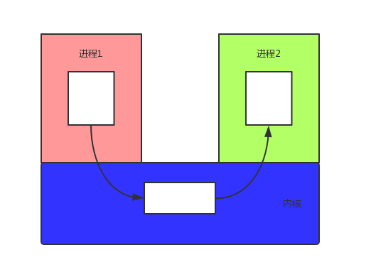
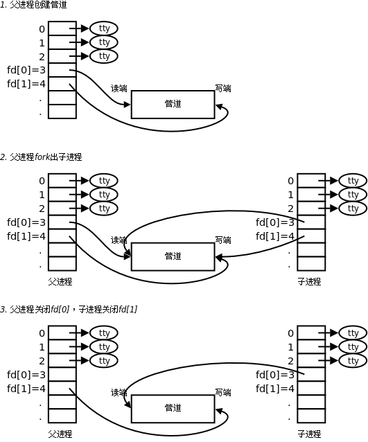

# 1.进程通信
## 1.IPC
Linux环境下，进程地址空间相互独立，每个进程各自有不同的用户地址空间。任何一个进程的全局变量在另一个进程中都看不到，所以进程和进程之间不能相互访问，要交换数据必须通过内核，在内核中开辟一块缓冲区，进程1把数据从用户空间拷到内核缓冲区，进程2再从内核缓冲区把数据读走，内核提供的这种机制称为进程间通信（IPC，InterProcess Communication）。<br>
<br>


在进程间完成数据传递需要借助操作系统提供特殊的方法，如：文件、管道、信号、共享内存、消息队列、套接字、命名管道等。随着计算机的蓬勃发展，一些方法由于自身设计缺陷被淘汰或者弃用。现今常用的进程间通信方式有：
- ① 管道 (使用最简单)
- ② 信号 (开销最小)
- ③ 共享映射区 (无血缘关系)
- ④ 本地套接字 (最稳定)

## 2.管道
### 1.基本概念

管道是一种最基本的IPC机制，作用于有血缘关系的进程之间，完成数据传递。调用pipe系统函数即可创建一个管道。有如下特质：<br>
- 1. 其本质是一个伪文件(实为内核缓冲区)
- 2. 由两个文件描述符引用，一个表示读端，一个表示写端。
- 3. 规定数据从管道的写端流入管道，从读端流出。


管道的原理: 管道实为内核使用环形队列机制，借助内核缓冲区(4k)实现。<br>

管道的局限性：<br>
- ① 数据自己读不能自己写。
- ② 数据一旦被读走，便不在管道中存在，不可反复读取。
- ③ 由于管道采用半双工通信方式。因此，数据只能在一个方向上流动。
- ④ 只能在有公共祖先的进程间使用管道。


__注：__<br>常见的通信方式有，单工通信、半双工通信、全双工通信。<br>

### 2.pipe函数
``int pipe(int pipefd[2]);``		成功：0；失败：-1，设置errno<br>
函数调用成功返回``r/w``两个文件描述符。无需``open``，但需手动``close``。规定：``fd[0] → r``； ``fd[1] → w``，就像0对应标准输入，1对应标准输出一样。向管道文件读写数据其实是在读写内核缓冲区。<br>
管道创建成功以后，创建该管道的进程（父进程）同时掌握着管道的读端和写端。如何实现父子进程间通信呢？通常可以采用如下步骤：<br>

<br>

- 1. 父进程调用pipe函数创建管道，得到两个文件描述符fd[0]、fd[1]指向管道的读端和写端。
- 2. 父进程调用fork创建子进程，那么子进程也有两个文件描述符指向同一管道。
- 3. 父进程关闭管道读端，子进程关闭管道写端。父进程可以向管道中写入数据，子进程将管道中的数据读出。由于管道是利用环形队列实现的，数据从写端流入管道，从读端流出，这样就实现了进程间通信。

### 3.管道的读写行为

- 1.读管道：<br>
  - 1.管道中有数据，read返回实际读到的数据
  - 2.管道中没数据，read阻塞等待，直到有数据为止
- 2.写管道：<br>
  - 1.管道读端全部被关闭，进程异常终止(也可以使用捕捉SIGPIPE信号，使进程不终止)
  - 2.管道读端没有完全关闭：
    - 1)管道已满，write阻塞(内核维护的默认管道大小是4096，根据现实需求可能会弹性扩容，所以想要写满，不容易)
    - 2)管道未满，write将数据写入，并返回实际写入的数据字节数

__注意：__ 只有当管道不同时有多个读端和写端时，才可以正常通行。<br>
- 1.一个读端一个写端
- 2.一个读端多个写端
- 3.多个读端一个写端

满足以上三条任意一种pipe就可以工作。<br>


下面这个程序因为父进程的读写端没有关闭，导致pipe不能实现单向通信。<br>
```c
#include <stdio.h>
#include <unistd.h>
#include <sys/wait.h>

int main(void)
{
	pid_t pid;
	int fd[2], i;

	pipe(fd);

	for (i = 0; i < 2; i++) {
		if((pid = fork()) == 0) {
			break;
        }
    }

	if (i == 0) {			//fist subprocess
		close(fd[0]);				//close read
		dup2(fd[1], STDOUT_FILENO);
		execlp("ls", "ls", NULL);
	} else if (i == 1) {	//second subprocess
		close(fd[1]);				//close write
		dup2(fd[0], STDIN_FILENO);
		execlp("wc", "wc", "-l", NULL);
	} else {
        //close(fd[0]);
        //close(fd[1]);
		for(i = 0; i < 2; i++)		//wait twice
			wait(NULL);
	}

	return 0;
}
```

### 4.管道的优劣
- 优点：简单，相比信号，套接字实现进程间通信，简单很多。
- 缺点：
  - 1.只能单向通信，双向通信需建立两个管道。
  - 2.只能用于父子、兄弟进程(有共同祖先)间通信。该问题后来使用fifo有名管道解决。

## 3.FIFO
为了和pipe区分，又被称为命名管道。管道(pipe)只能用于有血缘关系的进程，而FIFO即便是无血缘关系的进程也可以通信。<br>
FIFO是Linux系统基础文件类型中的一种。但FIFO文件在磁盘上没有数据块，仅仅用这个标志标识一个管道，各个程序可以通过打开这个文件进行read/write，实际上是在读写内核通道，这样就实现了数据传递<br>

创建方式：<br>
- 1.命令：mkfifo管道名
- 2.函数库：``int mkfifo(const char *pathname,  mode_t mode);``成功：0； 失败：-1<br>

## 3.共享内存
### 1.文件
通过文件实现数据传递，但不常用。<br>
一旦使用mkfifo创建了一个FIFO，就可以使用open打开它，常见的文件I/O函数都可用于fifo。如：close、read、write、unlink等。<br>

### 2.存储映射
把磁盘映射为内存，通过操作内存的方式改变磁盘的内容。<br>

#### 1.mmap函数和munmap函数
##### 1.mmap函数
``void *mmap(void *adrr, size_t length, int prot, int flags, int fd, off_t offset);`` <br>
返回：成功：返回创建的映射区首地址；失败：返回``MAP_FAILED``宏，本质是``(void*)-1``<br>

参数：	<br>
- addr: 	建立映射区的首地址，由Linux内核指定。使用时，直接传递NULL
- length： 欲创建映射区的大小
- prot：	映射区权限PROT_READ、PROT_WRITE、PROT_READ|PROT_WRITE
- flags：	标志位参数(常用于设定更新物理区域、设置共享、创建匿名映射区)
  - MAP_SHARED:  会将映射区所做的操作反映到物理设备（磁盘）上。
  - MAP_PRIVATE: 映射区所做的修改不会反映到物理设备。
- fd： 	用来建立映射区的文件描述符
- offset： 	映射文件的偏移(4k的整数倍)

##### 2.munmap函数
用来释放mmap开辟的空间。<br>
同malloc函数申请内存空间类似的，mmap建立的映射区在使用结束后也应调用类似free的函数来释放。<br>
``int munmap(void *addr, size_t length);``	成功：0； 失败：-1<br>

借鉴malloc和free函数原型，尝试装自定义函数``smalloc``，``sfree``来完成映射区的建立和释放。思考函数接口该如何设计？<br>

__总结：__ 使用mmap时务必注意以下事项：<br>
- 1.创建映射区的过程中，隐含着一次对映射文件的读操作。
- 2.当MAP_SHARED时，要求：映射区的权限应 <=文件打开的权限(出于对映射区的保护)。而MAP_PRIVATE则无所谓，因为mmap中的权限是对内存的限制。
- 3.映射区的释放与文件关闭无关。只要映射建立成功，文件可以立即关闭。
- 4.特别注意，当映射文件大小为0时，不能创建映射区。所以：用于映射的文件必须要有实际大小！！	mmap使用时常常会出现总线错误，通常是由于共享文件存储空间大小引起的。
- 5.munmap传入的地址一定是mmap的返回地址。坚决杜绝指针++操作。
- 6.如果文件偏移量必须为4K的整数倍
- 7.mmap创建映射区出错概率非常高，一定要检查返回值，确保映射区建立成功再进行后续操作。

参考下面的实例：<br>
```c
fp_r=open(src,O_RDONLY);
if(fp_r==-1)
{
  perror("open:");
  return -1;
}
ftruncate(fp_w,fsize);
//file open
map_r=mmap(NULL,fsize,PROT_READ,MAP_PRIVATE,fp_r,0);
if(map_r==MAP_FAILED)
{
  perror("mmap:");
  return -1;
}
munmap(map_r,fsize);
```
上面的实例中ftruncate函数用来扩展要 需要被写入的文件 大小，原因参考上述 __总结4__<br>

#### 2.mmap父子进程通信
父子等有血缘关系的进程之间也可以通过mmap建立的映射区来完成数据通信。但相应的要在创建映射区的时候指定对应的标志位参数flags：<br>
mmap建立的映射区(但必须要使用``MAP_SHARED``)<br>

#### 3.匿名映射
通过使用我们发现，使用映射区来完成文件读写操作十分方便，父子进程间通信也较容易。但缺陷是，每次创建映射区一定要依赖一个文件才能实现。通常为了建立映射区要open一个temp文件，创建好了再unlink、close掉，比较麻烦。 可以直接使用匿名映射来代替。<br>
Linux系统给我们提供了创建匿名映射区的方法，无需依赖一个文件即可创建映射区。同样需要借助标志位参数flags来指定。<br>

使用MAP_ANONYMOUS (或MAP_ANON)， 如:<br>
``int *p = mmap(NULL, 4, PROT_READ|PROT_WRITE, MAP_SHARED|MAP_ANONYMOUS, -1, 0);``<br>"4"随意举例，该位置表大小，可依实际需要填写,因为是匿名文件操作，fd文件描述符用"-1"代替<br>

需注意的是，``MAP_ANONYMOUS``和``MAP_ANON``这两个宏是Linux操作系统特有的宏。在类Unix系统中如无该宏定义，可使用如下两步来完成匿名映射区的建立。<br>
- ``fd = open("/dev/zero", O_RDWR);``
- ``p = mmap(NULL, size, PROT_READ|PROT_WRITE, MMAP_SHARED, fd, 0);``


eg:<br>
```c
#include<stdio.h>
#include<string.h>
#include<unistd.h>
#include<fcntl.h>
#include<sys/mman.h>
#include<stdlib.h>

int main()
{
	char *sp=NULL;
	int len=5;
	char *str="noble thanks";
	pid_t pid;
	sp= mmap(NULL,10,PROT_READ|PROT_WRITE,MAP_SHARED|MAP_ANONYMOUS,-1,0);
	if(sp==MAP_FAILED)
	{
		perror("mmap failed:");
		exit(1);
	}
	pid=fork();
	if(pid>0)
	{
		strcpy(sp,str);
	}
	else if(pid==0)
	{
		printf(">>:%s\n",sp);
	}
	munmap(sp,10);
	return 0;
}
```

#### 4无血缘关系进程间通信
实质上mmap是内核借助文件帮我们创建了一个映射区，多个进程之间利用该映射区完成数据传递。由于内核空间多进程共享，因此无血缘关系的进程间也可以使用mmap来完成通信。只要设置相应的标志位参数flags即可。若想实现共享，当然应该使用MAP_SHARED了。<br>


## 4.共享内存二
现在记录一种Linux内核提供的一种共享内存实现进程的通信。<br>

### 1.共享内存的管理命令
```
ipcmk
ipcrm
ipcs
lsipc
```
#### 1.ipcs
显示当前系统中可以查看到底共享内存信息。<br>

#### 2.ipcrm
用来删除系统中的共享内存：<br>
``ipcrm {shm|msg|sem} id...``<br>

### 2.函数使用
```c
#include <sys/ipc.h>
#include <sys/shm.h>
int shmget(key_t key, size_t size, int shmflg);
void *shmat(int shmid, const void *shmaddr, int shmflg);
int shmdt(const void *shmaddr);
int shmctl(int shmid, int cmd, struct shmid_ds *buf);
```

#### 1.shmget函数
创建一个共享内存标识。<br>
``shmid = shmget(0x22222,128,0666 | IPC_CREAT);``<br>

#### 2.shmat函数
使当前程序链接共享内存：<br>
``shmid = shmat(shmid,NULL,0);``<br>
该函数返回一个指针，使得可以像使用堆栈区一样使用共享内存。<br>

#### 3.shmdt函数
取消共享内存的链接：<br>
``shmdt(shmid);``

#### 4.shmctl函数
删除一个共享内存：<br>
``shmctl(shmid,IPC_RMID,NULL)``<br>
如果我们需要被删除的共享内存的状态，可以定义结构体，并给第三个参数传递结构体的指针。<br>
