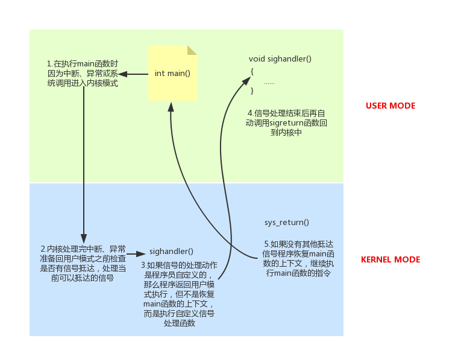
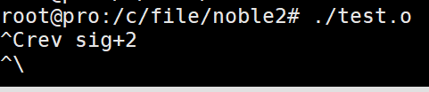
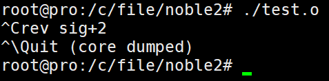

# 信号

## 1.信号的概念
信号是一种传达信息的载体，它有如下特点：<br>
- 1.简单
- 2.不能携带太多信息
- 3.在特定的时间发送

## 2.信号的机制
信号是内核发送给进程的。某个进程满足一定的条件时，驱使内核向某个进程发送一个信号。进程接受到信号后必须立即停止自己当前的代码执行，进程处理信号。<br>

## 3.信号的相关状态和事件
### 1.产生信号
- 1.按键产生，如：Ctrl+c、Ctrl+z、Ctrl+\
- 2.系统调用产生，如：kill、raise、abort
- 3.软件条件产生，如：定时器alarm
- 4.硬件异常产生，如：非法访问内存(段错误)、除0(浮点数例外)、内存对齐出错(总线错误)
- 5.命令产生，如：kill命令

### 2.信号的特质
信号是软件实现，对执行有很长的延时性(对CPU来说)，这会产生一些问题，如死锁等，而解决办法只能是通过更改程序逻辑来实现。<br>

### 3.信号的状态字
一般有两种表示信号的状态字，阻塞信号字和未响应信号字，当信号的阻塞字设为1时，产生的信号但在传递的过程中被阻塞。当产生的信号还未解决时未响应信号字设为1，任何信号都会有很短暂的置1时间，而阻塞信号会有较长时间的置1.<br>

### 4.信号类型
```
root@pro:~# kill -l
 1) SIGHUP        2) SIGINT         3) SIGQUIT        4) SIGILL         5) SIGTRAP
 6) SIGABRT       7) SIGBUS         8) SIGFPE         9) SIGKILL        10) SIGUSR1
11) SIGSEGV       12) SIGUSR2       13) SIGPIPE       14) SIGALRM       15) SIGTERM
16) SIGSTKFLT     17) SIGCHLD       18) SIGCONT       19) SIGSTOP       20) SIGTSTP
21) SIGTTIN       22) SIGTTOU       23) SIGURG        24) SIGXCPU       25) SIGXFSZ
26) SIGVTALRM     27) SIGPROF       28) SIGWINCH      29) SIGIO         30) SIGPWR
31) SIGSYS        34) SIGRTMIN      35) SIGRTMIN+1    36) SIGRTMIN+2    37) SIGRTMIN+3
38) SIGRTMIN+4    39) SIGRTMIN+5    40) SIGRTMIN+6    41) SIGRTMIN+7    42) SIGRTMIN+8
43) SIGRTMIN+9    44) SIGRTMIN+10   45) SIGRTMIN+11   46) SIGRTMIN+12   47) SIGRTMIN+13
48) SIGRTMIN+14   49) SIGRTMIN+15   50) SIGRTMAX-14   51) SIGRTMAX-13   52) SIGRTMAX-12
53) SIGRTMAX-11   54) SIGRTMAX-10   55) SIGRTMAX-9    56) SIGRTMAX-8    57) SIGRTMAX-7
58) SIGRTMAX-6    59) SIGRTMAX-5    60) SIGRTMAX-4    61) SIGRTMAX-3    62) SIGRTMAX-2
63) SIGRTMAX-1    64) SIGRTMAX
```

我们只关注前31个信号。<br>

### 5.信号的4要素
编号、名称、事件、默认处理动作 被称为信号的四要素。<br>
``man 7 signal``查看帮助文档获取<br>
```
Signal     Value     Action   Comment
──────────────────────────────────────────────────────────────────────
SIGHUP        1       Term    Hangup detected on controlling terminal
                              or death of controlling process
SIGINT        2       Term    Interrupt from keyboard
SIGQUIT       3       Core    Quit from keyboard
SIGILL        4       Core    Illegal Instruction
SIGABRT       6       Core    Abort signal from abort(3)
SIGFPE        8       Core    Floating-point exception
SIGKILL       9       Term    Kill signal
SIGSEGV      11       Core    Invalid memory reference
SIGPIPE      13       Term    Broken pipe: write to pipe with no
                              readers; see pipe(7)
SIGALRM      14       Term    Timer signal from alarm(2)
SIGTERM      15       Term    Termination signal
SIGUSR1   30,10,16    Term    User-defined signal 1
SIGUSR2   31,12,17    Term    User-defined signal 2
SIGCHLD   20,17,18    Ign     Child stopped or terminated
SIGCONT   19,18,25    Cont    Continue if stopped
SIGSTOP   17,19,23    Stop    Stop process
SIGTSTP   18,20,24    Stop    Stop typed at terminal
SIGTTIN   21,21,26    Stop    Terminal input for background process
SIGTTOU   22,22,27    Stop    Terminal output for background process
......
```

#### Value为什么有三个
在标准信号中，有一些信号是有三个“Value”，第一个值通常对alpha和sparc架构有效，中间值针对x86、arm和其他架构，最后一个应用于mips架构。一个‘-’表示在对应架构上尚未定义该信号。
不同的操作系统定义了不同的系统信号。因此有些信号出现在Unix系统内，也出现在Linux中，而有的信号出现在FreeBSD或Mac OS中却没有出现在Linux下。

#### 默认动作Action：
- Term：终止进程
- Ign： 忽略信号 (默认即时对该种信号忽略操作)
- Core：终止进程，生成Core文件。(查验进程死亡原因， 用于gdb调试)
- Stop：停止（暂停）进程
- Cont：继续运行进程

### 6.kill函数/命令产生信号
kill命令产生信号：kill -SIGKILL 进程ID<br>
kill函数：给指定进程发送指定信号(不一定杀死)<br>
``int kill(pid_t pid, int sig);``	 成功：0；失败：-1 (ID非法，信号非法，普通用户杀init进程等权级问题)，设置errno<br>

- sig：不推荐直接使用数字，应使用宏名，因为不同操作系统信号编号可能不同，但名称一致。
- pid > 0:  发送信号给指定的进程。
- pid = 0:  发送信号给 与调用kill函数进程属于同一进程组的所有进程。
- pid < -1:  取|pid|发给对应进程组。
- pid = -1：发送给进程有权限发送的系统中所有进程。


进程组：每个进程都属于一个进程组，进程组是一个或多个进程集合，他们相互关联，共同完成一个实体任务，每个进程组都有一个进程组长，默认进程组ID与进程组长ID相同。<br>


### 7.alarm函数
设置定时器(闹钟)。在指定seconds后，内核会给当前进程发送14）SIGALARM信号。进程收到该信号，默认动作终止。<br>
每个进程都有且只有唯一的一个定时器。<br>
``unsigned int alarm(unsigned int seconds);`` 返回0或剩余的秒数，无失败。<br>
``alarm(0)``会取消之前设置的闹钟。<br>


## 3.信号屏蔽字的设定
为了实现对信号阻塞的设定，通过维护一个mask缓存，记录用户的缓冲设定，通过以下函数实现：<br>

- ``int sigemptyset(sigset_t *set);``			将某个信号集全清0		 		成功：0；失败：-1，设置errno
- ``int sigfillset(sigset_t *set);``				将某个信号集全置1		  		成功：0；失败：-1，设置errno
- ``int sigaddset(sigset_t *set, int signum);``		将某个信号加入信号集合中  	成功：0；失败：-1，设置errno
- ``int sigdelset(sigset_t *set, int signum);``		将某信号从信号清出信号集   	成功：0；失败：-1，设置errno
- ``int sigismember(const sigset_t *set, int signum);``判断某个信号是否在信号集中：在：1；不在：0；出错：-1，设置errno

 除sigismember外，其余操作函数中的set均为传出参数。sigset_t类型的本质是位图。但不应该直接使用位操作，而应该使用上述函数，确保代码的可移植性。<br>

### 1.sigprocmask函数
上面的函数只是更改缓存中的mask，如果要修改PCB中的信号字，就要使用sigprocmask函数。<br>
__严格注意__<br>
屏蔽信号：只是将信号处理延后执行(延至解除屏蔽)；而忽略表示将信号丢弃处理。<br>

``sigprocmask``函数的功能是：使用我们自定义的信号屏蔽字影响PCB进程控制中的屏蔽字，具体怎么影响看``how``的宏。<br>
``int sigprocmask(int how, const sigset_t *set, sigset_t *oldset);``	成功：0；失败：-1，设置errno<br>

参数：
- set：传入参数，是一个自定义信号集合。由参数how来指示如何修改当前信号屏蔽字。
- oldset：传出参数，保存旧的信号屏蔽字。
- how参数取值：假设当前的信号屏蔽字为mask
  - 1.SIG_BLOCK: 当how设置为此值，set表示需要屏蔽的信号。相当于 mask = mask|set
  - 2.SIG_UNBLOCK: 当how设置为此，set表示需要解除屏蔽的信号。相当于 mask = mask & ~set
  - 3.SIG_SETMASK: 当how设置为此，set表示用于替代原始屏蔽及的新屏蔽集。相当于mask = set若，调用sigprocmask解除了对当前若干个信号的阻塞，则在sigprocmask返回前，至少将其中一个信号递达。

### 2.sigpending函数
读取当前进程的未决信号集<br>
``int sigpending(sigset_t *set);``	set传出参数。   返回值：成功：0；失败：-1，设置errno<br>


### 3.实例
下面的程序是对上面程序的一般使用实例：<br>
```c
#include<stdio.h>
#include<unistd.h>
#include<signal.h>
void printset(const sigset_t *ped)
{
        int i;
        for(i=0;i<32;i++)
        {
                if((sigismember(ped,i)==1))
                        putchar('1');
                else
                        putchar('0');
        }
        printf("\n");
}
int main()
{
        sigset_t set,ped;
        sigemptyset(&set);
        sigaddset(&set,SIGINT);
        sigaddset(&set,SIGQUIT);

        sigprocmask(SIG_BLOCK,&set,NULL);
        while(1){
                sigpending(&ped);
                printset(&ped);
                sleep(1);
        }
        return 0;
}
```


## 4.信号的捕捉

### 1.信号捕捉
用户通过信号捕捉函数``signal``或``sigaction``实现对信号处理的自定义，但自定义代码在用户空间执行，这使得信号捕捉过程有些复杂。<br>
举个例子：<br>
- 1.开发者自定义了``SIGINT``信号的处理函数``sighandler``
- 2.当前正在执行main函数，突然发生中断或异常
- 3.CPU处理完中断或异常后准备要回到``main``函数继续执行前，检测到有``SIGINT``信号抵达
- 4.内核决定返回用户状态后不是恢复``main``函数的上下文继续执行，而是执行``sighandler``函数，``sighandler``函数和``main``函数不在同一个堆栈空间，是相互独立的。
- 5.``sighandler``函数返回后自动执行一个特殊系统调用``sigreturn``再次回到内核状态
- 6.如果没有检测到新的信号抵达，这次就返回到``main``函数恢复上下文继续执行

<br>

### 2.signal函数
避免使用，因为它是ANSI标准不是POSIX，不统一。<br>
``typedef void (*sighandler_t)(int);`` <br>
``sighandler_t signal(int signum, sighandler_t handler);``<br>
signal是函数指针的定义，表示没有返回值<br>

### 3.sigaction函数
``int sigaction(int signum, const struct sigaction *act,struct sigaction *oldact);`` 成功返回0 失败返回-1 error设置。<br>

__参数：__<br>
- signum 那31个信号的类型，使用的是宏，如SIGINT
- act 如果不为NULL，则执行act的动作
- oldact 如果不为NULL，则把原来旧的的动作保存在oldact中，是传出参数

```c
struct sigaction {
  void     (*sa_handler)(int);
  void     (*sa_sigaction)(int, siginfo_t *, void *);
  sigset_t sa_mask;
  int      sa_flags;
  void     (*sa_restorer)(void);
};
```
__对结构体的解释：__<br>
- 1.``sa_handler``元素，它和第二个元素``sa_sigaction``一样指代用户自定义的信号捕捉函数，但是它不能接受用户的参数，而``sa_sigaction``可以接受用户的参数，``sa_handler``和``sa_sigaction``会被系统回调
- 2.``sa_flags``是表示使用``sa_handler``还是使用``sa_sigaction``,当使用``sa_handler``时``sa_flags``设置为0即可，如果是使用``sa_sigaction``，就把``sa_flags``设置为``SA_SIGINFO``。不要同时设置``sa_handler``和``sa_sigation``
- 3.当``sa_flags``设置为``SA_NODEFER``时，信号执行自定义信号处理函数时不会屏蔽当前信号
- 4.``sa_mask``元素，在调用自定义信号处理函数时，用来屏蔽其他信号。其本质和PCB中的信号屏蔽字mask位图是一致的，内核会把sa_mask设置的需要被屏蔽的信号 加入PCB的屏蔽字中
- 5.``sa_restorer``不是给我们使用的，不管
- 6.当某个信号的自定义处理函数被调用时，内核自动将该信号加入信号屏蔽字，当信号的处理函数完毕后，恢复原来的信号屏蔽字。这样做的目的是：当执行这个自定义信号处理时，如果又有该信号抵达时，会阻塞该信号，直到现在的自定义函数执行完毕。
- 7.``sa_sigaction``函数的第一个参数与``sa_handler``一样表示当前信号的编号，第二个参数是``siginfo_t``结构体(可以向自定义信号处理函数传递信息，比``sa_handler``要强大)，第三个参数一般不用


对于``sa_sigaction``还是较为复杂的，它适用于实时信号，如果是非实时信号还是用``sa_handler``简单些。当需要使用时再研究吧。<br>


下面的实例是``sigaction``函数的最简单实例，即按下``ctrl+c`` 会一直产生信号而被处理打印``recv``语句。<br>
eg：<br>
```c
#include<stdio.h>
#include<signal.h>
#include<unistd.h>

void handler(int sig);

int main()
{
        struct sigaction art;
        art.sa_handler = handler;
        sigemptyset(&art.sa_mask);
        art.sa_flags = 0;
        sigaction(SIGINT,&art,NULL);
        while(1)
                pause();
        return 0;
}
void handler(int sig)
{
        printf("rev sig+%d\n",sig);
}
```
在信号捕捉里，我们禁止调用不可重入函数。也就是说``sa_handler``和``sa_sigaction``指向的函数必须是可重入的。<br>
可重入函数时指：当一个函数未执行完毕 暂停 再次调用该函数不会发生逻辑错误，所以没有改变或使用全局变量和静态变量的函数 是可重入函数的特征。<br>


在下面的实例中我们使用``sigaction``函数实现了s``ignal``函数<br>
eg：<br>
```c
#include<stdio.h>
#include<signal.h>
#include<unistd.h>

void handler(int sig);
__sighandler_t my_signal(int sig,__sighandler_t handler);

int main()
{
        my_signal(SIGINT,handler);
        while(1)
                pause();
        return 0;
}
__sighandler_t my_signal(int sig,__sighandler_t handler)
{
        struct sigaction act;
        struct sigaction oldact;
        act.sa_handler = handler;
        sigemptyset(&act.sa_mask);
        act.sa_flags=0;
        sigaction(sig,&act,&oldact);

        return oldact.sa_handler;
}
void handler(int sig)
{
        printf("rev sig+%d\n",sig);
}
```

下面的例子实现sa_mask的作用：<br>
eg：<br>
```c
#include<stdio.h>
#include<signal.h>
#include<unistd.h>

void handler(int sig);

int main()
{
        struct sigaction act;
        act.sa_handler = handler;
        sigemptyset(&act.sa_mask);
        sigaddset(&act.sa_mask,SIGQUIT);// 在信号处理函数执行期间屏蔽SIGQUIT信号，完毕后会抵达
        /* 注意sigprocmask中屏蔽的信号是一直不能抵达的，除非解除了阻塞*/
        act.sa_flags= 0;
        sigaction(SIGINT,&act,NULL);
        while(1)
                pause();
        return 0;
}
void handler(int sig)
{
        printf("rev sig+%d\n",sig);
        sleep(5);
}
```

先按下``ctrl+c`` ，然后马上``ctrl+\``，程序是不会马上终止的，即等到``handler``处理完毕``SIGQUIT``信号才会抵达。<br>

输出：<br>
<br>

5s后.........：<br>
<br>
