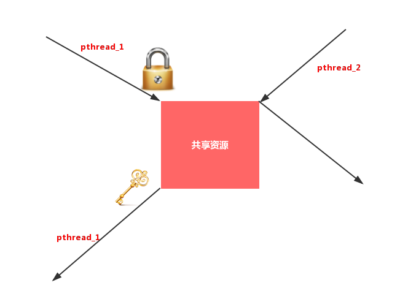
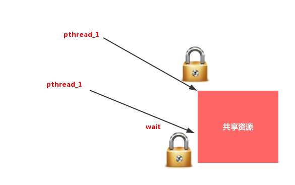
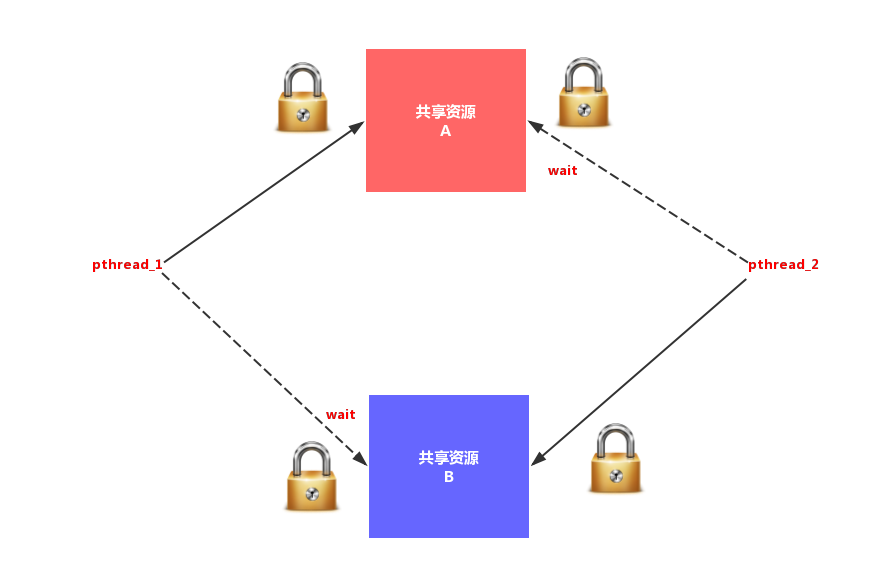

# 线程同步
## 1.线程同步的概念
线程同步，指一个线程发出某一功能调用时，在没有得到结果之前，该调用不返回。同时其它线程为保证数据一致性，不能调用该功能。<br>

注意：线程的同步概念与其他场合的同步概念不同，不是指并行之类的概念，而是指协同配合的意思。<br>

## 2.数据混乱原因：
- 1.资源共享（独享资源则不会）
- 2.调度随机（意味着数据访问会出现竞争）
- 3.线程间缺乏必要的同步机制。


以上3点中，前两点不能改变，欲提高效率，传递数据，资源必须共享。只要共享资源，就一定会出现竞争。只要存在竞争关系，数据就很容易出现混乱。<br>
所以只能从第三点着手解决。使多个线程在访问共享资源的时候，出现互斥。<br>

## 3.互斥量mutex
Linux中提供一把互斥锁mutex（也称之为互斥量）。<br>
每个线程在对资源操作前都尝试先加锁，成功加锁才能操作，操作结束解锁。<br>
资源还是共享的，线程间也还是竞争的，
但通过“锁”就将资源的访问变成互斥操作，而后与时间有关的错误也不会再产生了。<br>

<br>

应注意：同一时刻，只能有一个线程持有该锁。<br>
当A线程对某个全局变量加锁访问，B在访问前尝试加锁，拿不到锁，B阻塞。C线程不去加锁，而直接访问该全局变量，依然能够访问，但会出现数据混乱。<br>
所以，互斥锁实质上是操作系统提供的一把“建议锁”（又称“协同锁”），建议程序中有多线程访问共享资源的时候使用该机制。但，并没有强制限定。<br>
因此，即使有了mutex，如果有线程不按规则来访问数据，依然会造成数据混乱。<br>

## 4.常使用的函数
- ``pthread_mutex_init``函数
- ``pthread_mutex_destroy``函数
- ``pthread_mutex_lock``函数
- ``pthread_mutex_trylock``函数
- ``pthread_mutex_unlock``函数

以上5个函数的返回值都是：成功返回0， 失败返回错误号。<br>
``pthread_mutex_t`` 类型，其本质是一个结构体。为简化理解，应用时可忽略其实现细节，简单当成整数看待。<br>
``pthread_mutex_t mutex;`` 变量mutex只有两种取值1、0。<br>

### 1.pthread_mutex_init函数
初始化一个互斥锁(互斥量) ---> 初值可看作1<br>
``int pthread_mutex_init(pthread_mutex_t *restrict mutex, const pthread_mutexattr_t *restrict attr);``<br>
参1：传出参数，调用时应传 ``&mutex``	<br>
restrict关键字：限制指针，告诉编译器，所有修改该指针指向内存中内容的操作，只能通过本指针完成。不能通过除本指针以外的其他变量或指针修改<br>
参2：互斥量属性。是一个传入参数，通常传``NULL``，选用默认属性(线程间共享)。 参APUE.12.4同步属性<br>
- 1.静态初始化：如果互斥锁 ``mutex`` 是静态分配的（定义在全局，或加了static关键字修饰），可以直接使用宏进行初始化。e.g.  ``pthead_mutex_t muetx = PTHREAD_MUTEX_INITIALIZER;``<br>
- 2.动态初始化：局部变量应采用动态初始化。e.g.  ``pthread_mutex_init(&mutex, NULL)``<br>

### 2.pthread_mutex_destroy函数
销毁一个互斥锁<br>
``int pthread_mutex_destroy(pthread_mutex_t *mutex);``<br>

### 3.pthread_mutex_lock函数
加锁。可理解为将mutex--（或-1）<br>
``int pthread_mutex_lock(pthread_mutex_t *mutex);``<br>

### 4.pthread_mutex_unlock函数
解锁。可理解为将mutex ++（或+1）<br>
``int pthread_mutex_unlock(pthread_mutex_t *mutex);``<br>

### 5.pthread_mutex_trylock函数
尝试加锁<br>
``int pthread_mutex_trylock(pthread_mutex_t *mutex);``<br>

## 5.加锁与解锁

### 1.lock与unlock：
lock尝试加锁，如果加锁不成功，线程阻塞，阻塞到持有该互斥量的其他线程解锁为止。<br>
unlock主动解锁函数，同时将阻塞在该锁上的所有线程全部唤醒，至于哪个线程先被唤醒，取决于优先级、调度。默认：先阻塞、先唤醒。<br>
例如：T1 T2 T3 T4 使用一把mutex锁。T1加锁成功，其他线程均阻塞，直至T1解锁。T1解锁后，T2 T3 T4均被唤醒，并自动再次尝试加锁。<br>
可假想mutex锁 init成功初值为1。	lock 功能是将mutex--。	unlock将mutex++<br>

### 2.lock与trylock：
lock加锁失败会阻塞，等待锁释放。<br>
trylock加锁失败直接返回错误号（如：EBUSY），不阻塞。<br>

__下面的程序是典型的因为没有同步而造成的数据混乱__<br>
```c
#include <stdio.h>
#include <string.h>
#include <pthread.h>
#include <stdlib.h>
#include <unistd.h>

void *tfn(void *arg)
{
    srand(time(NULL));

    while (1) {

        printf("hello ");
        sleep(rand() % 3);	/*模拟长时间操作共享资源，导致cpu易主，产生与时间有关的错误*/
        printf("world\n");
        sleep(rand() % 3);
    }

    return NULL;
}

int main(void)
{
    pthread_t tid;
    srand(time(NULL));

    pthread_create(&tid, NULL, tfn, NULL);
    while (1) {

        printf("HELLO ");
        sleep(rand() % 3);
        printf("WORLD\n");
        sleep(rand() % 3);

    }
    pthread_join(tid, NULL);

    return 0;
}
```

修改该程序，使用mutex互斥锁进行同步。	<br>
- 1.定义全局互斥量，初始化init(&m, NULL)互斥量，添加对应的destry
- 2.两个线程while中，两次printf前后，分别加lock和unlock
- 3.将unlock挪至第二个sleep后，发现交替现象很难出现。
  线程在操作完共享资源后本应该立即解锁，但修改后，线程抱着锁睡眠。睡醒解锁后又立即加锁，这两个库函数本身不会阻塞。
所以在这两行代码之间失去cpu的概率很小。因此，另外一个线程很难得到加锁的机会。
- 4.main 中加flag = 5 将flg在while中--  这时，主线程输出5次后试图销毁锁，但子线程未将锁释放，无法完成。
- 5.main 中加pthread_cancel()将子线程取消。

```c
#include <stdio.h>
#include <string.h>
#include <pthread.h>
#include <stdlib.h>
#include <unistd.h>

pthread_mutex_t m;

void err_thread(int ret, char *str)
{
    if (ret != 0) {
        fprintf(stderr, "%s:%s\n", str, strerror(ret));
        pthread_exit(NULL);
    }
}

void *tfn(void *arg)
{
    srand(time(NULL));

    while (1) {
        pthread_mutex_lock(&m);     // m--

        printf("hello ");
        sleep(rand() % 3);	/*模拟长时间操作共享资源，导致cpu易主，产生与时间有关的错误*/
        printf("world\n");
        pthread_mutex_unlock(&m);   // m++
        sleep(rand() % 3);

    }

    return NULL;
}

int main(void)
{
    pthread_t tid;
    srand(time(NULL));
    int flag  = 5;

    pthread_mutex_init(&m, NULL);        // 1
    int ret = pthread_create(&tid, NULL, tfn, NULL);
    err_thread(ret, "pthread_create error");


    while (flag--) {
        pthread_mutex_lock(&m);     // m--

        printf("HELLO ");
        sleep(rand() % 3);
        printf("WORLD\n");
        pthread_mutex_unlock(&m);     // m--

        sleep(rand() % 3);

    }
    pthread_cancel(tid);
    pthread_join(tid, NULL);

    pthread_mutex_destroy(&m);

    return 0;
}
```

__结论：__<br>
在访问共享资源前加锁，访问结束后立即解锁。锁的临界区应越小越好。<br>

## 6.死锁
1.线程试图对同一个互斥量A加锁两次。<br>

<br>

2.线程1拥有A锁，请求获得B锁；线程2拥有B锁，请求获得A锁<br>

<br>

## 7.读写锁
与互斥量类似，但读写锁允许更高的并行性。其特性为：写独占，读共享。<br>

### 1.读写锁状态：
一把读写锁具备三种状态：<br>
- 1.读模式下加锁状态 (读锁)
- 2.写模式下加锁状态 (写锁)
- 3.不加锁状态

### 2.读写锁特性：
- 1.读写锁是“写模式加锁”时， 解锁前，所有对该锁加锁的线程都会被阻塞。
- 2.读写锁是“读模式加锁”时， 如果线程以读模式对其加锁会成功；如果线程以写模式加锁会阻塞。
- 3.读写锁是“读模式加锁”时， 既有试图以写模式加锁的线程，也有试图以读模式加锁的线程。那么读写锁会阻塞随后的读模式锁请求。优先满足写模式锁。 __读锁、写锁并行阻塞，写锁优先级高__


读写锁也叫共享-独占锁。当读写锁以读模式锁住时，它是以共享模式锁住的；当它以写模式锁住时，它是以独占模式锁住的。 __写独占、读共享。__<br>
读写锁非常适合于对数据结构读的次数远大于写的情况。<br>

### 3.主要应用函数：
``pthread_rwlock_init``函数<br>
``pthread_rwlock_destroy``函数<br>
``pthread_rwlock_rdlock``函数<br>
``pthread_rwlock_wrlock``函数<br>
``pthread_rwlock_tryrdlock``函数<br>
``pthread_rwlock_trywrlock``函数<br>
``pthread_rwlock_unlock``函数<br>
以上7 个函数的返回值都是：成功返回0， 失败直接返回错误号。	<br>
``pthread_rwlock_t类型	用于定义一个读写锁变量。<br>
``pthread_rwlock_t rwlock;``<br>

#### 1.pthread_rwlock_init函数
初始化一把读写锁<br>
``int pthread_rwlock_init(pthread_rwlock_t *restrict rwlock, const pthread_rwlockattr_t *restrict attr);``<br>
参2：attr表读写锁属性，通常使用默认属性，传NULL即可。<br>

#### 2.pthread_rwlock_destroy函数
销毁一把读写锁<br>
``int pthread_rwlock_destroy(pthread_rwlock_t *rwlock);``<br>

#### 3.pthread_rwlock_rdlock函数
以读方式请求读写锁。（常简称为：请求读锁）<br>
``int pthread_rwlock_rdlock(pthread_rwlock_t *rwlock);``<br>

#### 4.pthread_rwlock_wrlock函数
以写方式请求读写锁。（常简称为：请求写锁）<br>
``int pthread_rwlock_wrlock(pthread_rwlock_t *rwlock);``<br>

#### 5.pthread_rwlock_unlock函数
解锁<br>
``int pthread_rwlock_unlock(pthread_rwlock_t *rwlock);``<br>

#### 6.pthread_rwlock_tryrdlock函数
非阻塞以读方式请求读写锁（非阻塞请求读锁）<br>
``int pthread_rwlock_tryrdlock(pthread_rwlock_t *rwlock);``<br>

#### 7.pthread_rwlock_trywrlock函数
非阻塞以写方式请求读写锁（非阻塞请求写锁）<br>
``int pthread_rwlock_trywrlock(pthread_rwlock_t *rwlock);``<br>

下面的实例是上面函数的一般试用：<br>
```c
#include <stdio.h>
#include <unistd.h>
#include <pthread.h>

int counter;
pthread_rwlock_t rwlock;

/* 3个线程不定时写同一全局资源，5个线程不定时读同一全局资源 */
void *th_write(void *arg)
{
    int t;
    int i = (int)arg;
    while (1) {
        pthread_rwlock_wrlock(&rwlock);
        t = counter;
        usleep(1000);
        printf("=======write %d: %lu: counter=%d ++counter=%d\n", i, pthread_self(), t, ++counter);
        pthread_rwlock_unlock(&rwlock);
        usleep(10000);
    }
    return NULL;
}
void *th_read(void *arg)
{
    int i = (int)arg;

    while (1) {
        pthread_rwlock_rdlock(&rwlock);
        printf("----------------------------read %d: %lu: %d\n", i, pthread_self(), counter);
        pthread_rwlock_unlock(&rwlock);
        usleep(2000);
    }
    return NULL;
}

int main(void)
{
    int i;
    pthread_t tid[8];

    pthread_rwlock_init(&rwlock, NULL);

    for (i = 0; i < 3; i++)
        pthread_create(&tid[i], NULL, th_write, (void *)i);

    for (i = 0; i < 5; i++)
        pthread_create(&tid[i+3], NULL, th_read, (void *)i);

    for (i = 0; i < 8; i++)
        pthread_join(tid[i], NULL);

    pthread_rwlock_destroy(&rwlock);

    return 0;
}

```


## 8.条件变量
条件本身不是锁！但它也可以造成线程阻塞。通常与互斥锁配合使用。给多线程提供一个会合的场所。<br>

### 1.主要应用函数：
``pthread_cond_ini``t函数<br>
``pthread_cond_destroy``函数<br>
``pthread_cond_wait``函数<br>
``pthread_cond_timedwait``函数<br>
``pthread_cond_signal``函数<br>
``pthread_cond_broadcast``函数<br>
以上6 个函数的返回值都是：成功返回0， 失败直接返回错误号。<br>
``pthread_cond_``t类型	用于定义条件变量<br>
``pthread_cond_t cond;``<br>


### 2.函数说明

#### 1.pthread_cond_init函数
初始化一个条件变量<br>
``int pthread_cond_init(pthread_cond_t *restrict cond, const pthread_condattr_t *restrict attr);``		<br>
参2：``attr``表条件变量属性，通常为默认值，传``NULL``即可<br>
也可以使用静态初始化的方法，初始化条件变量：<br>
``pthread_cond_t cond = PTHREAD_COND_INITIALIZER``;<br>

#### 2.pthread_cond_destroy函数
销毁一个条件变量<br>
``int pthread_cond_destroy(pthread_cond_t *cond);``<br>

#### 3.pthread_cond_wait函数
阻塞等待一个条件变量<br>
``int pthread_cond_wait(pthread_cond_t *restrict cond, pthread_mutex_t *restrict mutex);``<br>
函数作用：<br>
- 1.阻塞等待条件变量cond（参1）满足
- 2.释放已掌握的互斥锁（解锁互斥量）相当于pthread_mutex_unlock(&mutex);<br>
1.2.两步为一个原子操作。
- 3.当被唤醒，``pthread_cond_wait``函数返回时，解除阻塞并重新申请获取互斥锁``pthread_mutex_lock(&mutex);``


#### 4.pthread_cond_signal函数
唤醒至少一个阻塞在条件变量上的线程<br>
``int pthread_cond_signal(pthread_cond_t *cond);``<br>

#### 5.pthread_cond_broadcast函数
唤醒全部阻塞在条件变量上的线程<br>
``int pthread_cond_broadcast(pthread_cond_t *cond);``<br>


## 9.信号量
进化版的互斥锁（1 --> N）<br>
由于互斥锁的粒度比较大，如果我们希望在多个线程间对某一对象的部分数据进行共享，使用互斥锁是没有办法实现的，只能将整个数据对象锁住。这样虽然达到了多线程操作共享数据时保证数据正确性的目的，却无形中导致线程的并发性下降。线程从并行执行，变成了串行执行。与直接使用单进程无异。<br>
信号量，是相对折中的一种处理方式，既能保证同步，数据不混乱，又能提高线程并发。<br>

### 1.主要应用函数：
``sem_init``函数
``sem_destroy``函数
``sem_wait``函数
``sem_trywait``函数
``sem_timedwait``函数
``sem_post``函数
以上6 个函数的返回值都是：成功返回0， 失败返回-1，同时设置``errno``。(注意，它们没有``pthread``前缀)
``sem_t类型，本质仍是结构体。但应用期间可简单看作为整数，忽略实现细节（类似于使用文件描述符）。
``sem_t sem;`` 规定信号量sem不能 < 0。头文件 <semaphore.h>

### 2.信号量基本操作：
sem_wait:
- 1.信号量大于0，则信号量--		（类比pthread_mutex_lock）
- 2.信号量等于0，造成线程阻塞

sem_post：
- 1.将信号量++
- 2.同时唤醒阻塞在信号量上的线程	（类比pthread_mutex_unlock）


但，由于sem_t的实现对用户隐藏，所以所谓的++、--操作只能通过函数来实现，而不能直接++、--符号。<br>
信号量的初值，决定了占用信号量的线程的个数。<br>
