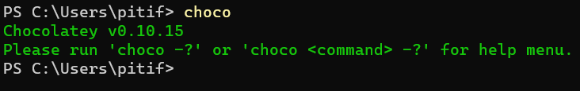
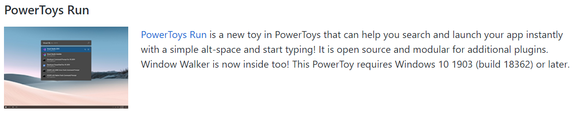
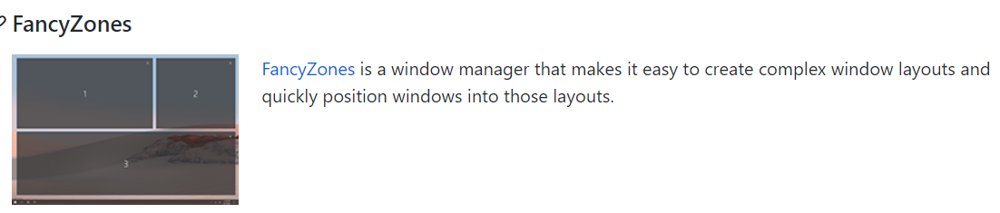

# 搭建开发环境

网上有nick编写的关于使用wsl2搭建开发环境的视频文本

https://nickjanetakis.com/blog/a-linux-dev-environment-on-windows-with-wsl-2-docker-desktop-and-more

## 01.chocolate包管理工具

chocolate包管理工具不是官方工具，但非常实用

https://chocolatey.org/install

安装官方网站安装步骤一步一步安装，成功后如下：




## 02.安装powertoys

powertoys的github页面如下

https://github.com/microsoft/PowerToys

主页面上写了通过chocolate安装方法

```
choco install powertoys
```

安装成功后需要重启系统才会自启动。


#### 2.1.实用工具powertoys run



**PowerToys Run** 是一款快速启动器工具，类似于 [Mac](https://www.iplaysoft.com/go/mac) 系统自带的 Spotlight (聚焦搜索) 以及 Windows 上的 [Listary](https://www.iplaysoft.com/listary.html)、[Wox](https://www.iplaysoft.com/wox.html)、[everything](https://www.iplaysoft.com/search-everything.html) 等工具。按下 `Alt` + `空格`即可随时呼出输入框，输入名字后，它能快速找到对应的软件、搜索文件/文件夹，并回车迅速打开它们。

#### 2.2.实用工具FancyZones




#### 2.3.更多功能

更多功能可以去github网站查找

https://github.com/microsoft/PowerToys

国语介绍：

https://www.iplaysoft.com/powertoys.html


## 03.安装配置windows powershell

在Microsoft store 安装windwos powershell

并配置常用快捷键和样式。

官方教程：[https://docs.microsoft.com/zh-cn/windows/terminal/customize-settings/key-bindings](https://docs.microsoft.com/zh-cn/windows/terminal/customize-settings/key-bindings)

我的配置策略：

```json
"profiles":
    {
        "defaults":
        {
            // Put settings here that you want to apply to all profiles.
            //amos-set
            "backgroundImage": "ms-appdata:///roaming/class.png",
            "backgroundImageStretchMode": "uniformToFill",
            "backgroundImageOpacity": 0.1
        },
    }


"keybindings":
    [
        //amos-HotKey
        //close tab
        { "command": { "action": "closeTab"}, "keys": "Ctrl+shift+x"},
        //copy tab
        { "command": "duplicateTab", "keys": "ctrl+shift+p" },
        //open right tab
        { "command": "nextTab", "keys": "ctrl+shift+k" },
        //open left tab
        { "command": "prevTab", "keys": "ctrl+shift+j" }
    ]
```


## 04.安装wsl2

#### 4.1.开启linux内核支持

控制面板-> 程序 -> 启用或关闭windows功能-> 勾选"适用于Linux的windwos子系统"


#### 4.2.安装wsl2

https://docs.microsoft.com/en-us/windows/wsl/install-win10

按照微软定义的安装方法一步一步进行即可。


## 05.安装docker

https://hub.docker.com/editions/community/docker-ce-desktop-windows/


使用docker和wsl2协同做开发，有相关文档说明：https://s0docs0docker0com.icopy.site/docker-for-windows/wsl/

其中建议将代码放在linux中。


