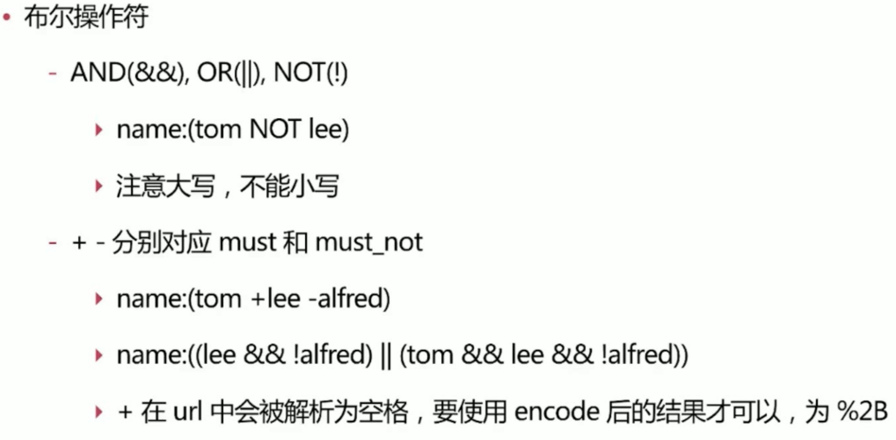
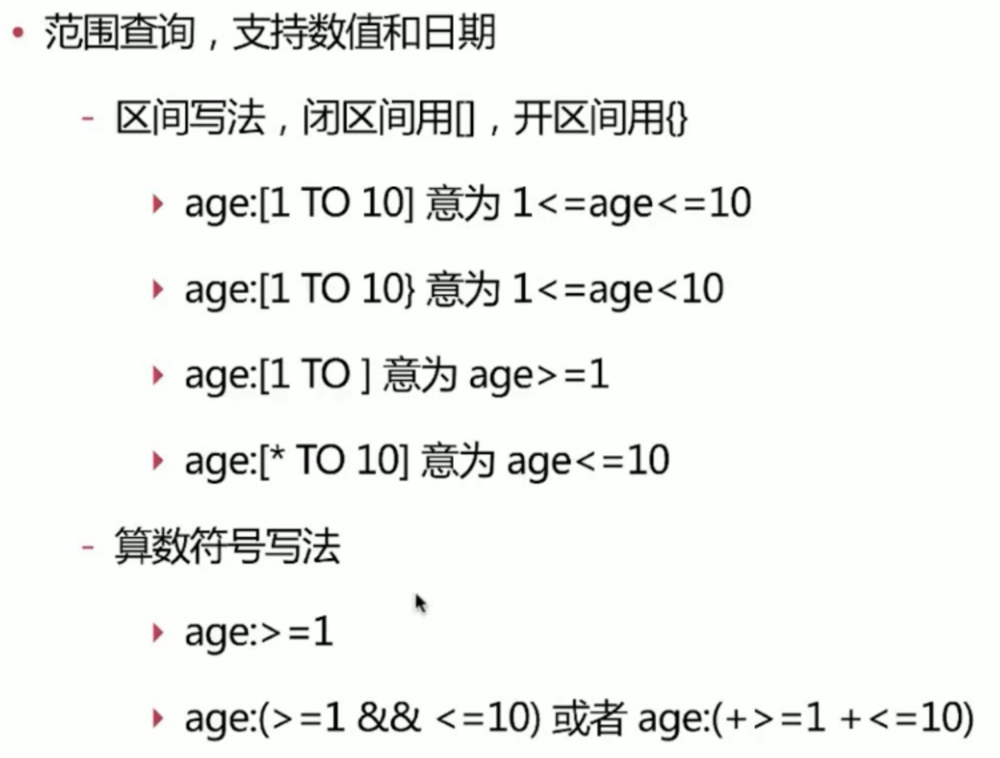
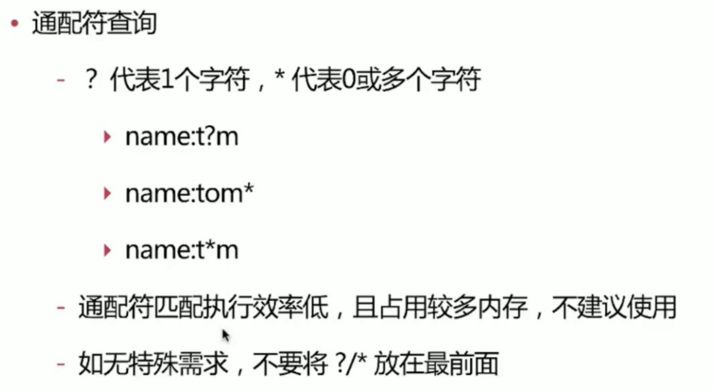

# 01.URLsearch

数据准备：
```
PUT test_search_index
{
  "settings": {
    "index":{
      "number_of_shards":"1"
    }
  }
}

POST test_search_index/doc/_bulk
{"index":{"_id":"1"}}
{"username":"alfred way","job":"java engineer","age":18,"birth":"1990-01-02","isMarried":false}
{"index":{"_id":"2"}}
{"username":"alfred","job":"java senior engineer and java specialist","age":28,"birth":"1980-05-07","isMarried":true}
{"index":{"_id":"3"}}
{"username":"lee","job":"java and ruby engineer","age":22,"birth":"1985-08-07","isMarried":false}
{"index":{"_id":"4"}}
{"username":"alfred junior way","job":"ruby engineer","age":23,"birth":"1989-08-07","isMarried":false}
```

## 将text字段转换为keyword
```
PUT infosec_risk_referer_monitor_log/_mapping
{
  "properties": {
    "remote_addr":{
       "type": "text",
      "fielddata": true
    }
  }
}
```

## 1.1.范查询
```
GET test_search_index/_search?q=alfred
```

```json
{
  "took" : 792,
  "timed_out" : false,
  "_shards" : {
    "total" : 1,
    "successful" : 1,
    "skipped" : 0,
    "failed" : 0
  },
  "hits" : {
    "total" : {
      "value" : 3,
      "relation" : "eq"
    },
    "max_score" : 1.2039728,
    "hits" : [
      {
        "_index" : "test_search_index",
        "_type" : "doc",
        "_id" : "2",
        "_score" : 1.2039728,
        "_source" : {
          "username" : "alfred",
          "job" : "java senior engineer and java specialist",
          "age" : 28,
          "birth" : "1980-05-07",
          "isMarried" : true
        }
      },
      {
        "_index" : "test_search_index",
        "_type" : "doc",
        "_id" : "1",
        "_score" : 0.33698124,
        "_source" : {
          "username" : "alfred way",
          "job" : "java engineer",
          "age" : 18,
          "birth" : "1990-01-02",
          "isMarried" : false
        }
      },
      {
        "_index" : "test_search_index",
        "_type" : "doc",
        "_id" : "4",
        "_score" : 0.2760198,
        "_source" : {
          "username" : "alfred junior way",
          "job" : "ruby engineer",
          "age" : 23,
          "birth" : "1989-08-07",
          "isMarried" : false
        }
      }
    ]
  }
}
```
范查询是匹配所有字段来做查询。上面的实例包括``username,job``，其他字段类型不同，所以不包含。

## 1.2.字段查询
```
GET test_search_index/_search?q=username:alfred
```
只查询`username`字段包含`alfred`

### 1.2.1.双引号的语义
```
GET test_search_index/_search?q=username:"alfred way"
```
将 ``alfred way``当作一个整体做查询。上面的实例中只返回一条结果：

```json
{
  "took" : 84,
  "timed_out" : false,
  "_shards" : {
    "total" : 1,
    "successful" : 1,
    "skipped" : 0,
    "failed" : 0
  },
  "hits" : {
    "total" : {
      "value" : 1,
      "relation" : "eq"
    },
    "max_score" : 0.99185646,
    "hits" : [
      {
        "_index" : "test_search_index",
        "_type" : "doc",
        "_id" : "1",
        "_score" : 0.99185646,
        "_source" : {
          "username" : "alfred way",
          "job" : "java engineer",
          "age" : 18,
          "birth" : "1990-01-02",
          "isMarried" : false
        }
      }
    ]
  }
}
```

### 1.2.2.小括号的语义
```
GET test_search_index/_search?q=username:(alfred way)
```
是``或``的意思，类似``shell``中的``|``

## 2.bool相关运算符


```
GET test_search_index/_search?q=username:(alfred NOT way) //包含alfred 但不包含 way
GET test_search_index/_search?q=username:(alfred %2Bway) // +必须使用%2B代替
GET test_search_index/_search?q=username:(alfred -way) //同第一个
```

```json
{
  "took" : 9,
  "timed_out" : false,
  "_shards" : {
    "total" : 1,
    "successful" : 1,
    "skipped" : 0,
    "failed" : 0
  },
  "hits" : {
    "total" : {
      "value" : 1,
      "relation" : "eq"
    },
    "max_score" : 0.43250346,
    "hits" : [
      {
        "_index" : "test_search_index",
        "_type" : "doc",
        "_id" : "2",
        "_score" : 0.43250346,
        "_source" : {
          "username" : "alfred",
          "job" : "java senior engineer and java specialist",
          "age" : 28,
          "birth" : "1980-05-07",
          "isMarried" : true
        }
      }
    ]
  }
}
```

## 3.区间查询


```
GET test_search_index/_search?q=username:alfred AND age:>25
```

```json
{
  "took" : 6,
  "timed_out" : false,
  "_shards" : {
    "total" : 1,
    "successful" : 1,
    "skipped" : 0,
    "failed" : 0
  },
  "hits" : {
    "total" : {
      "value" : 1,
      "relation" : "eq"
    },
    "max_score" : 1.4325035,
    "hits" : [
      {
        "_index" : "test_search_index",
        "_type" : "doc",
        "_id" : "2",
        "_score" : 1.4325035,
        "_source" : {
          "username" : "alfred",
          "job" : "java senior engineer and java specialist",
          "age" : 28,
          "birth" : "1980-05-07",
          "isMarried" : true
        }
      }
    ]
  }
}
```

## 4.通配符查询
公司环境尽量不要用

