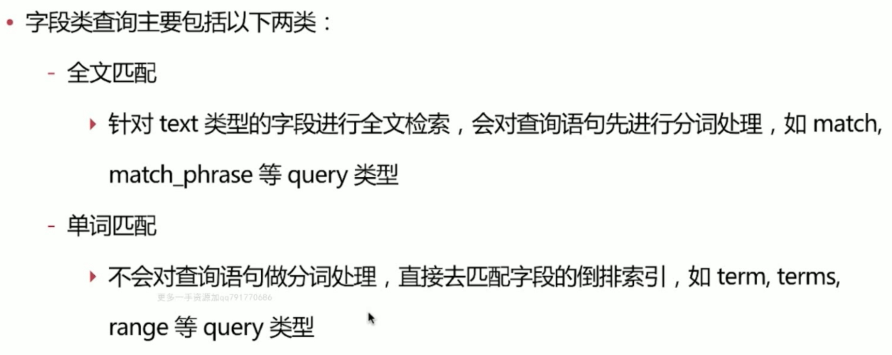
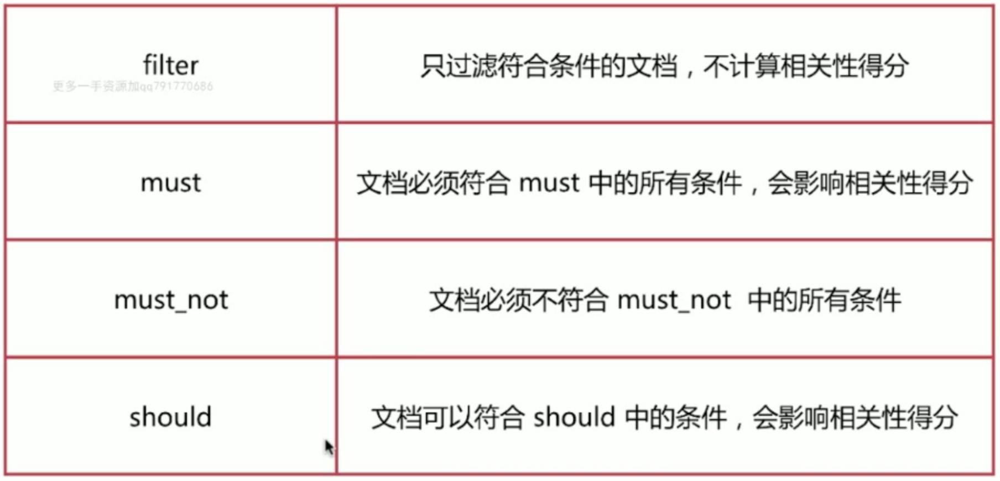

# Query DSL
基于JSON定义的查询语句，主要包含如下两类：
- 1.字段类查询
    - 如 ``term,match,range``等，只针对一个字段的查询
- 2.复合查询
    - 如``bool``等查询，包含一个或多个字段类查询

## 01.字段类查询



### 1.1.match query
```json
GET test_search_index/_search
{
  "explain":true,
  "query": {
    "match": {
      "username": "alfred way"
    }
  }
}
```
返回username中存在 alfred 或 way的文档。
注意这里的双引号和URLQuery中的语义不同。

#### 1.1.1.operator
默认operator是 or
```json
GET test_search_index/_search
{
  "query": {
    "match": {
      "username": {
        "query": "alfred way",
        "operator": "and"
      }
    }
  }
}
```
返回username中(存在alfred 并且 存在 way)

### 1.2.Match phrase Query
```json
GET test_search_index/_search
{
  "query": {
    "match_phrase": {
      "job": {
        "query": "java engineer",
        "slop": "1"
      }
    }
  }
}
```
返回job中顺序包含java和engineer的doc。
且java和engineer之间最多只能有slop个term。
slop默认为0

上面的查询结果返回：
```json
{
  "took" : 1,
  "timed_out" : false,
  "_shards" : {
    "total" : 1,
    "successful" : 1,
    "skipped" : 0,
    "failed" : 0
  },
  "hits" : {
    "total" : {
      "value" : 2,
      "relation" : "eq"
    },
    "max_score" : 0.56026345,
    "hits" : [
      {
        "_index" : "test_search_index",
        "_type" : "doc",
        "_id" : "1",
        "_score" : 0.56026345,
        "_source" : {
          "username" : "alfred way",
          "job" : "java engineer",
          "age" : 18,
          "birth" : "1990-01-02",
          "isMarried" : false
        }
      },
      {
        "_index" : "test_search_index",
        "_type" : "doc",
        "_id" : "2",
        "_score" : 0.21693128,
        "_source" : {
          "username" : "alfred",
          "job" : "java senior engineer and java specialist",
          "age" : 28,
          "birth" : "1980-05-07",
          "isMarried" : true
        }
      }
    ]
  }
}
```

### 1.3.Query String Query
```json
GET test_search_index/_search
{
  "profile":true,
  "query":{
    "query_string": {
      "default_field": "username",
      "query": "alfred AND way"
    }
  }
}
```
查询`username`字段中包含`alfred`且包含`way`的`doc`


```json
GET test_search_index/_search
{
  "profile":true,
  "query": {
    "query_string": {
      "fields": [
        "username",
        "job"
      ],
      "query": "alfred OR (java AND ruby)"
    }
  }
}
```
满足如下要求任意一个就doc都返回：
- 1.username或者job中包含alfred都返回
- 2.username和job做交集，这个总集合中包含java且包含ruby的doc返回

### 1.4.term Query
看一个例子
```json
GET test_search_index/_search
{
  "query":{
    "term":{
      "username":"alfred way"
    }
  }
}
```
上面这个查询很可能返回空，因为`alfred way`被分词器分成了`alfred`和`way`两个`term`，`username`的词典中没有`alfred way`这个`term`。

```json
GET test_search_index/_search
{
  "query": {
    "terms": {
      "username": [
        "alfred",
        "way"
      ]
    }
  }
}
```
上面这个例子返回
- `username`中`alfred`或`way`对应的文档

### 1.5.range Query
范围查询主要针对数值和日期类。

#### 1.5.1.Date Math
针对日期做一些更友好的计算：

- -y year
- -M mounth
- -w week
- -d day
- -h hour
- -m minutes
- -s second

例如：
```json
GET test_search_index/_search
{
  "query":{
    "range": {
      "birth": {
        "gte": "now-30y"
      }
    }
  }
}
```

一般日期表示方法如下：
```json
GET test_search_index/_search
{
  "query":{
    "range": {
      "birth": {
        "gte": "1980-01-01"
      }
    }
  }
}
```

### 1.6.exist
过滤存在某个字段的doc
```
"exists": {
            "field": "tongDun.thirdRisk.riskHistoryObjs.categoryName",
            "boost": 1
          }
```

## 2.bool Query
bool查询是指由一个或多个bool字句构成


### 2.1.filter Query
`filter` 查询只过滤符合条件的文档，不计算相关性得分(速度快)
- es针对`filter`会有智能缓存，速度进一步提高
- 做简单匹配查询不考虑得分时，推荐使用`filter`代替`query`

```json
GET test_search_index/_search
{
  "query":{
    "constant_score": {
      "filter": {
        "match":{
          "username":"alfred"
        }
      }
    }
  }
}
```

### 2.2.bool组合复杂查询
查询dt字段是20210602或20210530
```json
POST infosec_risk_xms_raw_log*/_search?size=2
{
  "query": {
    "bool": {
      "should": [
        {
          "match": {
            "dt": "20210602"
          }
        },
        {
          "match": {
            "dt": "20210530"
          }
        }
      ]
    }
  }
  , "aggs": {
    "NAME": {
      "terms": {
        "field": "dt",
        "size": 10
      }
    }
  }
}
```


## 3.count API
count Api只返回文档的个数，不返回文档的内容
```json
GET test_search_index/_count
{
  "query":{
    "match":{
      "username": "alfred"
    }
  }
}
```
es返回值：
```json
{
  "count" : 3,
  "_shards" : {
    "total" : 1,
    "successful" : 1,
    "skipped" : 0,
    "failed" : 0
  }
}
```

## 4.source API
source Api 过滤返回的文档内容，只返回部分文档
```json
GET test_search_index/_search
{
  "_source": ["username","age"]
}
```

es返回值：
```json
{
  "took" : 8,
  "timed_out" : false,
  "_shards" : {
    "total" : 1,
    "successful" : 1,
    "skipped" : 0,
    "failed" : 0
  },
  "hits" : {
    "total" : {
      "value" : 4,
      "relation" : "eq"
    },
    "max_score" : 1.0,
    "hits" : [
      {
        "_index" : "test_search_index",
        "_type" : "doc",
        "_id" : "1",
        "_score" : 1.0,
        "_source" : {
          "age" : 18,
          "username" : "alfred way"
        }
      },
      {
        "_index" : "test_search_index",
        "_type" : "doc",
        "_id" : "2",
        "_score" : 1.0,
        "_source" : {
          "age" : 28,
          "username" : "alfred"
        }
      },
      {
        "_index" : "test_search_index",
        "_type" : "doc",
        "_id" : "3",
        "_score" : 1.0,
        "_source" : {
          "age" : 22,
          "username" : "lee"
        }
      },
      {
        "_index" : "test_search_index",
        "_type" : "doc",
        "_id" : "4",
        "_score" : 1.0,
        "_source" : {
          "age" : 23,
          "username" : "alfred junior way"
        }
      }
    ]
  }
}
```

## 5.模糊查询
```
GET index_name-2021.12.27/_search
{
  "query": {
    "wildcard": {
      "FiledName": "*30293/203600000011*"
    }
  }
}
```