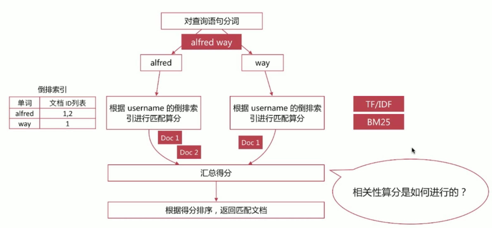
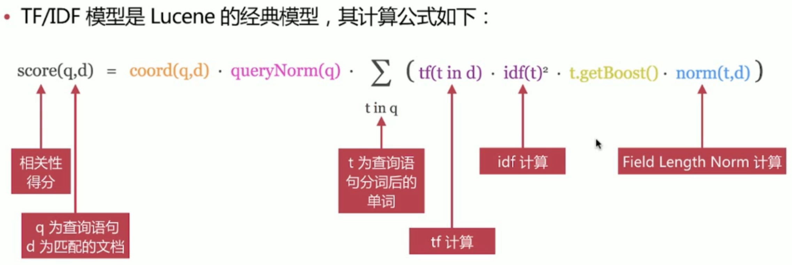
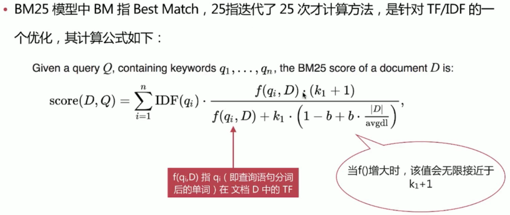
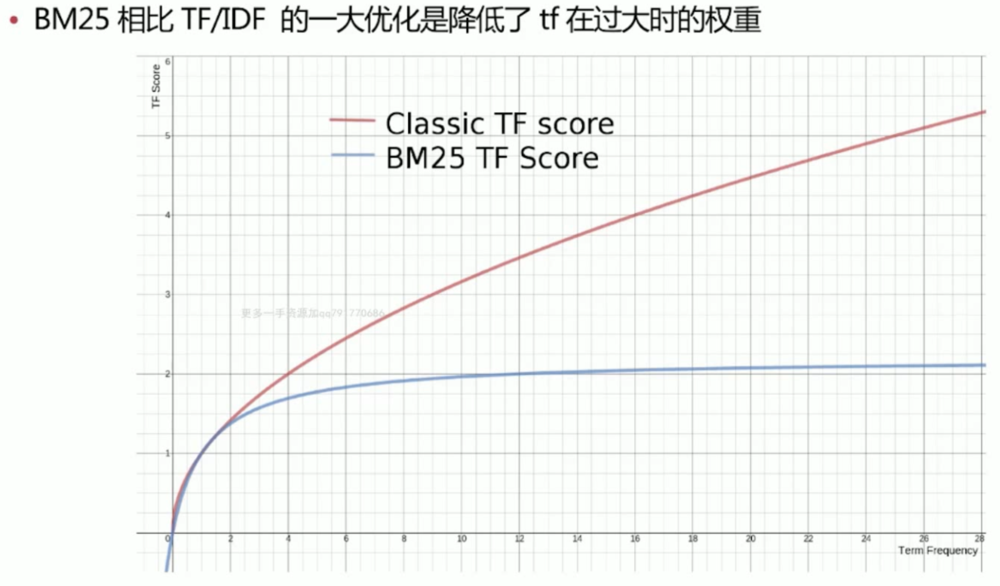
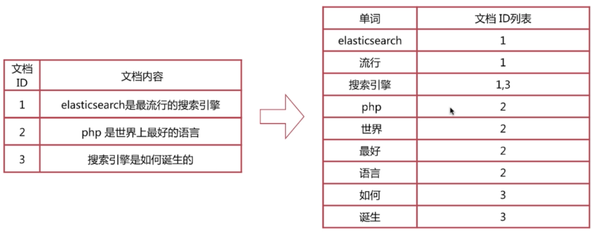
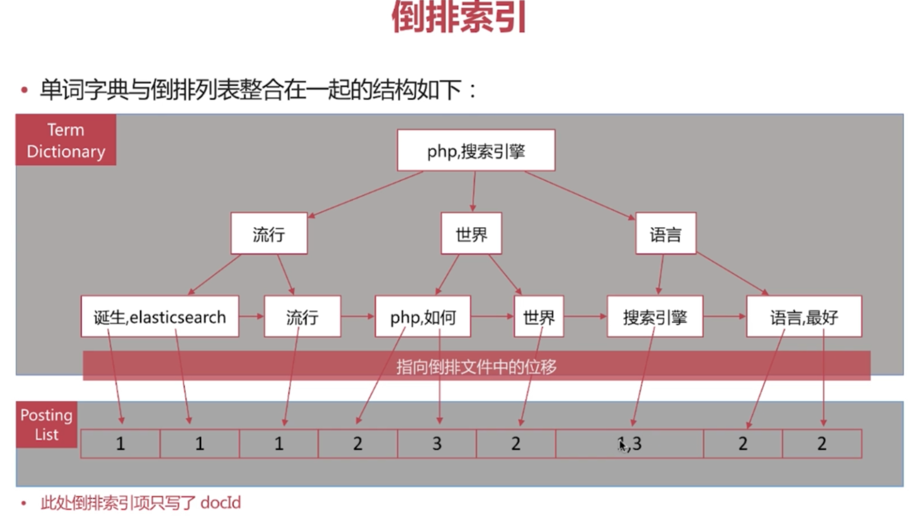
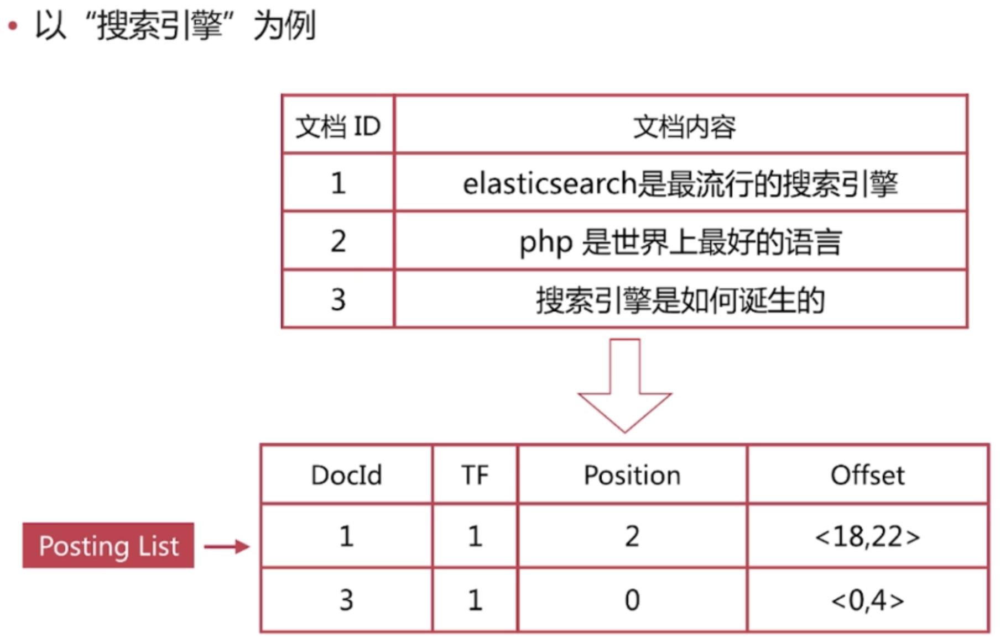
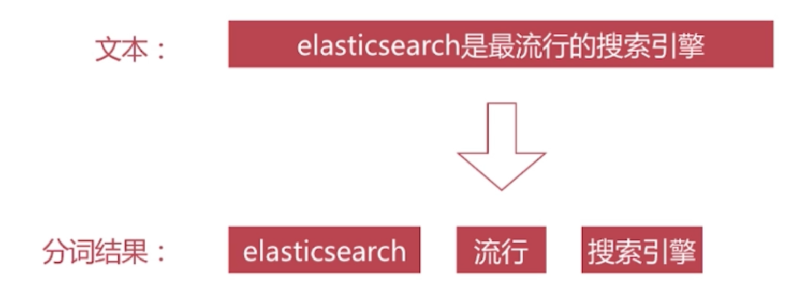

# 重要概念

## 01.相关性算分

参考04.QUERY_DSL中的查询语句：
```
GET test_search_index/_search
{
  "explain":true,
  "query": {
    "match": {
      "username": "alfred way"
    }
  }
}
```
elasticsearch查询alfred计算出文档列表，在通过way计算出文档列表。之后汇总得分，根据得分排序，返回匹配文档。

### 1.1.相关性算分的重要概念
- 1.Term Frequency(TF)词频，即单词在该文档中出现的次数。词频与相关度成正比。
- 2.Document Frequency(DF)文档频率，即单词出现的文档数。是文档数
- 3.Inverse Document Frequency(IDF)逆向文档频率，与文档频率相反，简单理解为1/DF。即单词出现的文档数越少，相关度越高
- 4.Field-length Norm文档越短，相关性越高

### 1.2.TF/IDF模型


### 1.3.BM25模型

新版本es使用的是BM25算法

BM25模型优化


## 02.倒排索引相关的内容
下图中左边是正排索引，右边是倒排索引
- 1.正排索引，通过文档ID查询文档内容
- 2.倒排索引，通过内容查询文档ID


搜索引擎通过倒排索引与正排索引一起实现查询流程：
```
1.用户输入关键词
2.通过倒排索引查询文档ID
3.通过正排索引和文档ID查询文档所有内容
4.返回搜索结果
```

### 2.1.倒排索引的组成
- 1.单词词典(Term Dictionary)
- 2.倒排列表(Posting List)



es中的文档时json格式，在es中每个字段(比如 username，age)都有自己的倒排索引。每个倒排索引都包含单词词典和倒排列表。

#### 2.1.1.单词词典
- 记录所有文档的单词-数据量肯定非常大
- 记录单词到倒排列表的信息

#### 2.1.2.倒排列表
倒排列表(Posting List)记录了单词对应的文档集合，由倒排索引项(Posting)组成。

(Posting)主要包含
- 1.文档ID，用于查询文档ID，在通过正排索引获取文档内容
- 2.单词频率(TF,Term Frequency)，记录词频，用于后续相关性算分
- 3.位置(Position),记录单词在文档中的分词位置(多个)，用于做词语搜索(Phrase Query)
- 4.偏移(Offset)，记录单词在文档中开始和结束的位置，用于做高亮显示

下面这个图片以“搜索引擎”这个单词(term)为例，介绍倒排索引记录的内容：


## 3.分词
分词是指将文本转换为一系列单词(term)的过程，在es里面成为Analysis，如下图所示：
