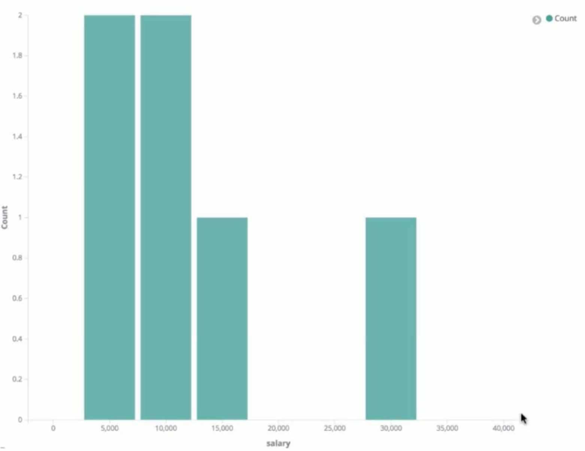
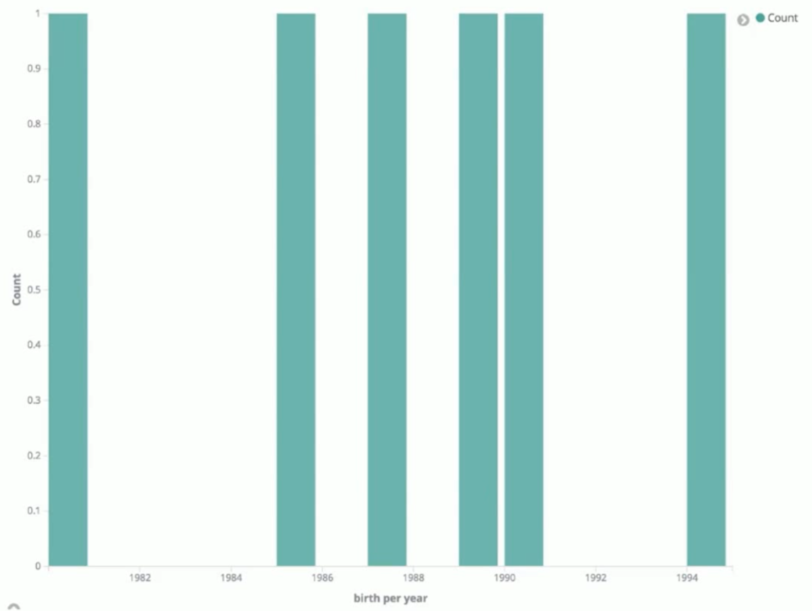

# 聚合分析

## 01.Metric聚合分析

- 单值分析，只输出一个结果
    - min,max,avg,sum
    - cardinality
- 多值分析，输出多个结果
    - stats,extended stats
    - percentile, percentile rank
    - top hits

### 1.1.min,max,avg,sum
request:
```json
POST logstash-*/_search?size=0
{
  "aggs": {
    "NAME": {
      "avg": {
        "field": "geo.coordinates.lat"
      }
    }
  }
}
```

response:
```json
{
  "took" : 27,
  "timed_out" : false,
  "_shards" : {
    "total" : 15,
    "successful" : 15,
    "skipped" : 0,
    "failed" : 0
  },
  "hits" : {
    "total" : 14005,
    "max_score" : 0.0,
    "hits" : [ ]
  },
  "aggregations" : {
    "NAME" : {
      "value" : 39.999860500861686
    }
  }
}
```

### 1.2.cardinality
将字段的所有值作为集合，返回这个集合的势。
request:
```json
POST test_search_index/_search?size=0
{
  "aggs": {
    "NAME": {
      "cardinality": {
        "field": "job.keyword"
      }
    }
  }
}
```
- phrase.keyword
    - 表示不做分词，将整个phrase作为完整的term


response:
```json
{
  "took" : 23,
........
  },
  "aggregations" : {
    "NAME" : {
      "value" : 4
    }
  }
}
```

### 1.3.stats
返回一些列数值类型的统计值，包含min,max,avg,sum和count

request:
```json
POST test_search_index/_search?size=0
{
  "aggs": {
    "NAME": {
      "stats": {
        "field": "age"
      }
    }
  }
}
```

response:
```json
{
  "took" : 5,
..........
  },
  "aggregations" : {
    "NAME" : {
      "count" : 4,
      "min" : 18.0,
      "max" : 28.0,
      "avg" : 22.75,
      "sum" : 91.0
    }
  }
}
```

### 1.4.Extended stats
对stats的扩展，包含了更多的统计数据，比如方差，标准差等

### 1.5.percentile
百分位数统计

request:
```json
POST test_search_index/_search?size=0
{
  "aggs": {
    "NAME": {
      "percentiles": {
        "field": "salary"
      }
    }
  }
}
```

response:
```json
{
  "took" : 1,
..........
  },
  "aggregations" : {
    "NAME" : {
      "values" : {
        "1.0" : "5150",
        "5.0" : "5750",
        "25.0" : "8500",
        "50.0" : "11000",
        "75.0" : "14250",
        "95.0" : "26250",
        "99.0" : "29250"
      }
    }
  }
}
```

- "95.0":"26250"的语义是
    - 百分之95的人salary在26250之内

### 1.6.percentile rank
百分位统计

request:
```json
POST test_search_index/_search?size=0
{
  "aggs": {
    "NAME": {
      "percentiles_ranks": {
        "field": "salary",
        "values": [
          11000,
          30000
        ]
      }
    }
  }
}
```

response:
```json
{
  "took" : 1,
..........
  },
  "aggregations" : {
    "NAME" : {
      "values" : {
        "11000.0":50,
        "30000.0":75
      }
    }
  }
}
```

- "11000.0":50的语义是
    - salary在11000.0以内的占所有数据的百分之50

### 1.7.top hits
一般用于分桶后获取该桶内最匹配的顶部文档列表，即详情数据

request:
```json
GET test_search_index/_search?size=0
{
  "aggs": {
    "jobs": {
      "terms": {
        "field": "job.keyword",
        "size": 10
      },
      "aggs": {
        "top_employee": {
          "top_hits": {
            "size": 10,
            "sort": [
              {
                "age":{
                  "order": "desc"
                }
              }
            ]
          }
        }
      }
    }
  }
}
```

response:
```json
{
  "took" : 18,
..........
  },
  "aggregations" : {
    "jobs" : {
      "doc_count_error_upper_bound" : 0,
      "sum_other_doc_count" : 0,
      "buckets" : [
        {
          "key" : "java and ruby engineer",
          "doc_count" : 1,
          "top_employee" : {
            "hits" : {
              "total" : 1,
              "max_score" : null,
              "hits" : [
                {
                  "_index" : "test_search_index",
                  "_type" : "doc",
                  "_id" : "3",
                  "_score" : null,
                  "_source" : {
                    "username" : "lee",
                    "job" : "java and ruby engineer",
                    "age" : 22,
                    "birth" : "1985-08-07",
                    "isMarried" : false
                  },
                  "sort" : [
                    22
                  ]
                }
              ]
            }
          }
        },
        {
          "key" : "java engineer",
          "doc_count" : 1,
          "top_employee" : {
            "hits" : {
              "total" : 1,
              "max_score" : null,
              "hits" : [
                {
                  "_index" : "test_search_index",
                  "_type" : "doc",
                  "_id" : "1",
                  "_score" : null,
                  "_source" : {
                    "username" : "alfred way",
                    "job" : "java engineer",
                    "age" : 18,
                    "birth" : "1990-01-02",
                    "isMarried" : false
                  },
                  "sort" : [
                    18
                  ]
                }
              ]
            }
          }
        },
        {
          "key" : "java senior engineer and java specialist",
          "doc_count" : 1,
          "top_employee" : {
            "hits" : {
              "total" : 1,
              "max_score" : null,
              "hits" : [
                {
                  "_index" : "test_search_index",
                  "_type" : "doc",
                  "_id" : "2",
                  "_score" : null,
                  "_source" : {
                    "username" : "alfred",
                    "job" : "java senior engineer and java specialist",
                    "age" : 28,
                    "birth" : "1980-05-07",
                    "isMarried" : true
                  },
                  "sort" : [
                    28
                  ]
                }
              ]
            }
          }
        },
        {
          "key" : "ruby engineer",
          "doc_count" : 1,
          "top_employee" : {
            "hits" : {
              "total" : 1,
              "max_score" : null,
              "hits" : [
                {
                  "_index" : "test_search_index",
                  "_type" : "doc",
                  "_id" : "4",
                  "_score" : null,
                  "_source" : {
                    "username" : "alfred junior way",
                    "job" : "ruby engineer",
                    "age" : 23,
                    "birth" : "1989-08-07",
                    "isMarried" : false
                  },
                  "sort" : [
                    23
                  ]
                }
              ]
            }
          }
        }
      ]
    }
  }
}
```

## 2.bucket 聚合分析
bucket, 意为桶，即按照一定的规则将文档分配到不同的桶中，达到分类分析的目的

常见的bucket聚合分析如下：
- terms
- range
- Date range
- Histogram
- Date Histogram

### 2.1.terms
最简单的分桶策略，直接按照term来分桶，如果是text类型，则按照分词后的结果分桶

request:
```json
POST test_search_index/_search?size=0
{
  "aggs": {
    "jobs": {
      "terms": {
        "field": "job.keyword",
        "size": 3
      }
    }
  }
}
```

response:
```json
{
  "took" : 1,
..............
  },
  "aggregations" : {
    "jobs" : {
      "doc_count_error_upper_bound" : 0,
      "sum_other_doc_count" : 1,
      "buckets" : [
        {
          "key" : "ruby engineer",
          "doc_count" : 2
        },
        {
          "key" : "web engineer",
          "doc_count" : 2
        },
        {
          "key" : "java engineer",
          "doc_count" : 1
        }
      ]
    }
  }
}
```

### 2.2.range
通过指定数值的范围来设定分桶规则

request:
```json
POST test_search_index/_search?size=0
{
  "aggs": {
    "salary_range": {
      "range": {
        "field": "salary",
        "ranges": [
          {
            "to": 10000
          },
          {
            "from": 10000,
            "to": 20000
          },
          {
            "from": 20000
          }
        ]
      }
    }
  }
}
```

response:
```json
{
  "took" : 2,
............
  },
  "aggregations" : {
    "salary_range" : {
      "buckets" : [
        {
          "key" : "*-10000.0",
          "to" : 10000.0,
          "doc_count" : 2
        },
        {
          "key" : "10000.0-20000.0",
          "from" : 10000.0,
          "to" : 20000.0,
          "doc_count" : 3
        },
        {
          "key" : "20000.0-*",
          "from" : 20000.0,
          "doc_count" : 1
        }
      ]
    }
  }
}
```

### 2.3.date range
通过指定日期的范围来设定分桶的规则

request:

```json
GET test_search_index/_search
{
  "size": 0,
  "aggs": {
    "birth_bucket": {
      "range": {
        "field": "birth",
        "format": "yyyy",
        "ranges": [
          {
            "from":"1980",
            "to": "1990"
          },
          {
            "from": "1990",
            "to": "2000"
          },
          {
            "from": "2000"
          }
        ]
      }
    }
  }
}
```

response:

```json
{
  "took" : 1,
...........
  },
  "aggregations" : {
    "birth_bucket" : {
      "buckets" : [
        {
          "key" : "1980-1990",
          "from" : 3.155328E11,
          "from_as_string" : "1980",
          "to" : 6.31152E11,
          "to_as_string" : "1990",
          "doc_count" : 4
        },
        {
          "key" : "1990-2000",
          "from" : 6.31152E11,
          "from_as_string" : "1990",
          "to" : 9.466848E11,
          "to_as_string" : "2000",
          "doc_count" : 2
        },
        {
          "key" : "2000-*",
          "from" : 9.466848E11,
          "from_as_string" : "2000",
          "doc_count" : 0
        }
      ]
    }
  }
}
```

### 2.4.historgram
直方图，以固定的间隔的策略来分割数据



- interval：指定间隔大小
- extended_bounds：指定数值范围

request:
```json
GET test_search_index/_search
{
  "size":0,
  "aggs":{
    "salary_hist":{
      "histogram": {
        "field": "salary",
        "interval": 5000,
        "extended_bounds": {
          "min": 0,
          "max": 40000
        }
      }
    }
  }
}
```

response:

```json
{
  "took" : 4,
  "timed_out" : false,
  "_shards" : {
    "total" : 1,
    "successful" : 1,
    "skipped" : 0,
    "failed" : 0
  },
  "hits" : {
    "total" : 6,
    "max_score" : 0.0,
    "hits" : [ ]
  },
  "aggregations" : {
    "salary_hist" : {
      "buckets" : [
        {
          "key" : 0.0,
          "doc_count" : 0
        },
        {
          "key" : 5000.0,
          "doc_count" : 2
        },
        {
          "key" : 10000.0,
          "doc_count" : 2
        },
        {
          "key" : 15000.0,
          "doc_count" : 1
        },
        {
          "key" : 20000.0,
          "doc_count" : 0
        },
        {
          "key" : 25000.0,
          "doc_count" : 0
        },
        {
          "key" : 30000.0,
          "doc_count" : 1
        },
        {
          "key" : 35000.0,
          "doc_count" : 0
        },
        {
          "key" : 40000.0,
          "doc_count" : 0
        }
      ]
    }
  }
}
```

#### 2.4.1.对聚合结果排序
- 内置排序
```json
GET /cars/transactions/_search
{
  "size":0,
  "aggs":{
   "popular_colors":{
     "terms": {
       "field": "color",
       "order": {             ---表示要对聚合结果做排序
         "_count": "desc"     ---排序字段是doc_count，顺序是降序
       }
     }
   } 
  }
}
```
```
GET /cars/transactions/_search
{
  "size": 0,
  "aggs": {
    "price": {
      "histogram": {           ---区间聚合
        "field": "price",      ---取price字段的值
        "interval": 20000,     ---每个区间的大小是20000
        "order": {             ---表示要对聚合结果做排序
          "_key": "desc"       ---排序字段是桶的key值，这里是每个区间的起始值，顺序是降序
        }
      }
    }
  }
}
```
### 2.5.Date Historgram
针对日期的直方图或者柱状图，是时序数据分析中常用的聚合分析类型


- interval：指定间隔大小
- extended_bounds：指定数值范围

request:
```json
GET test_search_index/_search
{
  "size":0,
  "aggs":{
    "by_year":{
      "date_histogram": {
        "field": "birth",
        "interval": "year",
        "format":"yyyy"
      }
    }
  }
}
```

response:
```json
{
  "took" : 4,
  "timed_out" : false,
  "_shards" : {
    "total" : 1,
    "successful" : 1,
    "skipped" : 0,
    "failed" : 0
  },
  "hits" : {
    "total" : 6,
    "max_score" : 0.0,
    "hits" : [ ]
  },
  "aggregations" : {
    "by_year" : {
      "buckets" : [
        {
          "key_as_string" : "1980",
          "key" : 315532800000,
          "doc_count" : 1
        },
        {
          "key_as_string" : "1981",
          "key" : 347155200000,
          "doc_count" : 0
        },
        {
          "key_as_string" : "1982",
          "key" : 378691200000,
          "doc_count" : 0
        },
        {
          "key_as_string" : "1983",
          "key" : 410227200000,
          "doc_count" : 0
        },
        {
          "key_as_string" : "1984",
          "key" : 441763200000,
          "doc_count" : 0
        },
        {
          "key_as_string" : "1985",
          "key" : 473385600000,
          "doc_count" : 1
        },
        {
          "key_as_string" : "1986",
          "key" : 504921600000,
          "doc_count" : 0
        },
        {
          "key_as_string" : "1987",
          "key" : 536457600000,
          "doc_count" : 1
        },
        {
          "key_as_string" : "1988",
          "key" : 567993600000,
          "doc_count" : 0
        },
        {
          "key_as_string" : "1989",
          "key" : 599616000000,
          "doc_count" : 1
        },
        {
          "key_as_string" : "1990",
          "key" : 631152000000,
          "doc_count" : 1
        },
        {
          "key_as_string" : "1991",
          "key" : 662688000000,
          "doc_count" : 0
        },
        {
          "key_as_string" : "1992",
          "key" : 694224000000,
          "doc_count" : 0
        },
        {
          "key_as_string" : "1993",
          "key" : 725846400000,
          "doc_count" : 0
        },
        {
          "key_as_string" : "1994",
          "key" : 757382400000,
          "doc_count" : 1
        }
      ]
    }
  }
}
```